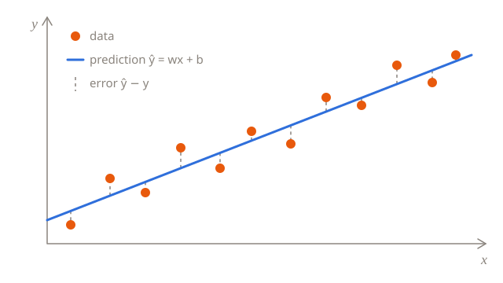

# Linear regression

Linear regression predicts a number by drawing the best straight line through the data. It's the simplest model that learns, and its ingredients (a loss, gradients, a learning rate) come back in every neural network.



## The model

With one feature $x$, the prediction is a line:

$$
\hat{y} = w x + b
$$

$w$ is the **weight** (the slope) and $b$ is the **bias** (where the line crosses the $y$ axis). Learning means finding the $w$ and $b$ that fit the data best.

With $d$ features, $x$ and $w$ become vectors:

$$
\hat{y} = w^\top x + b = w_1 x_1 + w_2 x_2 + \dots + w_d x_d + b
$$

## Measuring the error

For $n$ training examples $(x_i, y_i)$, the **mean squared error** averages the squared gaps between predictions and labels:

$$
L(w, b) = \frac{1}{n} \sum_{i=1}^{n} \left( \hat{y}_i - y_i \right)^2 = \frac{1}{n} \sum_{i=1}^{n} \left( w x_i + b - y_i \right)^2
$$

The best line is the one with the smallest $L$.

## Gradient descent

The gradient of the loss points uphill, so we take small steps the other way. The partial derivatives are:

$$
\frac{\partial L}{\partial w} = \frac{2}{n} \sum_{i=1}^{n} \left( \hat{y}_i - y_i \right) x_i
\qquad
\frac{\partial L}{\partial b} = \frac{2}{n} \sum_{i=1}^{n} \left( \hat{y}_i - y_i \right)
$$

Each step moves the parameters against the gradient, scaled by the **learning rate** $\eta$:

$$
w \leftarrow w - \eta \, \frac{\partial L}{\partial w}
\qquad
b \leftarrow b - \eta \, \frac{\partial L}{\partial b}
$$

> [!TIP]
> If the loss grows or jumps around, the learning rate is too big. If it barely moves, it's too small.

## In code

The whole algorithm in NumPy, fitting noisy data generated from $y = 3x + 2$:

```python
import numpy as np

rng = np.random.default_rng(0)
x = rng.uniform(0, 10, size=100)
y = 3 * x + 2 + rng.normal(0, 1, size=100)

w, b = 0.0, 0.0
learning_rate = 0.01

for step in range(2000):
    error = (w * x + b) - y
    loss = np.mean(error**2)
    w -= learning_rate * 2 * np.mean(error * x)
    b -= learning_rate * 2 * np.mean(error)
    if step % 500 == 0:
        print(f"step {step:4d}  loss {loss:8.3f}  w {w:.3f}  b {b:.3f}")

print(f"learned: y = {w:.2f}x + {b:.2f}")
```

The learned line lands close to $y = 3x + 2$, though not exactly on it, because of the noise.

## The normal equation

Linear regression also has an exact solution. Put the examples in a matrix $X$ (one row each, plus a column of ones for the bias) and the labels in a vector $y$. The loss is smallest at the $\theta$ that solves

$$
X^\top X \, \theta = X^\top y \quad\Longrightarrow\quad \theta = \left( X^\top X \right)^{-1} X^\top y
$$

where $\theta$ holds the weights and the bias.

```python
X = np.column_stack([x, np.ones_like(x)])
w, b = np.linalg.lstsq(X, y, rcond=None)[0]
```

`lstsq` solves the equation without computing the inverse, which is faster and more accurate.

So why bother with gradient descent? Solving the equation gets expensive with many features, and most models, from logistic regression to neural networks, have no exact solution at all. Gradient descent works for all of them.

## Check yourself

<details>
<summary>What happens if you raise the learning rate to 0.02? And to 0.05?</summary>

At 0.02 training converges about twice as fast. At 0.05 it diverges: every step overshoots the minimum by more than the last, and the loss grows until it overflows. Try both.

</details>

<details>
<summary>Why is the gradient for the bias just twice the average error?</summary>

The prediction $\hat{y}_i = w x_i + b$ changes one-for-one with $b$, so $\partial \hat{y}_i / \partial b = 1$. Only the factor $2(\hat{y}_i - y_i)$ from the square is left, averaged over the examples.

</details>

## Summary

- The model is a line (or a plane): $\hat{y} = w^\top x + b$.
- Mean squared error measures how wrong it is.
- Gradient descent repeatedly nudges $w$ and $b$ downhill.
- The learning rate sets the step size: too big diverges, too small crawls.
