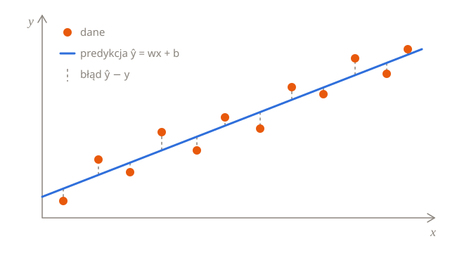

# Regresja liniowa

Regresja liniowa przewiduje liczbę, prowadząc przez dane najlepiej dopasowaną prostą. To najprostszy model, który się uczy, a jego składniki (funkcja straty, gradienty, współczynnik uczenia) wracają w każdej sieci neuronowej.



## Model

Przy jednej cesze $x$ predykcja jest prostą:

$$
\hat{y} = w x + b
$$

$w$ to **waga** (nachylenie prostej), a $b$ to **wyraz wolny** (ang. bias), czyli miejsce, w którym prosta przecina oś $y$. Uczenie polega na znalezieniu takich $w$ i $b$, przy których prosta najlepiej pasuje do danych.

Przy $d$ cechach $x$ i $w$ stają się wektorami:

$$
\hat{y} = w^\top x + b = w_1 x_1 + w_2 x_2 + \dots + w_d x_d + b
$$

## Mierzenie błędu

Dla $n$ przykładów treningowych $(x_i, y_i)$ **błąd średniokwadratowy** (ang. mean squared error, MSE) uśrednia kwadraty różnic między predykcjami a etykietami:

$$
L(w, b) = \frac{1}{n} \sum_{i=1}^{n} \left( \hat{y}_i - y_i \right)^2 = \frac{1}{n} \sum_{i=1}^{n} \left( w x_i + b - y_i \right)^2
$$

Najlepsza prosta to ta z najmniejszym $L$.

## Spadek gradientu

Gradient funkcji straty wskazuje pod górę, więc robimy małe kroki w przeciwną stronę. Pochodne cząstkowe wynoszą:

$$
\frac{\partial L}{\partial w} = \frac{2}{n} \sum_{i=1}^{n} \left( \hat{y}_i - y_i \right) x_i
\qquad
\frac{\partial L}{\partial b} = \frac{2}{n} \sum_{i=1}^{n} \left( \hat{y}_i - y_i \right)
$$

Każdy krok przesuwa parametry przeciwnie do gradientu, a długość kroku skaluje **współczynnik uczenia** (ang. learning rate) $\eta$:

$$
w \leftarrow w - \eta \, \frac{\partial L}{\partial w}
\qquad
b \leftarrow b - \eta \, \frac{\partial L}{\partial b}
$$

> [!TIP]
> Jeśli strata rośnie albo skacze, współczynnik uczenia jest za duży. Jeśli prawie się nie zmienia, jest za mały.

## W kodzie

Cały algorytm w NumPy, dopasowany do zaszumionych danych wygenerowanych z $y = 3x + 2$:

```python
import numpy as np

rng = np.random.default_rng(0)
x = rng.uniform(0, 10, size=100)
y = 3 * x + 2 + rng.normal(0, 1, size=100)

w, b = 0.0, 0.0
learning_rate = 0.01

for step in range(2000):
    error = (w * x + b) - y
    loss = np.mean(error**2)
    w -= learning_rate * 2 * np.mean(error * x)
    b -= learning_rate * 2 * np.mean(error)
    if step % 500 == 0:
        print(f"krok {step:4d}  strata {loss:8.3f}  w {w:.3f}  b {b:.3f}")

print(f"wynik: y = {w:.2f}x + {b:.2f}")
```

Wyuczona prosta ląduje blisko $y = 3x + 2$, choć przez szum nie dokładnie na niej.

## Równanie normalne

Regresja liniowa ma też rozwiązanie dokładne. Umieść przykłady w macierzy $X$ (po jednym w wierszu, plus kolumna jedynek dla wyrazu wolnego), a etykiety w wektorze $y$. Strata jest najmniejsza dla wektora $\theta$ spełniającego równanie

$$
X^\top X \, \theta = X^\top y \quad\Longrightarrow\quad \theta = \left( X^\top X \right)^{-1} X^\top y
$$

gdzie $\theta$ zawiera wagi i wyraz wolny.

```python
X = np.column_stack([x, np.ones_like(x)])
w, b = np.linalg.lstsq(X, y, rcond=None)[0]
```

`lstsq` rozwiązuje to równanie bez liczenia macierzy odwrotnej, co jest szybsze i dokładniejsze.

Po co więc spadek gradientu? Rozwiązywanie równania robi się kosztowne przy wielu cechach, a większość modeli, od regresji logistycznej po sieci neuronowe, w ogóle nie ma dokładnego rozwiązania. Spadek gradientu działa dla nich wszystkich.

## Sprawdź się

<details>
<summary>Co się stanie, gdy zwiększysz współczynnik uczenia do 0,02? A do 0,05?</summary>

Przy 0,02 trening zbiega mniej więcej dwa razy szybciej. Przy 0,05 się rozbiega: każdy krok przeskakuje minimum bardziej niż poprzedni, a strata rośnie, aż przekroczy zakres liczb zmiennoprzecinkowych. Wypróbuj obie wartości.

</details>

<details>
<summary>Dlaczego gradient względem wyrazu wolnego to po prostu podwojony średni błąd?</summary>

Predykcja $\hat{y}_i = w x_i + b$ zmienia się dokładnie o tyle, o ile zmienia się $b$, więc $\partial \hat{y}_i / \partial b = 1$. Zostaje tylko czynnik $2(\hat{y}_i - y_i)$ z kwadratu, uśredniony po przykładach.

</details>

## Podsumowanie

- Model to prosta (albo płaszczyzna): $\hat{y} = w^\top x + b$.
- Błąd średniokwadratowy mierzy, jak bardzo model się myli.
- Spadek gradientu raz po raz przesuwa $w$ i $b$ w dół zbocza.
- Współczynnik uczenia ustala długość kroku: za duży prowadzi do rozbieżności, za mały do ślimaczego tempa.
