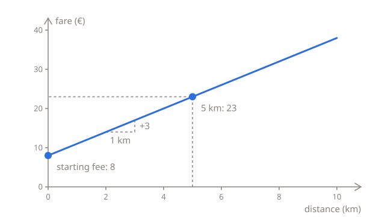
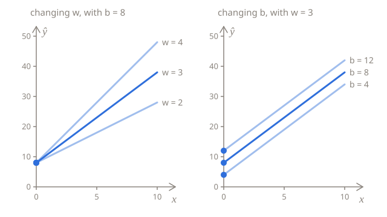

# Making predictions

A taxi has a sticker on its window with its prices: **€8 to start, plus €3 for every kilometer**. That's already a model: a rule that turns something you know, the length of a ride, into a number you want to predict, its fare. This lesson writes the rule in Python and in math, and ends with the question the rest of the chapter answers: how to find such a rule when there's no sticker.

## A fare, worked out by hand

A 5 km ride costs 5 × 3 = 15 for the distance, plus 8 to start, so 23 in all. Every fare is worked out the same way, by multiplying the distance by 3 and adding 8:

| Distance (km) | Worked out | Fare (€) |
| ------------- | ---------- | -------- |
| 0             | 0 × 3 + 8  | 8        |
| 1             | 1 × 3 + 8  | 11       |
| 2             | 2 × 3 + 8  | 14       |
| 5             | 5 × 3 + 8  | 23       |
| 10            | 10 × 3 + 8 | 38       |

In Python, the rule is a function of one line:

```python run
def predict(km):
    return 3 * km + 8


print(predict(5))
print(predict(10))
```

On a chart, with the distance along the bottom and the fare up the side, the fares lie on a straight line. It starts at 8, the fare for 0 km, and every kilometer to the right takes it 3 higher:



## The same rule in symbols

Machine learning writes the rule with letters in place of the numbers:

$$
\hat{y} = w x + b
$$

Each letter stands for one part of the taxi rule:

| Symbol    | For the taxi           | Its name                                                          |
| --------- | ---------------------- | ----------------------------------------------------------------- |
| $x$       | the distance, 5 km     | the **feature**: what the prediction is made from                 |
| $w$       | the price per km, 3    | the **weight**: how much the prediction grows when $x$ grows by 1 |
| $b$       | the starting fee, 8    | the **bias**: the prediction when $x$ is 0                        |
| $\hat{y}$ | the predicted fare, 23 | the **prediction**                                                |

Two letters side by side are multiplied, so $wx$ means $w$ times $x$. $\hat{y}$ is read "y-hat", and the hat marks a prediction. Plain $y$ is the real fare, the one printed on the receipt, and it's called the **label**. With the sticker's own rule, the two are always the same, but the next two lessons are all about what happens when they aren't.

On the chart, $w$ sets how steep the line is, and $b$ is the height where it crosses the vertical axis, at $x = 0$. The two are the model's **parameters**: the numbers that learning adjusts. Other parameters give another line, so another rule. Set `w` and `b` to other numbers and run this code again to see how the fares change:

```python run
w = 3
b = 8


def predict(km):
    return w * km + b


for km in [0, 1, 2, 5, 10]:
    print(km, predict(km))
```

A bigger $w$ makes every kilometer cost more, so the line gets steeper, while it still starts at $b$. A bigger $b$ adds the same amount to every fare, so the line moves up and stays as steep as before:



## More than one input

A fare can depend on more than the distance. Say the taxi also charges €0.50 for every minute it waits in traffic. A 4 km ride with 6 minutes of waiting costs 4 × 3 = 12 for the distance, 6 × 0.5 = 3 for the waiting, and 8 to start: 23 in all.

Each input gets its own weight, and each input times its weight is added in:

$$
\hat{y} = w_1 x_1 + w_2 x_2 + b
$$

The small numbers only tell the inputs apart. $x_1$ is the first feature, the distance, with the weight $w_1 = 3$, and $x_2$ is the second, the minutes of waiting, with the weight $w_2 = 0.5$. With more features, the sum just gets longer: one feature times its weight for each, and the bias at the end.

```python run
def predict(km, minutes):
    return 3 * km + 0.5 * minutes + 8


print(predict(4, 6))
print(predict(4, 0))
```

The fares print as `23.0` and `20.0`, because multiplying by 0.5, a float, gives a float.

## Where do w and b come from?

So far, the rule was given: it was on the sticker. Machine learning starts where there's no sticker. All you have is receipts, each with a ride's distance and its fare, and the task is to work out $w$ and $b$ from them.

With two receipts that follow the rule exactly, that's a small puzzle. Say a 3 km ride cost 17, and a 7 km ride cost 29:

1. The second ride was 4 km longer and cost 12 more, so each kilometer costs 12 ÷ 4 = 3. That's $w$.
2. The first ride's 3 km cost 3 × 3 = 9, and its fare was 17, so the other 17 − 9 = 8 is the starting fee. That's $b$.
3. As a check, the rule gets the second fare right too: 7 × 3 + 8 = 29.

Real receipts aren't that tidy. By day, the taxi waits at lights and in traffic jams, which costs extra, but a receipt only shows the distance, not the minutes of waiting. Here are four day rides:

| Distance (km) | 2   | 4   | 6   | 8   |
| ------------- | --- | --- | --- | --- |
| Fare (€)      | 15  | 23  | 29  | 33  |

Solve the puzzle with different pairs of these receipts, and you get different answers:

| Receipts used | $w$ | $b$ |
| ------------- | --- | --- |
| 2 km and 4 km | 4   | 7   |
| 4 km and 6 km | 3   | 11  |
| 6 km and 8 km | 2   | 17  |

No straight line goes through all four receipts, so every choice of $w$ and $b$ misses some of them. Choosing the best one takes a way to score how badly a line misses, and that's what the next lesson is about.

## Summary

- A linear model predicts with $\hat{y} = wx + b$: the feature times the weight, plus the bias.
- The weight $w$ sets how steep the line is, and the bias $b$ is the prediction for $x = 0$.
- With more features, each one gets its own weight: $\hat{y} = w_1 x_1 + w_2 x_2 + b$.
- Learning means finding $w$ and $b$ from examples. Real examples don't lie on one line, so the next step is to measure how far off a line is.

## Check yourself

<details>
<summary>By the sticker's rule, a ride cost 32. How long was it?</summary>

8 km. Undo the steps in reverse order: take away the starting fee, 32 − 8 = 24, then divide by the price per km, 24 ÷ 3 = 8.

</details>

<details>
<summary>A model has a negative bias. Is that a mistake?</summary>

Not necessarily. A bias of −2 means the model predicts −2 for $x = 0$, which would be a strange taxi fare, but other data can have lines like that, and often no example is anywhere near $x = 0$. The bias is simply where the line that fits the data best crosses the vertical axis.

</details>

<details>
<summary>What would it take for every pair of day receipts to give the same answer?</summary>

Every ride would have to wait the same number of minutes. Then the waiting would add the same amount to every fare, and the four points would lie on one line, as steep as the sticker's, just higher.

</details>

## Your turn

In [Fare calculator](../../../exercises/04-foundations/02-linear-regression/01-predictions/01-fare-calculator/task.md), you'll write the rule with $w$ and $b$ as arguments, and work out the fares for a whole list of rides. In [Work out the tariff](../../../exercises/04-foundations/02-linear-regression/01-predictions/02-work-out-the-tariff/task.md), you'll solve the two-receipt puzzle in Python, for any two receipts.
