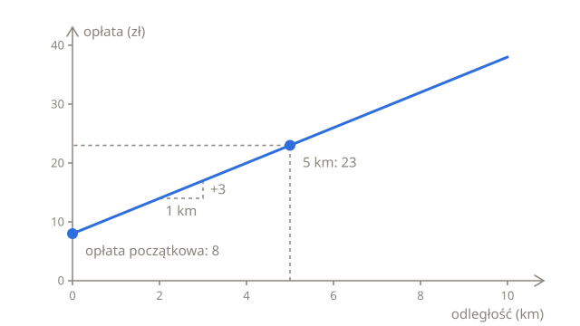
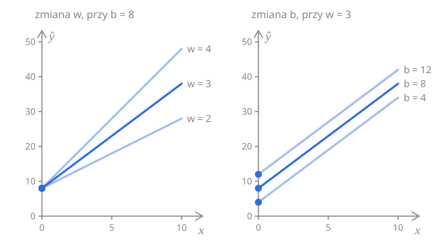

# Przewidywanie

Na szybie taksówki jest naklejka z cennikiem: **8 zł na start i 3 zł za każdy kilometr**. To już jest model: reguła, która zamienia coś, co znasz, czyli długość kursu, w liczbę, którą chcesz przewidzieć, czyli opłatę. W tej lekcji zapiszesz tę regułę w Pythonie i symbolami, a na końcu dojdziesz do pytania, na które odpowiada reszta rozdziału: jak znaleźć taką regułę, kiedy nie ma naklejki.

## Opłata policzona ręcznie

Kurs na 5 km kosztuje 5 × 3 = 15 za odległość i 8 na start, czyli razem 23. Każdą opłatę liczy się tak samo: mnożysz odległość przez 3 i dodajesz 8:

| Odległość (km) | Obliczenie | Opłata (zł) |
| -------------- | ---------- | ----------- |
| 0              | 0 × 3 + 8  | 8           |
| 1              | 1 × 3 + 8  | 11          |
| 2              | 2 × 3 + 8  | 14          |
| 5              | 5 × 3 + 8  | 23          |
| 10             | 10 × 3 + 8 | 38          |

W Pythonie ta reguła to funkcja z jednym wierszem:

```python run
def predict(km):
    return 3 * km + 8


print(predict(5))
print(predict(10))
```

Na wykresie, z odległością na osi poziomej i opłatą na pionowej, opłaty leżą na linii prostej. Zaczyna się ona na 8, czyli opłacie za 0 km, a każdy kilometr w prawo podnosi ją o 3:



## Ta sama reguła w symbolach

Uczenie maszynowe zapisuje tę regułę literami zamiast liczb:

$$
\hat{y} = w x + b
$$

Każda litera oznacza jedną część reguły taksówki:

| Symbol    | Dla taksówki            | Nazwa                                                    |
| --------- | ----------------------- | -------------------------------------------------------- |
| $x$       | odległość, 5 km         | **cecha**: to, na podstawie czego powstaje predykcja     |
| $w$       | cena za km, 3           | **waga**: o ile rośnie predykcja, gdy $x$ rośnie o 1     |
| $b$       | opłata początkowa, 8    | **wyraz wolny** (ang. bias): predykcja, gdy $x$ wynosi 0 |
| $\hat{y}$ | przewidywana opłata, 23 | **predykcja**                                            |

Dwie litery obok siebie się mnoży, więc $wx$ oznacza $w$ razy $x$. $\hat{y}$ czyta się „y z daszkiem”, a daszek oznacza predykcję. Samo $y$ to prawdziwa opłata, ta wydrukowana na paragonie, i nazywa się **etykietą**. Przy regule z naklejki obie są zawsze takie same, ale następne dwie lekcje są właśnie o tym, co się dzieje, gdy się różnią.

Na wykresie $w$ ustala, jak stroma jest prosta, a $b$ to wysokość, na której przecina ona oś pionową, w $x = 0$. Te dwie liczby to **parametry** modelu: liczby, które dostosowuje uczenie. Inne parametry dają inną prostą, czyli inną regułę. Ustaw `w` i `b` na inne liczby i uruchom ten kod jeszcze raz, żeby zobaczyć, jak zmieniają się opłaty:

```python run
w = 3
b = 8


def predict(km):
    return w * km + b


for km in [0, 1, 2, 5, 10]:
    print(km, predict(km))
```

Większe $w$ sprawia, że każdy kilometr kosztuje więcej, więc prosta robi się bardziej stroma, ale nadal zaczyna się w $b$. Większe $b$ dodaje tyle samo do każdej opłaty, więc prosta przesuwa się w górę i jest tak samo stroma jak wcześniej:



## Więcej niż jedno wejście

Opłata może zależeć od czegoś więcej niż odległość. Powiedzmy, że taksówka liczy też 0,50 zł za każdą minutę postoju w korku. Kurs na 4 km z 6 minutami postoju kosztuje 4 × 3 = 12 za odległość, 6 × 0,5 = 3 za postój i 8 na start: razem 23.

Każde wejście dostaje własną wagę, a każde wejście razy jego waga trafia do sumy:

$$
\hat{y} = w_1 x_1 + w_2 x_2 + b
$$

Małe liczby tylko odróżniają wejścia od siebie. $x_1$ to pierwsza cecha, odległość, z wagą $w_1 = 3$, a $x_2$ to druga, minuty postoju, z wagą $w_2 = 0{,}5$. Przy większej liczbie cech suma po prostu się wydłuża: każda cecha razy jej waga, a na końcu wyraz wolny.

```python run
def predict(km, minutes):
    return 3 * km + 0.5 * minutes + 8


print(predict(4, 6))
print(predict(4, 0))
```

Opłaty wypisują się jako `23.0` i `20.0`, bo wynik mnożenia przez `0.5`, czyli przez liczbę zmiennoprzecinkową, też jest liczbą zmiennoprzecinkową.

## Skąd się biorą w i b?

Do tej pory reguła była dana: była na naklejce. Uczenie maszynowe zaczyna się tam, gdzie naklejki nie ma. Masz tylko paragony, każdy z odległością i opłatą za kurs, a zadanie polega na wyznaczeniu z nich $w$ i $b$.

Przy dwóch paragonach, które dokładnie trzymają się reguły, to mała łamigłówka. Powiedzmy, że kurs na 3 km kosztował 17, a kurs na 7 km 29:

1. Drugi kurs był o 4 km dłuższy i kosztował o 12 więcej, więc każdy kilometr kosztuje 12 ÷ 4 = 3. To jest $w$.
2. 3 km pierwszego kursu kosztowały 3 × 3 = 9, a opłata wyniosła 17, więc pozostałe 17 − 9 = 8 to opłata początkowa. To jest $b$.
3. Dla sprawdzenia: reguła podaje też dobrą drugą opłatę, 7 × 3 + 8 = 29.

Prawdziwe paragony nie są tak uporządkowane. W dzień taksówka czeka na światłach i w korkach, co kosztuje dodatkowo, ale paragon pokazuje tylko odległość, a nie minuty postoju. Oto cztery kursy dzienne:

| Odległość (km) | 2   | 4   | 6   | 8   |
| -------------- | --- | --- | --- | --- |
| Opłata (zł)    | 15  | 23  | 29  | 33  |

Rozwiąż łamigłówkę dla różnych par tych paragonów, a dostaniesz różne odpowiedzi:

| Użyte paragony | $w$ | $b$ |
| -------------- | --- | --- |
| 2 km i 4 km    | 4   | 7   |
| 4 km i 6 km    | 3   | 11  |
| 6 km i 8 km    | 2   | 17  |

Żadna prosta nie przechodzi przez wszystkie cztery paragony, więc przy każdym wyborze $w$ i $b$ któreś z nich zostają poza prostą. Żeby wybrać najlepszą, trzeba umieć ocenić, jak bardzo prosta chybia, i o tym jest następna lekcja.

## Podsumowanie

- Model liniowy przewiduje według wzoru $\hat{y} = wx + b$: cecha razy waga plus wyraz wolny.
- Waga $w$ ustala, jak stroma jest prosta, a wyraz wolny $b$ to predykcja dla $x = 0$.
- Przy większej liczbie cech każda dostaje własną wagę: $\hat{y} = w_1 x_1 + w_2 x_2 + b$.
- Uczenie polega na znalezieniu $w$ i $b$ na podstawie przykładów. Prawdziwe przykłady nie leżą na jednej prostej, więc następny krok to zmierzenie, jak bardzo prosta się myli.

## Sprawdź się

<details>
<summary>Według reguły z naklejki kurs kosztował 32. Jak długi był?</summary>

8 km. Cofnij kroki w odwrotnej kolejności: odejmij opłatę początkową, 32 − 8 = 24, a potem podziel przez cenę za km, 24 ÷ 3 = 8.

</details>

<details>
<summary>Model ma ujemny wyraz wolny. Czy to błąd?</summary>

Niekoniecznie. Wyraz wolny −2 oznacza, że model przewiduje −2 dla $x = 0$, co byłoby dziwną opłatą za taksówkę, ale inne dane mogą mieć takie proste, a często żaden przykład nie leży nawet w pobliżu $x = 0$. Wyraz wolny to po prostu miejsce, w którym prosta najlepiej dopasowana do danych przecina oś pionową.

</details>

<details>
<summary>Co musiałoby się stać, żeby każda para paragonów dziennych dawała tę samą odpowiedź?</summary>

Każdy kurs musiałby stać w korku tyle samo minut. Wtedy postój dodawałby tyle samo do każdej opłaty, a cztery punkty leżałyby na jednej prostej, tak samo stromej jak ta z naklejki, tylko wyżej.

</details>

## Twoja kolej

W ćwiczeniu [Kalkulator opłat](../../../exercises/04-foundations/02-linear-regression/01-predictions/01-fare-calculator/task.pl.md) zapiszesz regułę z $w$ i $b$ jako argumentami i policzysz opłaty dla całej listy kursów. W ćwiczeniu [Odtwórz cennik](../../../exercises/04-foundations/02-linear-regression/01-predictions/02-work-out-the-tariff/task.pl.md) rozwiążesz w Pythonie łamigłówkę z dwoma paragonami, dla dowolnych dwóch paragonów.
