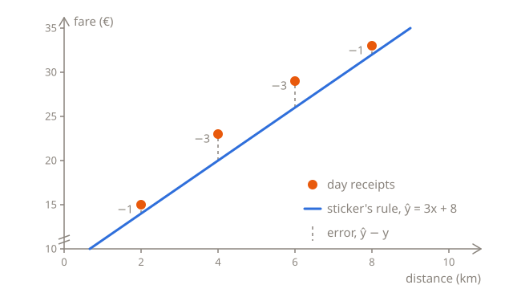

# Measuring the error

At the end of [Making predictions](01-predictions.md), four day receipts gave three different answers for the taxi's prices, depending on which two of them you used. To choose between the lines, you need a score: one number that says how far a line's predictions are from the real fares. This lesson builds that score, the **mean squared error**, one step at a time.

## Predictions against receipts

At night, the streets are empty and the taxi never waits, so its fares follow the sticker exactly. Here are four night rides, with what the sticker's rule, $w = 3$ and $b = 8$, predicts for them:

| Distance $x$ | Real fare $y$ | Prediction $\hat{y}$ | Error $\hat{y} - y$ |
| ------------ | ------------- | -------------------- | ------------------- |
| 2            | 14            | 14                   | 0                   |
| 4            | 20            | 20                   | 0                   |
| 6            | 26            | 26                   | 0                   |
| 8            | 32            | 32                   | 0                   |

The **error** of a prediction is the prediction minus the real value: $\hat{y} - y$. At night, every error is 0, because the line goes through every point.

By day, the taxi waits at lights and in traffic, and the waiting costs extra, but the receipts don't show it. The same rule on the four day rides:

| $x$ | $y$ | $\hat{y}$ | $\hat{y} - y$ |
| --- | --- | --------- | ------------- |
| 2   | 15  | 14        | −1            |
| 4   | 23  | 20        | −3            |
| 6   | 29  | 26        | −3            |
| 8   | 33  | 32        | −1            |

A negative error means the prediction was too low: the second ride cost 3 more than the rule said. A positive error means it was too high. On the chart, each error is the gap between a receipt and the line:



## From four errors to one score

To compare lines, the four errors have to become one number. Adding them up looks like the obvious way, but it fails. Take a flat line that predicts 25 for every ride, whatever its length: $w = 0$ and $b = 25$. Its errors are 25 − 15 = 10, 25 − 23 = 2, 25 − 29 = −4 and 25 − 33 = −8, and they add up to 0, as if the line were perfect. It isn't: it's 10 off on the first ride alone. The errors that are too high cancel out the ones that are too low.

Squaring fixes that. A number times itself is never negative, so (−3)² is 9, the same as 3², and nothing can cancel out. Squaring also makes big misses count for more than small ones: an error of 10 adds 100 to the sum, but an error of 2 only adds 4.

The score takes five steps:

1. **Predict** each fare with the line.
2. **Subtract** the real fare, to get each error.
3. **Square** each error.
4. **Add** the squares up.
5. **Divide** by the number of rides, to get the average.

For the sticker's rule on the day receipts:

| $x$ | $y$ | $\hat{y}$ | $\hat{y} - y$ | $(\hat{y} - y)^2$ |
| --- | --- | --------- | ------------- | ----------------- |
| 2   | 15  | 14        | −1            | 1                 |
| 4   | 23  | 20        | −3            | 9                 |
| 6   | 29  | 26        | −3            | 9                 |
| 8   | 33  | 32        | −1            | 1                 |

The squares add up to 1 + 9 + 9 + 1 = 20, and 20 ÷ 4 rides = 5. The average of the squared errors is the **mean squared error**, or **MSE**. The smaller it is, the closer the line is to the receipts, and 0 means it goes through every one of them.

Dividing by the number of rides keeps scores comparable. Without it, 400 receipts would score about 100 times worse than 4 of them, only because there are more of them.

## In Python

The same five steps, in a loop. `i` goes through the positions in the lists, 0, 1, 2 and 3, so `kms[i]` and `fares[i]` are the distance and the fare of the same ride:

```python run
kms = [2, 4, 6, 8]
fares = [15, 23, 29, 33]
w = 3
b = 8

total = 0
for i in range(len(kms)):
    prediction = w * kms[i] + b
    error = prediction - fares[i]
    total += error * error
print(total / len(kms))
```

It prints `5.0`, as `/` always gives a float. Change `w` and `b` and run it again to score other lines.

## The same steps in symbols

Math writes the whole loop in one line:

$$
\text{MSE} = \frac{1}{n} \sum_{i=1}^{n} \left( \hat{y}_i - y_i \right)^2
$$

Read it from the inside out, and each part is a step of the loop:

- $\hat{y}_i - y_i$ is the error of ride number $i$: its prediction minus its real fare. The small $i$ says which ride, like `[i]` in Python.
- $(\hat{y}_i - y_i)^2$ is that error, squared.
- $\sum$, the Greek capital letter sigma, means **add up**. The $i = 1$ under it and the $n$ over it say what to add up: the squared error for $i = 1$, then for $i = 2$, and so on, up to $i = n$. That's the `for` loop, with `total +=`.
- $n$ is the number of rides, `len(kms)`, and $\frac{1}{n}$ times the sum is the sum divided by $n$: the average.

The only difference is where the counting starts. Math counts rides from 1 and Python from 0, so ride $i = 1$ is `kms[0]`.

Each prediction $\hat{y}_i$ is $w x_i + b$, and the receipts stay the same whichever line you try, so the MSE depends only on $w$ and $b$. That's why it's also written as $L(w, b)$, the **loss** of the line with those parameters:

$$
L(w, b) = \frac{1}{n} \sum_{i=1}^{n} \left( w x_i + b - y_i \right)^2
$$

"Loss" is the general name for a score like this, where lower is better. The mean squared error is the usual loss for predicting numbers, and other tasks use other losses.

## Comparing lines

With a score, the lines from the pairs of receipts can be compared, with the sticker's rule and one more line:

| $w$ | $b$ | Where it comes from        | MSE |
| --- | --- | -------------------------- | --- |
| 3   | 8   | the sticker                | 5   |
| 4   | 7   | the 2 km and 4 km receipts | 10  |
| 3   | 11  | the 4 km and 6 km receipts | 2   |
| 2   | 17  | the 6 km and 8 km receipts | 10  |
| 3   | 10  | the best line there is     | 1   |

The last line goes through none of the receipts, but it's never more than 1 off, and no other line scores better. You'll see in the next lesson how to find it without guessing.

Its bias is 2 more than the sticker's, and the waiting explains why. These four rides waited 2, 6, 6 and 2 minutes, 4 minutes on average, and 4 minutes at €0.50 a minute is 2. The line can't see the waiting, so it adds its average cost to every fare. With the minutes as a second feature, the model from [More than one input](01-predictions.md#more-than-one-input), with $w_1 = 3$, $w_2 = 0.5$ and $b = 8$, would get every day fare right, with an MSE of 0.

## A baseline

Is an MSE of 1 good? The number alone doesn't say, because it depends on the units: the same fares in cents would score 10,000 times higher. So a score is judged against a **baseline**, the score of a model so simple that it ignores its input altogether.

The usual baseline predicts the same fare for every ride: the average fare. The four day fares add up to 15 + 23 + 29 + 33 = 100, so the average is 25, which is the flat line from before. Its errors are 10, 2, −4 and −8, their squares are 100, 4, 16 and 64, and its MSE is 184 ÷ 4 = 46.

A line with an MSE of 1, against a baseline of 46, has learned a lot from the distance. A model that scores worse than its baseline does worse than ignoring its input, which is a sure sign that something is wrong.

Why the average, and not some other fare? Because of all the flat lines, the one at the average has the lowest MSE. Try it: a flat line at 24 or at 26 scores 47, and the further from 25, the worse it gets.

## Summary

- The error of a prediction is the prediction minus the real value, $\hat{y} - y$.
- Errors are squared so that they can't cancel out, and so that big misses count for more.
- The mean squared error is the average of the squared errors: $L(w, b) = \frac{1}{n} \sum_{i=1}^{n} (\hat{y}_i - y_i)^2$. $\sum$ adds up, like a `for` loop.
- A score only means something next to a baseline, such as always predicting the average.

## Check yourself

<details>
<summary>A line's errors on four rides are 2, −2, 2 and −2. What do they add up to, and what's the line's MSE?</summary>

They add up to 0, which would make the line look perfect. Squared, they're 4 each, so the MSE is 16 ÷ 4 = 4.

</details>

<details>
<summary>Two lines score an MSE of 4 and 9 on the same receipts. About how far off is each one on a typical ride?</summary>

About 2 and about 3. The MSE is in squared euros, and its square root brings it back to euros: √4 = 2 and √9 = 3.

</details>

<details>
<summary>Why can't the best line score worse than the baseline on the same receipts?</summary>

The baseline is a line too, one with $w = 0$. The best line is the best of all lines, flat ones included, so at worst it's the baseline itself.

</details>

## Your turn

In [MSE step by step](../../../exercises/04-foundations/02-linear-regression/02-error/01-mse-step-by-step/task.md), you'll write the score as small functions, one for each step, so that a failing check points to the step that went wrong. In [Grade a guess](../../../exercises/04-foundations/02-linear-regression/02-error/02-grade-a-guess/task.md), you'll score any line on any receipts, and the baseline too.
