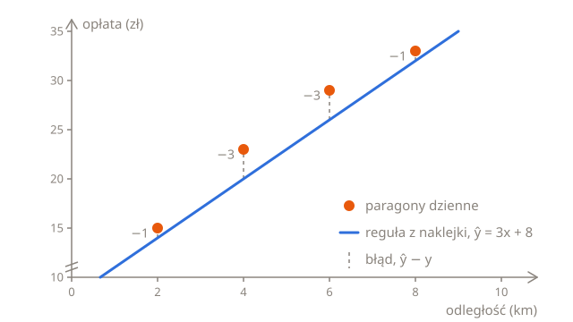

# Mierzenie błędu

Na końcu lekcji [Przewidywanie](01-predictions.pl.md) cztery paragony dzienne dały trzy różne odpowiedzi na pytanie o cennik taksówki, zależnie od wybranej pary. Żeby wybrać jedną z tych prostych, potrzebujesz oceny: jednej liczby, która mówi, jak daleko predykcje prostej są od prawdziwych opłat. Ta lekcja buduje tę ocenę, **błąd średniokwadratowy**, krok po kroku.

## Predykcje a paragony

W nocy ulice są puste i taksówka nigdy nie czeka, więc jej opłaty dokładnie trzymają się naklejki. Oto cztery kursy nocne razem z tym, co przewiduje dla nich reguła z naklejki, $w = 3$ i $b = 8$:

| Odległość $x$ | Prawdziwa opłata $y$ | Predykcja $\hat{y}$ | Błąd $\hat{y} - y$ |
| ------------- | -------------------- | ------------------- | ------------------ |
| 2             | 14                   | 14                  | 0                  |
| 4             | 20                   | 20                  | 0                  |
| 6             | 26                   | 26                  | 0                  |
| 8             | 32                   | 32                  | 0                  |

**Błąd** predykcji to predykcja minus prawdziwa wartość: $\hat{y} - y$. W nocy każdy błąd wynosi 0, bo prosta przechodzi przez każdy punkt.

W dzień taksówka czeka na światłach i w korkach, a postój kosztuje dodatkowo, tylko że paragony tego nie pokazują. Ta sama reguła na czterech kursach dziennych:

| $x$ | $y$ | $\hat{y}$ | $\hat{y} - y$ |
| --- | --- | --------- | ------------- |
| 2   | 15  | 14        | −1            |
| 4   | 23  | 20        | −3            |
| 6   | 29  | 26        | −3            |
| 8   | 33  | 32        | −1            |

Ujemny błąd oznacza, że predykcja była za niska: drugi kurs kosztował o 3 więcej, niż mówiła reguła. Dodatni błąd oznacza, że była za wysoka. Na wykresie każdy błąd to odstęp między paragonem a prostą:



## Od czterech błędów do jednej oceny

Żeby porównywać proste, cztery błędy muszą stać się jedną liczbą. Dodanie ich wygląda na oczywisty sposób, ale zawodzi. Weź płaską prostą, która przewiduje 25 dla każdego kursu, niezależnie od jego długości: $w = 0$ i $b = 25$. Jej błędy to 25 − 15 = 10, 25 − 23 = 2, 25 − 29 = −4 i 25 − 33 = −8, a ich suma wynosi 0, jakby prosta była idealna. A nie jest: na samym pierwszym kursie myli się o 10. Błędy za wysokie znoszą się z błędami za niskimi.

Podnoszenie do kwadratu to naprawia. Liczba pomnożona przez siebie nigdy nie jest ujemna, więc (−3)² to 9, tyle samo co 3², i nic nie może się znieść. Kwadrat sprawia też, że duże pomyłki liczą się bardziej niż małe: błąd 10 dodaje do sumy 100, a błąd 2 tylko 4.

Ocena powstaje w pięciu krokach:

1. **Przewidź** każdą opłatę za pomocą prostej.
2. **Odejmij** prawdziwą opłatę, żeby dostać każdy błąd.
3. **Podnieś** każdy błąd do kwadratu.
4. **Dodaj** kwadraty.
5. **Podziel** przez liczbę kursów, żeby dostać średnią.

Dla reguły z naklejki na paragonach dziennych:

| $x$ | $y$ | $\hat{y}$ | $\hat{y} - y$ | $(\hat{y} - y)^2$ |
| --- | --- | --------- | ------------- | ----------------- |
| 2   | 15  | 14        | −1            | 1                 |
| 4   | 23  | 20        | −3            | 9                 |
| 6   | 29  | 26        | −3            | 9                 |
| 8   | 33  | 32        | −1            | 1                 |

Kwadraty sumują się do 1 + 9 + 9 + 1 = 20, a 20 ÷ 4 kursy = 5. Średnia kwadratów błędów to **błąd średniokwadratowy** (ang. mean squared error, MSE). Im jest mniejszy, tym bliżej paragonów jest prosta, a 0 oznacza, że przechodzi przez każdy z nich.

Dzielenie przez liczbę kursów sprawia, że oceny da się porównywać. Bez niego 400 paragonów dostałoby ocenę mniej więcej 100 razy gorszą niż 4, tylko dlatego, że jest ich więcej.

## W Pythonie

Te same pięć kroków w pętli. `i` przechodzi przez pozycje na listach, 0, 1, 2 i 3, więc `kms[i]` i `fares[i]` to odległość i opłata tego samego kursu:

```python run
kms = [2, 4, 6, 8]
fares = [15, 23, 29, 33]
w = 3
b = 8

total = 0
for i in range(len(kms)):
    prediction = w * kms[i] + b
    error = prediction - fares[i]
    total += error * error
print(total / len(kms))
```

Wypisuje `5.0`, bo `/` zawsze daje liczbę zmiennoprzecinkową. Zmień `w` i `b` i uruchom kod jeszcze raz, żeby ocenić inne proste.

## Te same kroki w symbolach

Matematyka zapisuje całą pętlę w jednym wierszu:

$$
\text{MSE} = \frac{1}{n} \sum_{i=1}^{n} \left( \hat{y}_i - y_i \right)^2
$$

Czytaj go od środka, a każda jego część okaże się krokiem pętli:

- $\hat{y}_i - y_i$ to błąd kursu numer $i$: jego predykcja minus jego prawdziwa opłata. Małe $i$ mówi, o który kurs chodzi, jak `[i]` w Pythonie.
- $(\hat{y}_i - y_i)^2$ to ten błąd podniesiony do kwadratu.
- $\sum$, grecka wielka litera sigma, oznacza **zsumuj**. $i = 1$ pod nią i $n$ nad nią mówią, co zsumować: kwadrat błędu dla $i = 1$, potem dla $i = 2$ i tak dalej, aż do $i = n$. To pętla `for` z `total +=`.
- $n$ to liczba kursów, `len(kms)`, a $\frac{1}{n}$ razy suma to suma podzielona przez $n$, czyli średnia.

Jedyna różnica to miejsce, od którego zaczyna się liczenie. Matematyka numeruje kursy od 1, a Python od 0, więc kurs $i = 1$ to `kms[0]`.

Każda predykcja $\hat{y}_i$ to $w x_i + b$, a paragony są te same, niezależnie od tego, jaką prostą sprawdzasz, więc MSE zależy tylko od $w$ i $b$. Dlatego zapisuje się go też jako $L(w, b)$, **stratę** prostej o tych parametrach:

$$
L(w, b) = \frac{1}{n} \sum_{i=1}^{n} \left( w x_i + b - y_i \right)^2
$$

„Strata” (ang. loss) to ogólna nazwa takiej oceny, przy której mniej znaczy lepiej. Błąd średniokwadratowy to zwykła funkcja straty przy przewidywaniu liczb, a inne zadania używają innych funkcji straty.

## Porównywanie prostych

Mając ocenę, można porównać proste z par paragonów, razem z regułą z naklejki i jeszcze jedną prostą:

| $w$ | $b$ | Skąd się wzięła          | MSE |
| --- | --- | ------------------------ | --- |
| 3   | 8   | naklejka                 | 5   |
| 4   | 7   | paragony za 2 km i 4 km  | 10  |
| 3   | 11  | paragony za 4 km i 6 km  | 2   |
| 2   | 17  | paragony za 6 km i 8 km  | 10  |
| 3   | 10  | najlepsza możliwa prosta | 1   |

Ostatnia prosta nie przechodzi przez żaden paragon, ale nigdy nie myli się o więcej niż 1 i żadna inna prosta nie ma lepszej oceny. W następnej lekcji zobaczysz, jak ją znaleźć bez zgadywania.

Jej wyraz wolny jest o 2 większy niż na naklejce, a wyjaśnia to postój. Te cztery kursy stały w korku 2, 6, 6 i 2 minuty, średnio 4 minuty, a 4 minuty po 0,50 zł to 2. Prosta nie widzi postoju, więc dolicza jego średni koszt do każdej opłaty. Z minutami jako drugą cechą model z części [Więcej niż jedno wejście](01-predictions.pl.md#więcej-niż-jedno-wejście), z $w_1 = 3$, $w_2 = 0{,}5$ i $b = 8$, trafiałby w każdą opłatę dzienną, z MSE równym 0.

## Punkt odniesienia

Czy MSE równy 1 to dobry wynik? Sama liczba tego nie mówi, bo zależy od jednostek: te same opłaty w groszach dostałyby ocenę 10 000 razy wyższą. Dlatego ocenę porównuje się z **punktem odniesienia** (ang. baseline), czyli oceną modelu tak prostego, że całkiem ignoruje swoje wejście.

Zwykły punkt odniesienia przewiduje tę samą opłatę dla każdego kursu: średnią opłatę. Cztery opłaty dzienne sumują się do 15 + 23 + 29 + 33 = 100, więc średnia to 25, czyli płaska prosta z wcześniejszego przykładu. Jej błędy to 10, 2, −4 i −8, ich kwadraty to 100, 4, 16 i 64, a jej MSE to 184 ÷ 4 = 46.

Prosta z MSE równym 1, przy punkcie odniesienia 46, sporo się nauczyła z odległości. Model z oceną gorszą od punktu odniesienia radzi sobie gorzej, niż gdyby ignorował swoje wejście, a to pewny znak, że coś jest nie tak.

Dlaczego średnia, a nie jakaś inna opłata? Bo spośród wszystkich płaskich prostych ta na wysokości średniej ma najmniejszy MSE. Sprawdź: płaska prosta na 24 albo na 26 dostaje 47, a im dalej od 25, tym gorzej.

## Podsumowanie

- Błąd predykcji to predykcja minus prawdziwa wartość, $\hat{y} - y$.
- Błędy podnosi się do kwadratu, żeby nie mogły się znosić i żeby duże pomyłki liczyły się bardziej.
- Błąd średniokwadratowy to średnia kwadratów błędów: $L(w, b) = \frac{1}{n} \sum_{i=1}^{n} (\hat{y}_i - y_i)^2$. $\sum$ sumuje, jak pętla `for`.
- Ocena coś znaczy dopiero obok punktu odniesienia, takiego jak przewidywanie zawsze średniej.

## Sprawdź się

<details>
<summary>Błędy prostej na czterech kursach to 2, −2, 2 i −2. Ile wynosi ich suma i jaki jest MSE prostej?</summary>

Ich suma to 0, przez co prosta wyglądałaby na idealną. Po podniesieniu do kwadratu każdy wynosi 4, więc MSE to 16 ÷ 4 = 4.

</details>

<details>
<summary>Dwie proste mają na tych samych paragonach MSE równy 4 i 9. O ile mniej więcej każda z nich myli się na typowym kursie?</summary>

Mniej więcej o 2 i o 3. MSE jest w złotych do kwadratu, a pierwiastek kwadratowy przywraca złote: √4 = 2 i √9 = 3.

</details>

<details>
<summary>Dlaczego najlepsza prosta nie może mieć na tych samych paragonach gorszej oceny niż punkt odniesienia?</summary>

Punkt odniesienia też jest prostą, taką z $w = 0$. Najlepsza prosta to najlepsza ze wszystkich prostych, także płaskich, więc w najgorszym razie jest nią sam punkt odniesienia.

</details>

## Twoja kolej

W ćwiczeniu [MSE krok po kroku](../../../exercises/04-foundations/02-linear-regression/02-error/01-mse-step-by-step/task.pl.md) zapiszesz ocenę jako małe funkcje, po jednej na każdy krok, żeby niezaliczone sprawdzenie wskazywało krok, w którym coś poszło nie tak. W ćwiczeniu [Oceń prostą](../../../exercises/04-foundations/02-linear-regression/02-error/02-grade-a-guess/task.pl.md) ocenisz dowolną prostą na dowolnych paragonach, a do tego punkt odniesienia.
