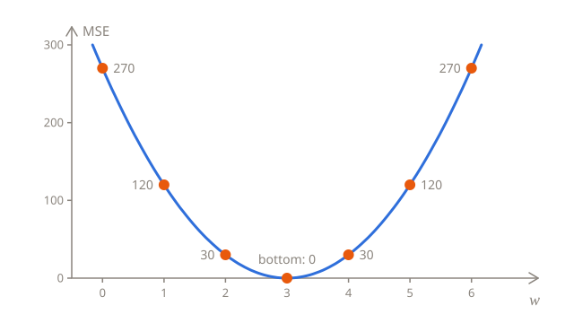
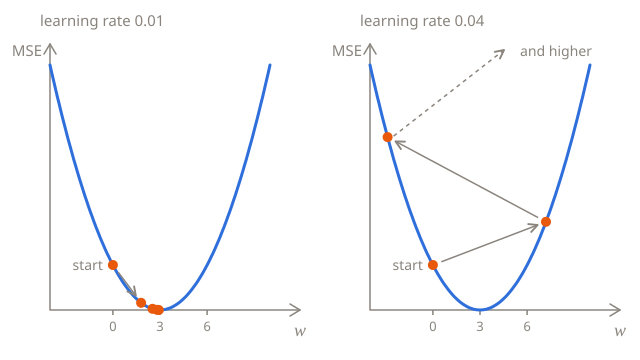

# Training

[Measuring the error](02-error.md) gave every line a score, its MSE, and among a handful of guesses, one line scored best. Guessing doesn't get far, though: a model with a million parameters can't be guessed. **Training** finds the parameters with the lowest loss by itself, by repeating one simple move: change the parameters a little, in the direction that makes the loss smaller.

This lesson starts with a single parameter, where the whole idea fits in one picture, and then trains both.

## One parameter: a bowl

Take the night rides, whose fares follow the sticker exactly, and say you already know that the starting fee is 8. Only the price per km, $w$, is left to find. Here's the MSE for a few values of $w$:

| $w$ | 0   | 1   | 2   | 3   | 4   | 5   | 6   |
| --- | --- | --- | --- | --- | --- | --- | --- |
| MSE | 270 | 120 | 30  | 0   | 30  | 120 | 270 |

The loss is 0 at $w = 3$, the sticker's price, and the further $w$ is from 3, on either side, the higher the loss. On a chart, it's a bowl, and training means getting to the bottom of it:



## Which way is down?

Training can't see the whole bowl, only the loss where it is. But it can find out which way is down: nudge $w$ a little, and see whether the loss drops. This `loss` function works out the MSE of the night rides for any $w$, with the bias fixed at 8:

```python run
kms = [2, 4, 6, 8]
fares = [14, 20, 26, 32]
b = 8


def loss(w):
    total = 0
    for i in range(len(kms)):
        error = w * kms[i] + b - fares[i]
        total += error * error
    return total / len(kms)


print(round(loss(1), 2))
print(round(loss(1.1), 2))
```

`round(x, 2)` rounds `x` to 2 decimal places. Without it, the second line would print 108.29999999999998: a computer stores most decimal fractions, like 0.1, only approximately, so results with a decimal point can be a tiny bit off.

At $w = 1$, the loss is 120, and at $w = 1.1$, it's 108.3. It dropped, so a bigger $w$ is the way down. At $w = 5$, it's the other way around: the loss is 120 at 5 but 132.3 at 5.1, so a bigger $w$ is the way up, and down is towards a smaller $w$.

The nudge says more than the direction. The loss dropped by 11.7 while $w$ grew by 0.1, so it drops about 117 for each 1 added to $w$. That rate is the **slope** of the bowl, and at $w = 1$ it's about −117, where the minus means that the loss goes down as $w$ goes up. Far from the bottom, where the bowl is steep, the slope is a big number, and near the bottom, where it's almost flat, the slope is close to 0.

## A formula for the slope

Nudging works, but it takes an extra pass through all the receipts for every parameter, and the answer depends on the size of the nudge. Calculus gives the slope exactly, as a formula called the **derivative**. For the MSE, the derivative for $w$ is:

$$
\frac{\partial L}{\partial w} = \frac{2}{n} \sum_{i=1}^{n} \left( \hat{y}_i - y_i \right) x_i
$$

$\frac{\partial L}{\partial w}$ reads "the derivative of $L$ with respect to $w$", and it means the slope of the loss when only $w$ changes. The formula is a recipe: multiply each ride's error by the ride's distance, add the products up, and multiply the sum by $\frac{2}{n}$, which is the same as dividing it by $n$ and doubling it.

At $w = 1$, the night rides are predicted as 10, 12, 14 and 16, so the errors are −4, −8, −12 and −16:

| $x$ | Error $\hat{y} - y$ | Error × $x$ |
| --- | ------------------- | ----------- |
| 2   | −4                  | −8          |
| 4   | −8                  | −32         |
| 6   | −12                 | −72         |
| 8   | −16                 | −128        |

The products add up to −240, and $\frac{2}{4} \times (-240) = -120$. The nudge gave about −117 because it measured the slope over a stretch of 0.1, where the bowl already gets flatter. With a nudge of 0.001, it would give −119.97, and the smaller the nudge, the closer it gets to −120.

<details>
<summary>Where does the formula come from?</summary>

Take one ride, whose error is $e = wx + b - y$. If $w$ grows by a small amount $h$, the prediction grows by $hx$, so the error becomes $e + hx$, and the squared error becomes

$$
(e + hx)^2 = e^2 + 2ehx + h^2 x^2
$$

The squared error grew by $2ehx + h^2 x^2$. Dividing by $h$ gives the growth for each 1 added to $w$: $2ex + hx^2$. The smaller the nudge $h$, the less $hx^2$ matters, and as $h$ shrinks towards 0, only $2ex$ is left. That's the slope for one ride. The MSE is the average over the rides, so its slope is the average of theirs: $\frac{1}{n} \sum 2 e_i x_i$, which is the formula above, with the 2 moved to the front.

</details>

## One step downhill

The slope says which way is down. When it's negative, the loss drops as $w$ grows, so $w$ should grow, and when it's positive, $w$ should shrink. So each step moves $w$ against the slope:

$$
w \leftarrow w - \eta \, \frac{\partial L}{\partial w}
$$

The arrow means "replace": work out the right side, and make it the new $w$, just like `w = w - learning_rate * slope` in Python. $\eta$, the Greek letter eta, is the **learning rate**, a small number that sets how big the steps are. Taking the slope away, rather than adding it, is what makes every step go downhill.

From $w = 0$, with a learning rate of 0.01:

| Step | $w$  | Slope | $w - 0.01 \times \text{slope}$ |
| ---- | ---- | ----- | ------------------------------ |
| 1    | 0    | −180  | 0 + 1.8 = 1.8                  |
| 2    | 1.8  | −72   | 1.8 + 0.72 = 2.52              |
| 3    | 2.52 | −28.8 | 2.52 + 0.288 = 2.808           |

The steps get shorter by themselves: each step is the slope times the learning rate, and the slope gets smaller as the bowl flattens out near the bottom. Here are ten steps:

```python run
kms = [2, 4, 6, 8]
fares = [14, 20, 26, 32]
b = 8
w = 0
learning_rate = 0.01

for step in range(10):
    slope = 0
    for i in range(len(kms)):
        error = w * kms[i] + b - fares[i]
        slope += 2 * error * kms[i] / len(kms)
    w = w - learning_rate * slope
    print(round(w, 4))
```

After ten steps, $w$ is 2.9997, and a few more would take it as close to 3 as you like.

## The learning rate

The learning rate is up to you, and it matters. Try 0.001, 0.03 and 0.04 in the code above:

- With **0.001**, the steps are 10 times shorter. After ten steps, $w$ is only 1.3842, and it takes about 100 steps to get within 0.01 of 3.
- With **0.03**, every step jumps over the bottom to the other side of the bowl: 5.4, 1.08, 4.536, 1.7712 and so on. It gets there in the end, but in a zigzag.
- With **0.04**, every jump lands higher up the other side than it started: 7.2, −2.88, 11.232, −8.5248. The loss grows with every step, and $w$ runs off towards huge numbers. The training has **diverged**.



> [!TIP]
> If the loss grows or jumps around, the learning rate is too big. If it barely moves, it's too small.

## Both parameters at once

Back to the day receipts, where neither number is known. The loss now depends on $w$ and $b$ together, and each has its own slope: how fast the loss changes when only $w$ changes, and when only $b$ changes. The slope for $w$ is the formula from before. The one for $b$ is the same without the $x_i$, because each 1 added to $b$ adds exactly 1 to every prediction, whatever the distance:

$$
\frac{\partial L}{\partial b} = \frac{2}{n} \sum_{i=1}^{n} \left( \hat{y}_i - y_i \right)
$$

Each step moves both parameters against their own slopes:

$$
w \leftarrow w - \eta \, \frac{\partial L}{\partial w}
\qquad
b \leftarrow b - \eta \, \frac{\partial L}{\partial b}
$$

Work out both slopes first, from the same $w$ and $b$, and only then change the parameters. If you change $w$ first, the slope for $b$ is worked out with the new $w$, and it's no longer the slope where you were standing.

The two slopes together are called the **gradient**, and training by stepping against the gradient, over and over, is called **gradient descent**. Neural networks learn the same way, with millions of parameters instead of two. Here it is on the day receipts, starting from $w = 0$ and $b = 0$. Every 1,000 steps, it prints the step, the loss, $w$ and $b$:

```python run
kms = [2, 4, 6, 8]
fares = [15, 23, 29, 33]
w = 0
b = 0
learning_rate = 0.01
n = len(kms)

for step in range(5001):
    total = 0
    slope_w = 0
    slope_b = 0
    for i in range(n):
        error = w * kms[i] + b - fares[i]
        total += error * error
        slope_w += 2 * error * kms[i] / n
        slope_b += 2 * error / n
    if step % 1000 == 0:
        print(step, round(total / n, 2), round(w, 2), round(b, 2))
    w = w - learning_rate * slope_w
    b = b - learning_rate * slope_b
```

The loss falls from 671 to 1, and the line ends at $w = 3$ and $b = 10$, the best line from the last lesson. The loss can't get to 0, because no line goes through all four receipts.

Try a learning rate of 0.02: it gets there about twice as fast. With 0.04, it diverges: the numbers grow until they're too big for Python to hold. By step 1,000, the loss is `inf`, for infinity, and after that, everything is `nan`, for "not a number".

## Why not solve it directly?

For two receipts, [Making predictions](01-predictions.md#where-do-w-and-b-come-from) worked out $w$ and $b$ directly, without any steps. Linear regression has a direct solution for any number of receipts too, shown in [The normal equation](#the-normal-equation) at the end of this lesson. But almost no other model has one: [logistic regression](../03-logistic-regression/), neural networks and language models can only be trained step by step. Gradient descent works for all of them, which is why it's worth learning on the simplest model first.

## The whole method on one page

Everything from the three lessons, in one place:

1. **The model** predicts with a weight and a bias: $\hat{y} = wx + b$.
2. **The loss** is the mean squared error: $L(w, b) = \frac{1}{n} \sum_{i=1}^{n} (\hat{y}_i - y_i)^2$.
3. **The gradient** is the slope of the loss for each parameter:

$$
\frac{\partial L}{\partial w} = \frac{2}{n} \sum_{i=1}^{n} \left( \hat{y}_i - y_i \right) x_i
\qquad
\frac{\partial L}{\partial b} = \frac{2}{n} \sum_{i=1}^{n} \left( \hat{y}_i - y_i \right)
$$

4. **Each step** moves the parameters against the gradient, scaled by the learning rate $\eta$:

$$
w \leftarrow w - \eta \, \frac{\partial L}{\partial w}
\qquad
b \leftarrow b - \eta \, \frac{\partial L}{\partial b}
$$

5. **Repeat** until the loss stops dropping. If it grows instead, lower the learning rate.

You'll often see the same training written with NumPy, a library that works on whole lists of numbers at once. You don't need it yet, but it helps to recognize the method in this form. `w * kms + b` works out every prediction in one go, `np.mean` averages a whole list, and `w -= x` is short for `w = w - x`, so the loop over the rides disappears:

```python run
import numpy as np

kms = np.array([2, 4, 6, 8])
fares = np.array([15, 23, 29, 33])
w = 0
b = 0
learning_rate = 0.01

for step in range(5000):
    errors = w * kms + b - fares
    w -= learning_rate * 2 * np.mean(errors * kms)
    b -= learning_rate * 2 * np.mean(errors)

print(round(w, 2), round(b, 2))
```

## Going further

This part is optional. Nothing later in the chapter depends on it, and the test doesn't ask about it.

### More inputs: vectors

With $d$ features, the prediction is $\hat{y} = w_1 x_1 + w_2 x_2 + \dots + w_d x_d + b$, which gets long to write. So the features of one example go into a list of numbers called a **vector**, $x = (x_1, x_2, \dots, x_d)$, and the weights into another, $w = (w_1, w_2, \dots, w_d)$. Multiplying two vectors item by item and adding up the products is their **dot product**, written $w^\top x$:

$$
\hat{y} = w^\top x + b = w_1 x_1 + w_2 x_2 + \dots + w_d x_d + b
$$

For a 4 km ride with 6 minutes of waiting, $x = (4, 6)$, and with the prices from the sticker, $w = (3, 0.5)$. Then $w^\top x = 3 \times 4 + 0.5 \times 6 = 15$, and $\hat{y} = 15 + 8 = 23$. Training works the same way, with one slope for each weight: the slope for $w_j$ is the one for $w$ above, with $x_i$ replaced by feature $j$ of ride $i$.

### The normal equation

Linear regression is one of the few models with an exact solution. Put the examples in a matrix $X$, a table with one row for each ride, one column for each feature, and a column of ones for the bias. Put the labels in a vector $y$. The parameters with the lowest loss, $\theta$ (the Greek letter theta), a vector with the weights and the bias, solve the **normal equation**:

$$
X^\top X \, \theta = X^\top y \quad\Longrightarrow\quad \theta = \left( X^\top X \right)^{-1} X^\top y
$$

$X^\top$ is $X$ with its rows and columns swapped, and $(X^\top X)^{-1}$ is the inverse of $X^\top X$, which for matrices takes the place of dividing. NumPy solves the equation in one call. With the minutes of waiting as a second feature, it finds the sticker's prices, waiting included:

```python run
import numpy as np

X = np.array([
    [2, 2, 1],
    [4, 6, 1],
    [6, 6, 1],
    [8, 2, 1],
])
fares = np.array([15, 23, 29, 33])
print(np.linalg.lstsq(X, fares)[0].round(2))
```

Each row of `X` is one day ride: its distance, its minutes of waiting, and a 1 for the bias. The result is the price per km, the price per minute of waiting and the starting fee, 3, 0.5 and 8, and with them, every day fare comes out exactly right. `lstsq` solves the equation without working out the inverse, which is faster and more accurate.

So why use gradient descent at all? Solving the equation gets slow with many features, and most models have no such equation. Gradient descent works for all of them.

## Check yourself

<details>
<summary>The slope for w is 0. Where are you, and what does a step do?</summary>

At the bottom of the bowl, where it's flat. The step is the learning rate times the slope, 0, so $w$ stays where it is: training has found the best $w$.

</details>

<details>
<summary>Training on the day receipts ends with a loss of 1, not 0. Did it fail?</summary>

No. A loss of 0 needs a line through all four receipts, and there's none, because the receipts don't show the waiting. 1 is the lowest loss any line can get on them.

</details>

<details>
<summary>What happens with a learning rate of 0.02 on the day receipts? And with 0.04?</summary>

With 0.02, the training gets to $w = 3$ and $b = 10$ about twice as fast. With 0.04, it diverges: every step overshoots the bottom by more than the last, and the loss grows until the numbers are too big for Python. Try both.

</details>

## Your turn

In [One step downhill](../../../exercises/04-foundations/02-linear-regression/03-training/01-one-step-downhill/task.md), you'll work out the slopes for both parameters and take a single step. In [Train it](../../../exercises/04-foundations/02-linear-regression/03-training/02-train-it/task.md), you'll put the steps in a loop and train a line on any receipts.
