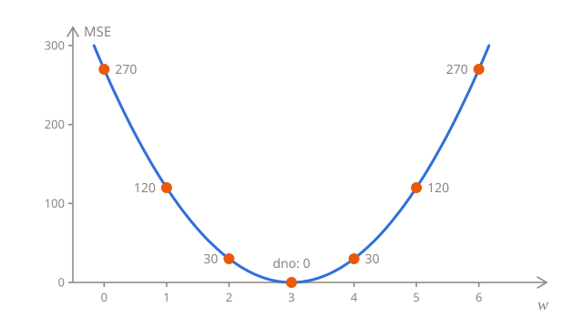
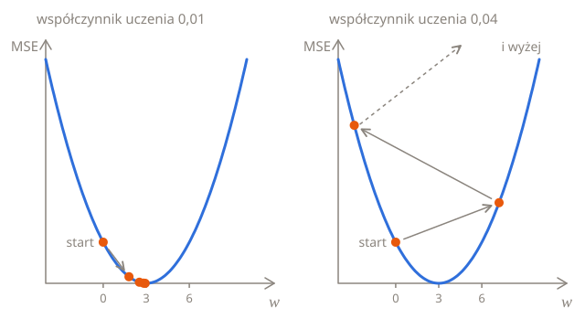

# Trening

Lekcja [Mierzenie błędu](02-error.pl.md) dała każdej prostej ocenę, jej MSE, i spośród kilku strzałów jedna prosta wypadła najlepiej. Zgadywaniem nie zajdzie się jednak daleko: modelu z milionem parametrów nie da się zgadnąć. **Trening** sam znajduje parametry z najmniejszą stratą, powtarzając jeden prosty ruch: zmień parametry odrobinę, w kierunku, w którym strata maleje.

Ta lekcja zaczyna od jednego parametru, przy którym cały pomysł mieści się na jednym obrazku, a potem trenuje oba.

## Jeden parametr: miska

Weź kursy nocne, których opłaty dokładnie trzymają się naklejki, i załóż, że opłatę początkową już znasz: to 8. Do znalezienia zostaje tylko cena za km, $w$. Oto MSE dla kilku wartości $w$:

| $w$ | 0   | 1   | 2   | 3   | 4   | 5   | 6   |
| --- | --- | --- | --- | --- | --- | --- | --- |
| MSE | 270 | 120 | 30  | 0   | 30  | 120 | 270 |

Strata wynosi 0 przy $w = 3$, cenie z naklejki, a im dalej $w$ jest od 3, w którąkolwiek stronę, tym wyższa strata. Na wykresie to miska, a trening polega na dotarciu do jej dna:



## Gdzie jest w dół?

Trening nie widzi całej miski, tylko stratę w miejscu, w którym jest. Może jednak sprawdzić, gdzie jest w dół: przesunąć $w$ odrobinę i zobaczyć, czy strata spada. Ta funkcja `loss` liczy MSE kursów nocnych dla dowolnego $w$, z wyrazem wolnym ustalonym na 8:

```python run
kms = [2, 4, 6, 8]
fares = [14, 20, 26, 32]
b = 8


def loss(w):
    total = 0
    for i in range(len(kms)):
        error = w * kms[i] + b - fares[i]
        total += error * error
    return total / len(kms)


print(round(loss(1), 2))
print(round(loss(1.1), 2))
```

`round(x, 2)` zaokrągla `x` do 2 miejsc po przecinku. Bez tego drugi wiersz wypisałby `108.29999999999998`: komputer przechowuje większość ułamków dziesiętnych, takich jak 0,1, tylko w przybliżeniu, więc wyniki z częścią ułamkową mogą się odrobinę różnić od dokładnych.

Przy $w = 1$ strata wynosi 120, a przy $w = 1{,}1$ już tylko 108,3. Spadła, więc większe $w$ to droga w dół. Przy $w = 5$ jest odwrotnie: strata wynosi 120 przy 5, ale 132,3 przy 5,1, więc większe $w$ to droga w górę, a w dół prowadzi mniejsze $w$.

Przesunięcie mówi więcej niż sam kierunek. Strata spadła o 11,7, gdy $w$ wzrosło o 0,1, więc spada mniej więcej o 117 na każde 1 dodane do $w$. To tempo to **nachylenie** miski, a przy $w = 1$ wynosi ono około −117, gdzie minus oznacza, że strata maleje, gdy $w$ rośnie. Daleko od dna, gdzie miska jest stroma, nachylenie jest dużą liczbą, a blisko dna, gdzie jest prawie płaska, nachylenie jest bliskie 0.

## Wzór na nachylenie

Przesuwanie działa, ale dla każdego parametru wymaga dodatkowego przejścia przez wszystkie paragony, a wynik zależy od wielkości przesunięcia. Rachunek różniczkowy podaje nachylenie dokładnie, jako wzór zwany **pochodną**. Dla MSE pochodna względem $w$ to:

$$
\frac{\partial L}{\partial w} = \frac{2}{n} \sum_{i=1}^{n} \left( \hat{y}_i - y_i \right) x_i
$$

$\frac{\partial L}{\partial w}$ czyta się „pochodna $L$ względem $w$” i oznacza nachylenie straty, gdy zmienia się tylko $w$. Wzór to przepis: pomnóż błąd każdego kursu przez jego odległość, zsumuj iloczyny i pomnóż sumę przez $\frac{2}{n}$, czyli podziel ją przez $n$ i podwój.

Przy $w = 1$ kursy nocne mają predykcje 10, 12, 14 i 16, więc błędy to −4, −8, −12 i −16:

| $x$ | Błąd $\hat{y} - y$ | Błąd × $x$ |
| --- | ------------------ | ---------- |
| 2   | −4                 | −8         |
| 4   | −8                 | −32        |
| 6   | −12                | −72        |
| 8   | −16                | −128       |

Iloczyny sumują się do −240, a $\frac{2}{4} \times (-240) = -120$. Przesunięcie dało około −117, bo zmierzyło nachylenie na odcinku długości 0,1, na którym miska już się spłaszcza. Przy przesunięciu o 0,001 dałoby −119,97, a im mniejsze przesunięcie, tym bliżej −120.

<details>
<summary>Skąd się bierze ten wzór?</summary>

Weź jeden kurs, którego błąd to $e = wx + b - y$. Jeśli $w$ wzrośnie o małą wartość $h$, predykcja wzrośnie o $hx$, więc błąd będzie wynosił $e + hx$, a kwadrat błędu

$$
(e + hx)^2 = e^2 + 2ehx + h^2 x^2
$$

Kwadrat błędu wzrósł o $2ehx + h^2 x^2$. Po podzieleniu przez $h$ dostajesz wzrost na każde 1 dodane do $w$: $2ex + hx^2$. Im mniejsze przesunięcie $h$, tym mniej znaczy $hx^2$, a gdy $h$ maleje do 0, zostaje tylko $2ex$. To nachylenie dla jednego kursu. MSE to średnia po kursach, więc jego nachylenie to średnia ich nachyleń: $\frac{1}{n} \sum 2 e_i x_i$, czyli wzór powyżej, z dwójką przeniesioną na początek.

</details>

## Jeden krok w dół

Nachylenie mówi, gdzie jest w dół. Gdy jest ujemne, strata spada, gdy $w$ rośnie, więc $w$ powinno wzrosnąć, a gdy jest dodatnie, $w$ powinno zmaleć. Każdy krok przesuwa więc $w$ przeciwnie do nachylenia:

$$
w \leftarrow w - \eta \, \frac{\partial L}{\partial w}
$$

Strzałka oznacza „zastąp”: policz prawą stronę i zrób z niej nowe $w$, tak jak `w = w - learning_rate * slope` w Pythonie. $\eta$, grecka litera eta, to **współczynnik uczenia** (ang. learning rate), mała liczba, która ustala długość kroków. To odejmowanie nachylenia, a nie dodawanie, sprawia, że każdy krok prowadzi w dół.

Od $w = 0$, ze współczynnikiem uczenia 0,01:

| Krok | $w$  | Nachylenie | $w - 0{,}01 \times \text{nachylenie}$ |
| ---- | ---- | ---------- | ------------------------------------- |
| 1    | 0    | −180       | 0 + 1,8 = 1,8                         |
| 2    | 1,8  | −72        | 1,8 + 0,72 = 2,52                     |
| 3    | 2,52 | −28,8      | 2,52 + 0,288 = 2,808                  |

Kroki same się skracają: każdy krok to nachylenie razy współczynnik uczenia, a nachylenie maleje, gdy miska spłaszcza się przy dnie. Oto dziesięć kroków:

```python run
kms = [2, 4, 6, 8]
fares = [14, 20, 26, 32]
b = 8
w = 0
learning_rate = 0.01

for step in range(10):
    slope = 0
    for i in range(len(kms)):
        error = w * kms[i] + b - fares[i]
        slope += 2 * error * kms[i] / len(kms)
    w = w - learning_rate * slope
    print(round(w, 4))
```

Po dziesięciu krokach $w$ wynosi 2,9997, a kilka kolejnych zbliżyłoby je do 3 tak bardzo, jak tylko chcesz.

## Współczynnik uczenia

Współczynnik uczenia wybierasz ty i ma on duże znaczenie. Wpisz w kodzie powyżej `0.001`, `0.03` i `0.04`:

- Przy **0,001** kroki są 10 razy krótsze. Po dziesięciu krokach $w$ wynosi tylko 1,3842, a zbliżenie się do 3 na mniej niż 0,01 zajmuje około 100 kroków.
- Przy **0,03** każdy krok przeskakuje dno na drugą stronę miski: 5,4; 1,08; 4,536; 1,7712 i tak dalej. Trening w końcu dociera na miejsce, ale zygzakiem.
- Przy **0,04** każdy skok ląduje po drugiej stronie wyżej, niż się zaczął: 7,2; −2,88; 11,232; −8,5248. Strata rośnie z każdym krokiem, a $w$ ucieka w stronę ogromnych liczb. Trening się **rozbiegł**.



> [!TIP]
> Jeśli strata rośnie albo skacze, współczynnik uczenia jest za duży. Jeśli prawie się nie zmienia, jest za mały.

## Oba parametry naraz

Wróćmy do paragonów dziennych, na których nie znamy żadnej z liczb. Strata zależy teraz od $w$ i $b$ jednocześnie, a każdy z nich ma własne nachylenie: jak szybko zmienia się strata, gdy zmienia się tylko $w$, i gdy zmienia się tylko $b$. Nachylenie względem $w$ to wzór z wcześniejszej części. To względem $b$ jest takie samo, tylko bez $x_i$, bo każde 1 dodane do $b$ dodaje dokładnie 1 do każdej predykcji, niezależnie od odległości:

$$
\frac{\partial L}{\partial b} = \frac{2}{n} \sum_{i=1}^{n} \left( \hat{y}_i - y_i \right)
$$

Każdy krok przesuwa oba parametry przeciwnie do ich własnych nachyleń:

$$
w \leftarrow w - \eta \, \frac{\partial L}{\partial w}
\qquad
b \leftarrow b - \eta \, \frac{\partial L}{\partial b}
$$

Najpierw policz oba nachylenia, z tych samych $w$ i $b$, a dopiero potem zmień parametry. Jeśli najpierw zmienisz $w$, nachylenie względem $b$ policzy się już z nowym $w$ i nie będzie nachyleniem w miejscu, w którym stoisz.

Oba nachylenia razem nazywa się **gradientem**, a trening przez robienie kroków przeciwnie do gradientu, raz za razem, nazywa się **spadkiem gradientu** (ang. gradient descent). [Sieci neuronowe](../04-neural-networks/) uczą się tak samo, tylko z milionami parametrów zamiast dwóch. Oto spadek gradientu na paragonach dziennych, od $w = 0$ i $b = 0$. Co 1000 kroków kod wypisuje numer kroku, stratę, $w$ i $b$:

```python run
kms = [2, 4, 6, 8]
fares = [15, 23, 29, 33]
w = 0
b = 0
learning_rate = 0.01
n = len(kms)

for step in range(5001):
    total = 0
    slope_w = 0
    slope_b = 0
    for i in range(n):
        error = w * kms[i] + b - fares[i]
        total += error * error
        slope_w += 2 * error * kms[i] / n
        slope_b += 2 * error / n
    if step % 1000 == 0:
        print(step, round(total / n, 2), round(w, 2), round(b, 2))
    w = w - learning_rate * slope_w
    b = b - learning_rate * slope_b
```

Strata spada z 671 do 1, a prosta kończy z $w = 3$ i $b = 10$, czyli jako najlepsza prosta z poprzedniej lekcji. Strata nie może dojść do 0, bo żadna prosta nie przechodzi przez wszystkie cztery paragony.

Ustaw `learning_rate` na `0.02`: trening dociera na miejsce mniej więcej dwa razy szybciej. Przy `0.04` się rozbiega: liczby rosną, aż stają się za duże, żeby Python mógł je przechować. W kroku 1000 strata to `inf`, czyli nieskończoność, a potem wszystko to `nan`, od ang. „not a number”, czyli „nie liczba”.

## Dlaczego nie rozwiązać tego wprost?

Dla dwóch paragonów lekcja [Przewidywanie](01-predictions.pl.md#skąd-się-biorą-w-i-b) wyznaczyła $w$ i $b$ wprost, bez żadnych kroków. Regresja liniowa ma rozwiązanie wprost także dla dowolnej liczby paragonów. Pokazuje je część [Równanie normalne](#równanie-normalne) na końcu tej lekcji. Prawie żaden inny model go jednak nie ma: [regresję logistyczną](../03-logistic-regression/), [sieci neuronowe](../04-neural-networks/) i modele językowe da się trenować tylko krok po kroku. Spadek gradientu działa dla nich wszystkich i dlatego warto poznać go najpierw na najprostszym modelu.

## Cała metoda na jednej stronie

Wszystko z trzech lekcji w jednym miejscu:

1. **Model** przewiduje za pomocą wagi i wyrazu wolnego: $\hat{y} = wx + b$.
2. **Funkcja straty** to błąd średniokwadratowy: $L(w, b) = \frac{1}{n} \sum_{i=1}^{n} (\hat{y}_i - y_i)^2$.
3. **Gradient** to nachylenie straty względem każdego parametru:

$$
\frac{\partial L}{\partial w} = \frac{2}{n} \sum_{i=1}^{n} \left( \hat{y}_i - y_i \right) x_i
\qquad
\frac{\partial L}{\partial b} = \frac{2}{n} \sum_{i=1}^{n} \left( \hat{y}_i - y_i \right)
$$

4. **Każdy krok** przesuwa parametry przeciwnie do gradientu, przeskalowanego przez współczynnik uczenia $\eta$:

$$
w \leftarrow w - \eta \, \frac{\partial L}{\partial w}
\qquad
b \leftarrow b - \eta \, \frac{\partial L}{\partial b}
$$

5. **Powtarzaj**, aż strata przestanie spadać. Jeśli zamiast tego rośnie, zmniejsz współczynnik uczenia.

Ten sam trening często zobaczysz zapisany z użyciem NumPy, biblioteki, która działa na całych listach liczb naraz. Na razie jej nie potrzebujesz, ale warto rozpoznawać metodę w tej postaci. `w * kms + b` liczy wszystkie predykcje za jednym razem, `np.mean` uśrednia całą listę, a `w -= x` to skrót od `w = w - x`, więc pętla po kursach znika:

```python run
import numpy as np

kms = np.array([2, 4, 6, 8])
fares = np.array([15, 23, 29, 33])
w = 0
b = 0
learning_rate = 0.01

for step in range(5000):
    errors = w * kms + b - fares
    w -= learning_rate * 2 * np.mean(errors * kms)
    b -= learning_rate * 2 * np.mean(errors)

print(round(w, 2), round(b, 2))
```

## Dla chętnych

Ta część jest nieobowiązkowa. Nic dalej w rozdziale od niej nie zależy i test o nią nie pyta.

### Więcej wejść: wektory

Przy $d$ cechach predykcja to $\hat{y} = w_1 x_1 + w_2 x_2 + \dots + w_d x_d + b$, a taki zapis robi się długi. Dlatego cechy jednego przykładu umieszcza się na liście liczb zwanej **wektorem**, $x = (x_1, x_2, \dots, x_d)$, a wagi na drugiej, $w = (w_1, w_2, \dots, w_d)$. Pomnożenie dwóch wektorów element po elemencie i zsumowanie iloczynów to ich **iloczyn skalarny**, zapisywany jako $w^\top x$:

$$
\hat{y} = w^\top x + b = w_1 x_1 + w_2 x_2 + \dots + w_d x_d + b
$$

Dla kursu na 4 km z 6 minutami postoju $x = (4; 6)$, a z cenami z naklejki $w = (3; 0{,}5)$. Wtedy $w^\top x = 3 \times 4 + 0{,}5 \times 6 = 15$, a $\hat{y} = 15 + 8 = 23$. Trening działa tak samo, z jednym nachyleniem dla każdej wagi: nachylenie względem $w_j$ to to samo co względem $w$ powyżej, tylko z $x_i$ zastąpionym przez cechę $j$ kursu $i$.

### Równanie normalne

Regresja liniowa to jeden z nielicznych modeli z dokładnym rozwiązaniem. Umieść przykłady w macierzy $X$, czyli tabeli z jednym wierszem na każdy kurs, jedną kolumną na każdą cechę i kolumną jedynek dla wyrazu wolnego. Etykiety umieść w wektorze $y$. Parametry z najmniejszą stratą, $\theta$ (grecka litera theta), czyli wektor z wagami i wyrazem wolnym, spełniają **równanie normalne**:

$$
X^\top X \, \theta = X^\top y \quad\Longrightarrow\quad \theta = \left( X^\top X \right)^{-1} X^\top y
$$

$X^\top$ to $X$ z zamienionymi wierszami i kolumnami, a $(X^\top X)^{-1}$ to odwrotność $X^\top X$, która przy macierzach zastępuje dzielenie. NumPy rozwiązuje to równanie jednym wywołaniem. Z minutami postoju jako drugą cechą znajduje ceny z naklejki, razem z ceną postoju:

```python run
import numpy as np

X = np.array([
    [2, 2, 1],
    [4, 6, 1],
    [6, 6, 1],
    [8, 2, 1],
])
fares = np.array([15, 23, 29, 33])
print(np.linalg.lstsq(X, fares)[0].round(2))
```

Każdy wiersz `X` to jeden kurs dzienny: jego odległość, minuty postoju i 1 dla wyrazu wolnego. Wynik to cena za km (3), cena za minutę postoju (0,5) i opłata początkowa (8), a z nimi każda opłata dzienna wychodzi dokładnie. `lstsq` rozwiązuje to równanie bez liczenia odwrotności, co jest szybsze i dokładniejsze.

Po co więc w ogóle spadek gradientu? Rozwiązywanie równania robi się wolne przy wielu cechach, a większość modeli takiego równania nie ma. Spadek gradientu działa dla nich wszystkich.

## Sprawdź się

<details>
<summary>Nachylenie względem w wynosi 0. Gdzie jesteś i co robi krok?</summary>

Na dnie miski, gdzie jest płasko. Krok to współczynnik uczenia razy nachylenie, czyli 0, więc $w$ zostaje na miejscu: trening znalazł najlepsze $w$.

</details>

<details>
<summary>Trening na paragonach dziennych kończy ze stratą 1, a nie 0. Czy się nie udał?</summary>

Udał się. Strata 0 wymaga prostej przechodzącej przez wszystkie cztery paragony, a takiej nie ma, bo paragony nie pokazują postoju. 1 to najmniejsza strata, jaką może na nich osiągnąć jakakolwiek prosta.

</details>

<details>
<summary>Co się stanie przy współczynniku uczenia 0,02 na paragonach dziennych? A przy 0,04?</summary>

Przy 0,02 trening dochodzi do $w = 3$ i $b = 10$ mniej więcej dwa razy szybciej. Przy 0,04 się rozbiega: każdy krok przeskakuje dno bardziej niż poprzedni, a strata rośnie, aż liczby staną się za duże dla Pythona. Wypróbuj obie wartości.

</details>

## Twoja kolej

W ćwiczeniu [Jeden krok w dół](../../../exercises/04-foundations/02-linear-regression/03-training/01-one-step-downhill/task.pl.md) policzysz nachylenia względem obu parametrów i zrobisz jeden krok. W ćwiczeniu [Wytrenuj prostą](../../../exercises/04-foundations/02-linear-regression/03-training/02-train-it/task.pl.md) umieścisz kroki w pętli i wytrenujesz prostą na dowolnych paragonach.
