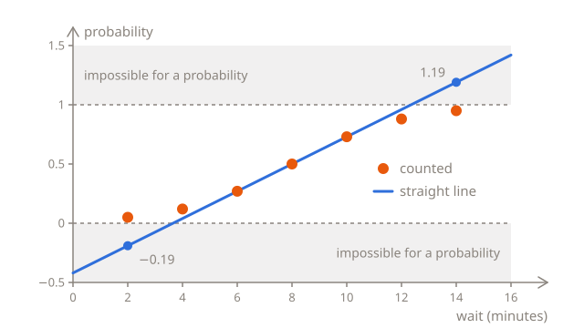
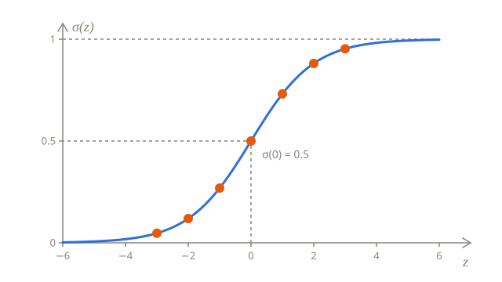
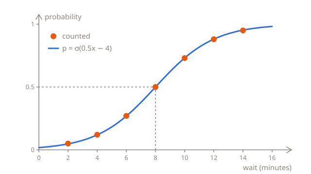
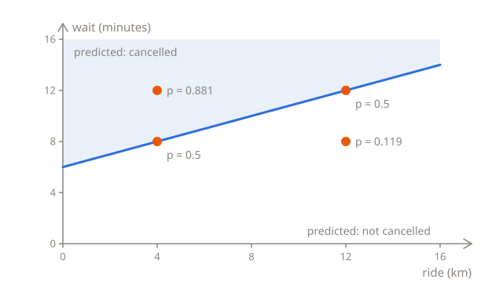

# Predicting a probability

The taxi company from the [linear regression lessons](../02-linear-regression/) also takes orders in an app. When a customer orders a taxi, the app shows how many minutes it will take to arrive, and some customers, rather than wait, cancel. The company would like to know how likely each new order is to be cancelled, so that it can offer a discount to the customers who are about to give up.

That's a yes-or-no question. This lesson builds a rule that answers it in two steps: first it predicts the **probability** that the order will be cancelled, and then it turns that probability into a yes or a no.

## Counting cancellations

The company looked through last month's orders and picked 100 for each of seven waits, from 2 to 14 minutes. Here's how many of each hundred were cancelled:

| Wait (minutes)     | 2   | 4   | 6   | 8   | 10  | 12  | 14  |
| ------------------ | --- | --- | --- | --- | --- | --- | --- |
| Cancelled (of 100) | 5   | 12  | 27  | 50  | 73  | 88  | 95  |

The longer the wait, the more orders were cancelled, but no wait decides it for sure: even with a 14-minute wait, 5 customers out of 100 waited for their taxi, and even with a 2-minute one, 5 cancelled.

Of the 100 orders with a 2-minute wait, 5 were cancelled, so an order like that is cancelled about 5 times in 100: 0.05 of the time, or 5%. That number is a **probability**, which says how likely something is, from 0 for something that never happens to 1 for something that always does. 0.5 means half the time. For an order with a 14-minute wait, the probability of a cancellation is about 0.95.

What the company wants to predict for each order is a category, cancelled or not, rather than an amount, like a fare. That makes it **classification**, one of the two kinds of supervised learning from the [first lesson of Foundations](../01-what-is-machine-learning.md#three-kinds-of-learning). With only two categories, the label can still be written as a number: $y = 1$ for an order that was cancelled, and $y = 0$ for one that wasn't. The model will predict the probability that $y$ is 1.

## A straight line doesn't fit

The probabilities are numbers, so why not predict them the way linear regression predicted fares, with a straight line? Take the line through two of the counts, 0.27 at 6 minutes and 0.73 at 10 minutes. It climbs 0.46 in 4 minutes, so $w = 0.46 \div 4 = 0.115$ per minute, and it's at 0.27 at 6 minutes, so $b = 0.27 - 0.115 \times 6 = -0.42$.

In the middle, the line is close to the counts, but towards the ends it goes wrong. At 2 minutes, it predicts 0.115 × 2 − 0.42 = −0.19, a negative probability, and at 14 minutes, 0.115 × 14 − 0.42 = 1.19, a cancellation more certain than certain:



Any line that isn't flat does the same far enough out, because it keeps on climbing. The counts don't: they bend, flattening out towards 0 on the left and towards 1 on the right, in the shape of a stretched S.

## Squashing the line

The fix keeps the line, but doesn't use its output as the probability. First it squashes the output into the range from 0 to 1, with the **sigmoid** function:

$$
\sigma(z) = \frac{1}{1 + e^{-z}}
$$

$\sigma$ is the Greek letter sigma, in lowercase. Its capital, $\sum$, means "add up", but the lowercase one is just the usual name for the sigmoid. $z$ can be any number, and soon it will be the output of the line. $e$ is a constant that turns up all over math, about 2.718, the way $\pi$ is about 3.14. $e^{-z}$ means $e$ to the power of $-z$. A power multiplies a number by itself, so $e^2 = e \times e$, about 7.389, and a negative power divides 1 by the positive one: $e^{-2} = 1 \div e^2$, about 0.135. Any number to the power of 0 is 1, so $e^0 = 1$.

Working the sigmoid out for a few values of $z$ shows what it does:

| $z$ | $e^{-z}$ | $1 + e^{-z}$ | $\sigma(z)$ |
| --- | -------- | ------------ | ----------- |
| −3  | 20.086   | 21.086       | 0.047       |
| −2  | 7.389    | 8.389        | 0.119       |
| −1  | 2.718    | 3.718        | 0.269       |
| 0   | 1        | 2            | 0.5         |
| 1   | 0.368    | 1.368        | 0.731       |
| 2   | 0.135    | 1.135        | 0.881       |
| 3   | 0.05     | 1.05         | 0.953       |

$e^{-z}$ is always positive, so the bottom of the fraction, $1 + e^{-z}$, is always more than 1, and 1 divided by a number bigger than 1 is less than 1. The bigger $z$ gets, the closer $e^{-z}$ gets to 0, and $\sigma(z)$ to 1. The more negative $z$ gets, the bigger $e^{-z}$ grows, and the closer $\sigma(z)$ gets to 0. It can get as close as you like to either end, but it never reaches it. Right in the middle, at $z = 0$, it's exactly 1 ÷ 2 = 0.5:



In Python, `math.exp(x)` works out $e$ to the power of `x`, so the sigmoid takes one line:

```python run
import math


def sigmoid(z):
    return 1 / (1 + math.exp(-z))


for z in [-3, -2, -1, 0, 1, 2, 3]:
    print(z, round(sigmoid(z), 3))
```

## The whole rule

Put the line inside the sigmoid, and you have logistic regression:

$$
p = \sigma(wx + b)
$$

The line works out $z = wx + b$ from the wait $x$, just as in linear regression, and the sigmoid squashes $z$ into $p$, the predicted probability that the order will be cancelled. With $w = 0.5$ and $b = -4$, an order with a 6-minute wait gets $z = 0.5 \times 6 - 4 = -1$, and $p = \sigma(-1) = 0.269$. Here's every wait from the counts:

| Wait $x$ | $z = 0.5x - 4$ | $p = \sigma(z)$ | Counted |
| -------- | -------------- | --------------- | ------- |
| 2        | −3             | 0.047           | 0.05    |
| 4        | −2             | 0.119           | 0.12    |
| 6        | −1             | 0.269           | 0.27    |
| 8        | 0              | 0.5             | 0.5     |
| 10       | 1              | 0.731           | 0.73    |
| 12       | 2              | 0.881           | 0.88    |
| 14       | 3              | 0.953           | 0.95    |

The predictions follow the counts closely, all the way to the ends, and however long or short the wait, they can't leave the range from 0 to 1:



Set `w` and `b` to other numbers and run this code again to see how the probabilities change:

```python run
import math

w = 0.5
b = -4


def sigmoid(z):
    return 1 / (1 + math.exp(-z))


def probability(wait):
    return sigmoid(w * wait + b)


for wait in [2, 4, 6, 8, 10, 12, 14]:
    print(wait, round(probability(wait), 3))
```

The bigger $w$, the faster the probability climbs as the wait grows, so the steeper the S. With $w = 1$ and $b = -8$, it's twice as steep, and it still crosses 0.5 at 8 minutes. A negative $w$ would turn the S around, for something that gets less likely as $x$ grows. A change to $b$ moves the whole S to the left or to the right.

## From a probability to a decision

A probability is useful in itself: 0.95 says more than "probably cancels". But in the end, the company has to decide, for each order, whether to offer the discount. A **threshold** turns the probability into a decision: predict 1, "cancelled", when $p$ is 0.5 or more, and 0, "not cancelled", when it's less. With a threshold of 0.5, the rule predicts whichever is more likely.

$p$ is exactly 0.5 where $z$ is 0, above 0.5 where $z$ is positive, and below 0.5 where $z$ is negative. So the decision only depends on the sign of $z$, and making it doesn't even need the sigmoid. With $w = 0.5$ and $b = -4$, $z = 0.5x - 4$ is 0 at $x = 8$: an order with a wait of 8 minutes or more is predicted to be cancelled, and one with a shorter wait isn't. The value where the decision changes, 8 minutes here, is the **decision boundary**. In general, $wx + b = 0$ at $x = -\frac{b}{w}$.

0.5 isn't the only possible threshold. If the discount is cheap and a lost customer is expensive, the company might offer it from a probability of 0.3, which with this rule means from a wait of about 6.3 minutes. The threshold is a business decision about what to do with the probabilities. The model's job is to get the probabilities right.

## More than one input

Customers who have ordered a long ride cancel less often: a ride across town is worth waiting for. Add the length of the ride as a second feature, and it gets its own weight, as in linear regression:

$$
p = \sigma(w_1 x_1 + w_2 x_2 + b)
$$

Say $x_1$ is the wait in minutes, with the weight $w_1 = 0.5$, $x_2$ is the length of the ride in km, with the weight $w_2 = -0.25$, and $b = -3$. The negative weight means that every kilometer makes a cancellation a little less likely. For four orders:

| Wait $x_1$ | Ride $x_2$ (km) | $z = 0.5 x_1 - 0.25 x_2 - 3$ | $p$   |
| ---------- | --------------- | ---------------------------- | ----- |
| 8          | 4               | 4 − 1 − 3 = 0                | 0.5   |
| 8          | 12              | 4 − 3 − 3 = −2               | 0.119 |
| 12         | 4               | 6 − 1 − 3 = 2                | 0.881 |
| 12         | 12              | 6 − 3 − 3 = 0                | 0.5   |

The same 8-minute wait gives a cancellation a probability of 0.5 on a 4 km ride, but only 0.119 on a 12 km ride.

```python run
import math


def sigmoid(z):
    return 1 / (1 + math.exp(-z))


def probability(wait, km):
    return sigmoid(0.5 * wait - 0.25 * km - 3)


print(round(probability(8, 4), 3))
print(round(probability(8, 12), 3))
print(round(probability(12, 4), 3))
```

The decision boundary is still where $z = 0$, so where $0.5 x_1 - 0.25 x_2 - 3 = 0$, which is the same as $x_1 = 6 + \frac{x_2}{2}$. On a chart with the length of the ride along the bottom and the wait up the side, that's a straight line. The rule predicts that the orders above it will be cancelled, and the ones below it won't:



The boundary is always straight: a single value with one feature, a line with two, and a flat plane with three. That's why logistic regression is called a **linear classifier**.

## Where do w and b come from?

So far, the rule was chosen to match the counts. That was only possible because last month's orders came in neat groups, a hundred with exactly the same wait, so each group had a fraction of cancellations to aim for. Real orders don't come like that: one waited 3 minutes, the next 11, the next 7, and with the length of the ride as a second feature, hardly any two orders are alike, so there's nothing to count. All there is for each order is its features and its label: cancelled or not, 1 or 0.

To find the best rule, you need a way to score a rule on orders like that, one by one, and that's what the next lesson is about. The lesson after it lets the rule find its own $w$ and $b$.

## Summary

- Classification predicts a category. With two categories, the label is 1 or 0: cancelled or not.
- Logistic regression predicts the probability of a 1: $p = \sigma(wx + b)$. The line works out $z = wx + b$, and the sigmoid, $\sigma(z) = \frac{1}{1 + e^{-z}}$, squashes it between 0 and 1.
- A threshold turns the probability into a decision. With a threshold of 0.5, the decision is 1 wherever $z \geq 0$.
- The decision boundary is where $z = 0$: at $x = -\frac{b}{w}$ with one feature, and along a straight line with two.

## Check yourself

<details>
<summary>What's the sigmoid of 0, and what does it mean for an order?</summary>

0.5, because $e^0 = 1$, and 1 ÷ (1 + 1) = 0.5. An order with $z = 0$ is right on the decision boundary: the rule thinks a cancellation is as likely as not. With a threshold of 0.5, it's predicted to be cancelled, but only just.

</details>

<details>
<summary>The sigmoid of 2 is about 0.881. What's the sigmoid of −2, without working it out?</summary>

About 0.119, which is 1 − 0.881. The S is symmetric: at $z = -2$, it's as far below 0.5 as it's above 0.5 at $z = 2$. In the table, 0.269 and 0.731 add up to 1 as well, and so do 0.047 and 0.953.

</details>

<details>
<summary>A rule has w = 1 and b = −8. Where's its decision boundary, and how is it different from the rule with w = 0.5 and b = −4?</summary>

At 8 minutes as well, as 8 ÷ 1 = 8, so it makes the same decisions. But it's twice as steep: its $z$ changes twice as fast, so its probabilities are closer to 0 and 1. At 6 minutes, it predicts $\sigma(-2) = 0.119$, well below the 0.27 that was counted. Which of the two rules is better, the next lesson can tell.

</details>

## Your turn

In [Probability calculator](../../../exercises/04-foundations/03-logistic-regression/01-probabilities/01-probability-calculator/task.md), you'll write the sigmoid and the rule, with $w$ and $b$ as arguments. In [Flag risky orders](../../../exercises/04-foundations/03-logistic-regression/01-probabilities/02-flag-risky-orders/task.md), you'll find a rule's decision boundary, and pick out the orders it predicts will be cancelled.
