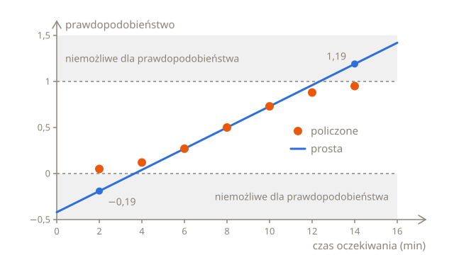
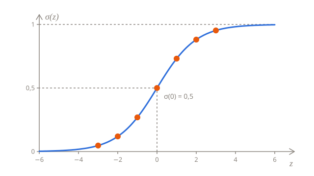
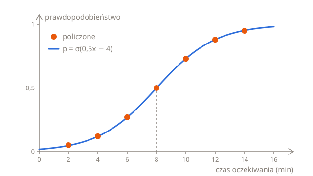
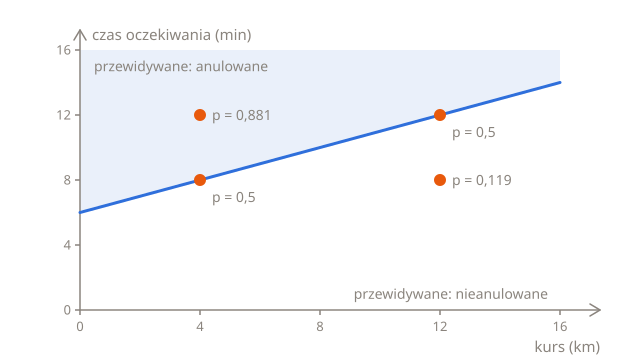

# Przewidywanie prawdopodobieństwa

Firma taksówkowa z [lekcji o regresji liniowej](../02-linear-regression/) przyjmuje też zamówienia w aplikacji. Gdy klient zamawia taksówkę, aplikacja pokazuje, za ile minut przyjedzie, a niektórzy klienci, zamiast czekać, anulują zamówienie. Firma chciałaby wiedzieć, jak prawdopodobne jest anulowanie każdego nowego zamówienia, żeby móc zaproponować zniżkę klientom, którzy zaraz zrezygnują.

Na to pytanie odpowiedź brzmi „tak” albo „nie”. Ta lekcja buduje regułę, która odpowiada na nie w dwóch krokach: najpierw przewiduje **prawdopodobieństwo**, że zamówienie zostanie anulowane, a potem zamienia to prawdopodobieństwo w odpowiedź „tak” albo „nie”.

## Ile zamówień anulowano

Firma przejrzała zamówienia z zeszłego miesiąca i wybrała po 100 dla każdego z siedmiu czasów oczekiwania, od 2 do 14 minut. Oto ile z każdej setki anulowano:

| Czas oczekiwania (minuty) | 2   | 4   | 6   | 8   | 10  | 12  | 14  |
| ------------------------- | --- | --- | --- | --- | --- | --- | --- |
| Anulowane (na 100)        | 5   | 12  | 27  | 50  | 73  | 88  | 95  |

Im dłuższe oczekiwanie, tym więcej anulowanych zamówień, ale żaden czas oczekiwania nie przesądza sprawy: nawet przy 14 minutach 5 klientów na 100 zaczekało na taksówkę, a nawet przy 2 minutach 5 anulowało.

Ze 100 zamówień z czasem oczekiwania 2 minuty anulowano 5, więc takie zamówienie jest anulowane mniej więcej 5 razy na 100: w 0,05 przypadków, czyli w 5%. Ta liczba to **prawdopodobieństwo**, które mówi, jak bardzo można się czegoś spodziewać, od 0 dla czegoś, co nigdy się nie zdarza, do 1 dla czegoś, co zdarza się zawsze. 0,5 oznacza połowę przypadków. Dla zamówienia z czasem oczekiwania 14 minut prawdopodobieństwo anulowania wynosi około 0,95.

Dla każdego zamówienia firma chce przewidzieć kategorię, anulowane albo nie, a nie kwotę, taką jak opłata. To **klasyfikacja**, jeden z dwóch rodzajów uczenia nadzorowanego z [pierwszej lekcji Podstaw](../01-what-is-machine-learning.pl.md#trzy-rodzaje-uczenia). Przy tylko dwóch kategoriach etykietę nadal da się zapisać jako liczbę: $y = 1$ dla zamówienia, które anulowano, i $y = 0$ dla takiego, którego nie anulowano. Model będzie przewidywał prawdopodobieństwo, że $y$ wynosi 1.

## Prosta nie pasuje

Prawdopodobieństwa to liczby, więc czemu nie przewidywać ich tak, jak regresja liniowa przewidywała opłaty, za pomocą prostej? Weź prostą przechodzącą przez dwa z policzonych odsetków: 0,27 przy 6 minutach i 0,73 przy 10 minutach. Wznosi się o 0,46 na 4 minuty, więc $w = 0{,}46 \div 4 = 0{,}115$ na minutę, a przy 6 minutach wynosi 0,27, więc $b = 0{,}27 - 0{,}115 \times 6 = -0{,}42$.

Pośrodku prosta jest blisko policzonych odsetków, ale na krańcach się myli. Przy 2 minutach przewiduje 0,115 × 2 − 0,42 = −0,19, czyli ujemne prawdopodobieństwo, a przy 14 minutach 0,115 × 14 − 0,42 = 1,19, czyli anulowanie pewniejsze niż pewne:



Każda prosta, która nie jest płaska, robi to samo, jeśli odejść dostatecznie daleko, bo nigdy nie przestaje rosnąć. Policzone odsetki tak nie robią: wyginają się, spłaszczając się przy 0 po lewej i przy 1 po prawej, w kształcie rozciągniętej litery S.

## Ściskanie prostej

Rozwiązanie zachowuje prostą, ale nie używa jej wyniku jako prawdopodobieństwa. Najpierw ściska ten wynik do przedziału od 0 do 1 za pomocą **sigmoidy**, czyli funkcji sigmoidalnej:

$$
\sigma(z) = \frac{1}{1 + e^{-z}}
$$

$\sigma$ to mała grecka litera sigma. Wielka sigma, $\sum$, oznacza „zsumuj”, ale mała to po prostu zwyczajowa nazwa sigmoidy. $z$ może być dowolną liczbą, a za chwilę będzie wynikiem prostej. $e$ to stała, która pojawia się w całej matematyce, około 2,718, tak jak $\pi$ to około 3,14. $e^{-z}$ oznacza $e$ do potęgi $-z$. Potęga mnoży liczbę przez samą siebie, więc $e^2 = e \times e$, około 7,389, a potęga ujemna dzieli 1 przez dodatnią: $e^{-2} = 1 \div e^2$, około 0,135. Każda liczba do potęgi 0 daje 1, więc $e^0 = 1$.

Policzenie sigmoidy dla kilku wartości $z$ pokazuje, co robi:

| $z$ | $e^{-z}$ | $1 + e^{-z}$ | $\sigma(z)$ |
| --- | -------- | ------------ | ----------- |
| −3  | 20,086   | 21,086       | 0,047       |
| −2  | 7,389    | 8,389        | 0,119       |
| −1  | 2,718    | 3,718        | 0,269       |
| 0   | 1        | 2            | 0,5         |
| 1   | 0,368    | 1,368        | 0,731       |
| 2   | 0,135    | 1,135        | 0,881       |
| 3   | 0,05     | 1,05         | 0,953       |

$e^{-z}$ jest zawsze dodatnie, więc mianownik ułamka, $1 + e^{-z}$, jest zawsze większy niż 1, a 1 podzielone przez liczbę większą niż 1 daje mniej niż 1. Im większe $z$, tym bliżej 0 jest $e^{-z}$, a $\sigma(z)$ tym bliżej 1. Im bardziej ujemne $z$, tym większe $e^{-z}$, a $\sigma(z)$ tym bliżej 0. Sigmoida może się zbliżyć do każdego z krańców tak bardzo, jak tylko chcesz, ale nigdy go nie osiąga. Dokładnie pośrodku, przy $z = 0$, wynosi 1 ÷ 2 = 0,5:



W Pythonie `math.exp(x)` liczy $e$ do potęgi `x`, więc sigmoida mieści się w jednym wierszu:

```python run
import math


def sigmoid(z):
    return 1 / (1 + math.exp(-z))


for z in [-3, -2, -1, 0, 1, 2, 3]:
    print(z, round(sigmoid(z), 3))
```

## Cała reguła

Włóż prostą do sigmoidy, a dostaniesz regresję logistyczną:

$$
p = \sigma(wx + b)
$$

Prosta liczy $z = wx + b$ z czasu oczekiwania $x$, dokładnie tak jak w regresji liniowej, a sigmoida ściska $z$ do $p$, przewidywanego prawdopodobieństwa, że zamówienie zostanie anulowane. Przy $w = 0{,}5$ i $b = -4$ zamówienie z czasem oczekiwania 6 minut dostaje $z = 0{,}5 \times 6 - 4 = -1$ i $p = \sigma(-1) = 0{,}269$. Oto każdy czas oczekiwania z tabeli:

| Czas oczekiwania $x$ | $z = 0{,}5x - 4$ | $p = \sigma(z)$ | Policzony odsetek |
| -------------------- | ---------------- | --------------- | ----------------- |
| 2                    | −3               | 0,047           | 0,05              |
| 4                    | −2               | 0,119           | 0,12              |
| 6                    | −1               | 0,269           | 0,27              |
| 8                    | 0                | 0,5             | 0,5               |
| 10                   | 1                | 0,731           | 0,73              |
| 12                   | 2                | 0,881           | 0,88              |
| 14                   | 3                | 0,953           | 0,95              |

Predykcje ściśle trzymają się policzonych odsetków, aż po same krańce, a niezależnie od tego, jak długie albo krótkie jest oczekiwanie, nie mogą wyjść poza przedział od 0 do 1:



Ustaw `w` i `b` na inne liczby i uruchom ten kod jeszcze raz, żeby zobaczyć, jak zmieniają się prawdopodobieństwa:

```python run
import math

w = 0.5
b = -4


def sigmoid(z):
    return 1 / (1 + math.exp(-z))


def probability(wait):
    return sigmoid(w * wait + b)


for wait in [2, 4, 6, 8, 10, 12, 14]:
    print(wait, round(probability(wait), 3))
```

Im większe $w$, tym szybciej prawdopodobieństwo rośnie wraz z czasem oczekiwania, więc tym bardziej stroma jest krzywa. Przy $w = 1$ i $b = -8$ jest dwa razy bardziej stroma, a nadal przecina 0,5 przy 8 minutach. Ujemne $w$ odwróciłoby krzywą, dla czegoś, co staje się mniej prawdopodobne, gdy $x$ rośnie. Zmiana $b$ przesuwa całą krzywą w lewo albo w prawo.

## Od prawdopodobieństwa do decyzji

Prawdopodobieństwo samo w sobie jest przydatne: 0,95 mówi więcej niż „pewnie anuluje”. Ale w końcu firma musi zdecydować, czy przy danym zamówieniu zaproponować zniżkę. **Próg** zamienia prawdopodobieństwo w decyzję: przewiduj 1, „anulowane”, gdy $p$ wynosi 0,5 lub więcej, i 0, „nieanulowane”, gdy jest mniejsze. Przy progu 0,5 reguła przewiduje to, co jest bardziej prawdopodobne.

$p$ wynosi dokładnie 0,5 tam, gdzie $z$ wynosi 0, więcej niż 0,5 tam, gdzie $z$ jest dodatnie, i mniej niż 0,5 tam, gdzie $z$ jest ujemne. Decyzja zależy więc tylko od znaku $z$, a do jej podjęcia nie trzeba nawet sigmoidy. Przy $w = 0{,}5$ i $b = -4$ wynik prostej, $z = 0{,}5x - 4$, wynosi 0 przy $x = 8$: reguła przewiduje, że zamówienie z czasem oczekiwania 8 minut lub dłuższym zostanie anulowane, a zamówienie z krótszym nie. Wartość, przy której zmienia się decyzja, tutaj 8 minut, to **granica decyzyjna**. Ogólnie $wx + b = 0$ przy $x = -\frac{b}{w}$.

0,5 to nie jedyny możliwy próg. Jeśli zniżka jest tania, a utrata klienta droga, firma może proponować zniżkę już od prawdopodobieństwa 0,3, co przy tej regule oznacza od czasu oczekiwania około 6,3 minuty. Próg to decyzja biznesowa o tym, co zrobić z prawdopodobieństwami. Zadaniem modelu jest podać dobre prawdopodobieństwa.

## Więcej niż jedno wejście

Klienci, którzy zamówili długi kurs, anulują rzadziej: na kurs przez całe miasto warto poczekać. Dodaj długość kursu jako drugą cechę, a dostanie ona własną wagę, tak jak w regresji liniowej:

$$
p = \sigma(w_1 x_1 + w_2 x_2 + b)
$$

Powiedzmy, że $x_1$ to czas oczekiwania w minutach, z wagą $w_1 = 0{,}5$, $x_2$ to długość kursu w km, z wagą $w_2 = -0{,}25$, a $b = -3$. Ujemna waga oznacza, że z każdym kilometrem anulowanie staje się trochę mniej prawdopodobne. Dla czterech zamówień:

| Czas oczekiwania $x_1$ | Kurs $x_2$ (km) | $z = 0{,}5 x_1 - 0{,}25 x_2 - 3$ | $p$   |
| ---------------------- | --------------- | -------------------------------- | ----- |
| 8                      | 4               | 4 − 1 − 3 = 0                    | 0,5   |
| 8                      | 12              | 4 − 3 − 3 = −2                   | 0,119 |
| 12                     | 4               | 6 − 1 − 3 = 2                    | 0,881 |
| 12                     | 12              | 6 − 3 − 3 = 0                    | 0,5   |

Ten sam czas oczekiwania, 8 minut, daje anulowaniu prawdopodobieństwo 0,5 przy kursie na 4 km, ale tylko 0,119 przy kursie na 12 km.

```python run
import math


def sigmoid(z):
    return 1 / (1 + math.exp(-z))


def probability(wait, km):
    return sigmoid(0.5 * wait - 0.25 * km - 3)


print(round(probability(8, 4), 3))
print(round(probability(8, 12), 3))
print(round(probability(12, 4), 3))
```

Granica decyzyjna nadal leży tam, gdzie $z = 0$, czyli tam, gdzie $0{,}5 x_1 - 0{,}25 x_2 - 3 = 0$, a to to samo co $x_1 = 6 + \frac{x_2}{2}$. Na wykresie z długością kursu na osi poziomej i czasem oczekiwania na pionowej to linia prosta. Reguła przewiduje, że zamówienia nad nią zostaną anulowane, a te pod nią nie:



Granica jest zawsze prosta: przy jednej cesze to pojedyncza wartość, przy dwóch linia prosta, a przy trzech płaszczyzna. Dlatego regresję logistyczną nazywa się **klasyfikatorem liniowym**.

## Skąd się biorą w i b?

Do tej pory regułę dobierano do policzonych odsetków. Dało się to zrobić tylko dlatego, że zamówienia z zeszłego miesiąca tworzyły równe grupy, po sto z dokładnie tym samym czasem oczekiwania, więc każda grupa miała odsetek anulowań, w który można było celować. Prawdziwe zamówienia tak nie wyglądają: przy jednym czas oczekiwania wynosi 3 minuty, przy następnym 11, przy kolejnym 7, a z długością kursu jako drugą cechą prawie żadne dwa zamówienia nie są takie same, więc nie ma czego liczyć. Dla każdego zamówienia są tylko jego cechy i jego etykieta: anulowane albo nie, 1 albo 0.

Żeby znaleźć najlepszą regułę, potrzebujesz sposobu na ocenienie reguły na takich zamówieniach, jednym po drugim, i o tym jest następna lekcja. Kolejna pozwala regule samej znaleźć swoje $w$ i $b$.

## Podsumowanie

- Klasyfikacja przewiduje kategorię. Przy dwóch kategoriach etykieta to 1 albo 0: anulowane albo nie.
- Regresja logistyczna przewiduje prawdopodobieństwo jedynki: $p = \sigma(wx + b)$. Prosta liczy $z = wx + b$, a sigmoida, $\sigma(z) = \frac{1}{1 + e^{-z}}$, ściska wynik do przedziału od 0 do 1.
- Próg zamienia prawdopodobieństwo w decyzję. Przy progu 0,5 decyzja to 1 wszędzie tam, gdzie $z \geq 0$.
- Granica decyzyjna leży tam, gdzie $z = 0$: przy jednej cesze w $x = -\frac{b}{w}$, a przy dwóch wzdłuż linii prostej.

## Sprawdź się

<details>
<summary>Ile wynosi sigmoida w zerze i co to oznacza dla zamówienia?</summary>

0,5, bo $e^0 = 1$, a 1 ÷ (1 + 1) = 0,5. Zamówienie z $z = 0$ leży dokładnie na granicy decyzyjnej: według reguły anulowanie jest tak samo prawdopodobne jak jego brak. Przy progu 0,5 reguła przewiduje, że zamówienie zostanie anulowane, ale tylko o włos.

</details>

<details>
<summary>Sigmoida w punkcie 2 wynosi około 0,881. Ile wynosi w punkcie −2, bez liczenia?</summary>

Około 0,119, czyli 1 − 0,881. Krzywa jest symetryczna: przy $z = -2$ jest tak samo daleko poniżej 0,5, jak przy $z = 2$ jest powyżej. W tabeli 0,269 i 0,731 też sumują się do 1, podobnie jak 0,047 i 0,953.

</details>

<details>
<summary>Reguła ma w = 1 i b = −8. Gdzie leży jej granica decyzyjna i czym ta reguła różni się od reguły z w = 0,5 i b = −4?</summary>

Też przy 8 minutach, bo 8 ÷ 1 = 8, więc podejmuje te same decyzje. Ale jest dwa razy bardziej stroma: jej $z$ zmienia się dwa razy szybciej, więc jej prawdopodobieństwa są bliżej 0 i 1. Przy 6 minutach przewiduje $\sigma(-2) = 0{,}119$, daleko poniżej policzonego 0,27. Która z tych dwóch reguł jest lepsza, powie następna lekcja.

</details>

## Twoja kolej

W ćwiczeniu [Kalkulator prawdopodobieństwa](../../../exercises/04-foundations/03-logistic-regression/01-probabilities/01-probability-calculator/task.pl.md) zapiszesz sigmoidę i regułę z $w$ i $b$ jako argumentami. W ćwiczeniu [Oznacz ryzykowne zamówienia](../../../exercises/04-foundations/03-logistic-regression/01-probabilities/02-flag-risky-orders/task.pl.md) znajdziesz granicę decyzyjną reguły i wybierzesz zamówienia, o których reguła przewiduje, że zostaną anulowane.
