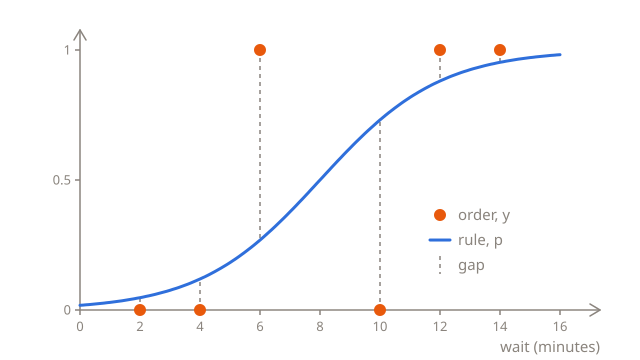
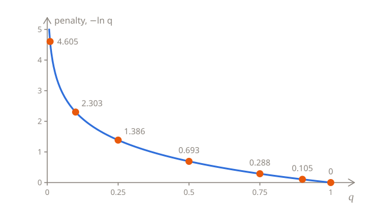
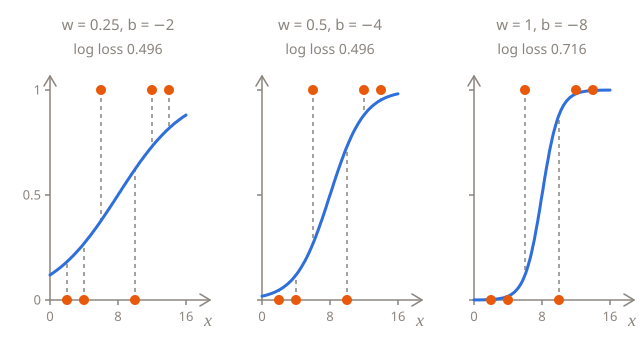

# Measuring the error

At the end of [Predicting a probability](01-probabilities.md), there was nothing left to count: real orders come one at a time, each with its label, cancelled or not. To choose the best rule, you need a score that says how wrong a rule is on orders like that. This lesson builds two: accuracy, which is easy to read, and the **log loss**, which is what training uses.

## Six orders

Here are six orders from last week, with the wait the app showed, in minutes, and whether the order was cancelled:

| Wait $x$      | 2   | 4   | 6   | 10  | 12  | 14  |
| ------------- | --- | --- | --- | --- | --- | --- |
| Cancelled $y$ | 0   | 0   | 1   | 0   | 1   | 1   |

Mostly, the longer the wait, the more likely a cancellation, but not always: the customer who was told 6 minutes cancelled, and the one who was told 10 minutes waited. Real data is like that. The wait isn't everything, and some customers are in more of a hurry than others.

The rule from the last lesson, $w = 0.5$ and $b = -4$, predicts these probabilities and decisions:

| $x$ | $y$ | $p$   | Decision | Right? |
| --- | --- | ----- | -------- | ------ |
| 2   | 0   | 0.047 | 0        | yes    |
| 4   | 0   | 0.119 | 0        | yes    |
| 6   | 1   | 0.269 | 0        | no     |
| 10  | 0   | 0.731 | 1        | no     |
| 12  | 1   | 0.881 | 1        | yes    |
| 14  | 1   | 0.953 | 1        | yes    |

On a chart, each order is a dot at 1 if it was cancelled, and at 0 if it wasn't. The gap between a dot and the curve shows how far the predicted probability was from what happened:



## Accuracy

The simplest score counts the right decisions: 4 of the 6, or 0.67. The fraction of decisions that are right is the **accuracy**, and it's usually the first thing people ask about a classifier.

It's a fine score to report, but a poor one to train with, for two reasons. First, it can't tell a confident prediction from a lucky one: a probability of 0.51 counts the same as 0.99 when it's right, and 0.49 the same as 0.01 when it's wrong. Second, and worse, it hardly ever changes. Nudge $w$ from 0.5 to 0.51, and every probability changes a little, but the boundary only moves from 8 minutes to about 7.8, no order crosses it, and the accuracy stays at 4 of 6. It only changes when the boundary jumps over an order, so almost everywhere, a small change to $w$ or $b$ changes nothing, and a nudge can't tell which way is better. [Training](../02-linear-regression/03-training.md#which-way-is-down) finds the way down from the slope of the loss, which is what a nudge measures, so it needs a score that changes a little with every little change to the rule.

## A penalty for every order

A better score looks at the probability the rule gave to what actually happened. For an order that was cancelled, that's $p$. For an order that wasn't, it's $1 - p$, the probability the rule gave to "not cancelled". The higher that probability, the better the rule did on the order:

| $x$ | $y$ | $p$   | Probability of what happened |
| --- | --- | ----- | ---------------------------- |
| 2   | 0   | 0.047 | 1 − 0.047 = 0.953            |
| 4   | 0   | 0.119 | 1 − 0.119 = 0.881            |
| 6   | 1   | 0.269 | 0.269                        |
| 10  | 0   | 0.731 | 1 − 0.731 = 0.269            |
| 12  | 1   | 0.881 | 0.881                        |
| 14  | 1   | 0.953 | 0.953                        |

Each order gets a **penalty**, which should be 0 when the rule gave what happened a probability of 1, and bigger the smaller that probability was. With $q$ for the probability of what happened, the penalty is $-\ln q$:

| $q$      | 1   | 0.9   | 0.75  | 0.5   | 0.25  | 0.1   | 0.01  |
| -------- | --- | ----- | ----- | ----- | ----- | ----- | ----- |
| $-\ln q$ | 0   | 0.105 | 0.288 | 0.693 | 1.386 | 2.303 | 4.605 |

$\ln q$ is the **natural logarithm** of $q$, which undoes a power of $e$: it's the power you raise $e$ to, to get $q$. $e^0 = 1$, so $\ln 1 = 0$, and $e^{-0.693}$ is about 0.5, so $\ln 0.5$ is about −0.693. For any $q$ between 0 and 1, the power is negative, and the minus in front of $\ln$ makes the penalty positive. In Python, it's `math.log(q)`, and many books write it $\log$.



The penalty is mild when the rule was right, and harsh when it was sure and wrong. A rule that gave what happened 0.9 pays 0.105, and one that gave it 0.5, no better than a coin toss, pays 0.693. But one that gave it 0.01, 99% sure of the opposite, pays 4.605, as much as 44 orders at 0.9. And the closer $q$ gets to 0, the more the penalty grows, without limit.

For the six orders, the penalties are:

| $x$ | Probability of what happened | Penalty |
| --- | ---------------------------- | ------- |
| 2   | 0.953                        | 0.049   |
| 4   | 0.881                        | 0.127   |
| 6   | 0.269                        | 1.313   |
| 10  | 0.269                        | 1.313   |
| 12  | 0.881                        | 0.127   |
| 14  | 0.953                        | 0.049   |

They add up to 2.978, and 2.978 ÷ 6 orders = 0.496. The average penalty is the **log loss**. The two orders the rule got wrong make up almost all of it.

Like the MSE, the log loss takes five steps:

1. **Predict** the probability of a cancellation for each order.
2. **Pick** the probability of what happened: $p$ if the order was cancelled, and $1 - p$ if it wasn't.
3. **Take its logarithm**, and flip the sign, to get the penalty.
4. **Add** the penalties up.
5. **Divide** by the number of orders, to get the average.

## In Python

The same five steps, in a loop:

```python run
import math

waits = [2, 4, 6, 10, 12, 14]
cancelled = [0, 0, 1, 0, 1, 1]
w = 0.5
b = -4


def sigmoid(z):
    return 1 / (1 + math.exp(-z))


total = 0
for i in range(len(waits)):
    p = sigmoid(w * waits[i] + b)
    if cancelled[i] == 1:
        q = p
    else:
        q = 1 - p
    total += -math.log(q)
print(round(total / len(waits), 3))
```

It prints `0.496`. Change `w` and `b` and run it again to score other rules.

## The same steps in symbols

$$
L(w, b) = -\frac{1}{n} \sum_{i=1}^{n} \Big( y_i \ln p_i + (1 - y_i) \ln (1 - p_i) \Big)
$$

It looks longer than the MSE, but the part in the brackets is only the `if` from the loop, written as arithmetic. $y_i$ is always 1 or 0, so one of the two terms is always multiplied by 0, and drops out:

- For an order that was cancelled, $y_i = 1$ and $1 - y_i = 0$, so only $\ln p_i$ is left.
- For an order that wasn't, $y_i = 0$, so only $\ln (1 - p_i)$ is left.

Either way, what's left is the logarithm of the probability of what happened. The minus in front flips the signs of all of them at once, so that the penalties are positive, and $\frac{1}{n} \sum$ averages them, as in the MSE. Each $p_i$ is $\sigma(w x_i + b)$, so, like the MSE, the log loss depends only on $w$ and $b$.

The log loss is also called **binary cross-entropy**, "binary" because there are two categories. It's the usual loss for classification. Language models are trained with the same penalty, on the probability they gave to the token that actually came next, out of many thousands: see [pretraining](../../vocabulary/pretraining.md).

## Comparing rules

Here's the log loss of a few rules. Two have the same boundary as the rule from the last lesson, but one is half as steep, and the other twice as steep:

| $w$  | $b$   | Where it comes from    | Accuracy | Log loss |
| ---- | ----- | ---------------------- | -------- | -------- |
| 0.25 | −2    | half as steep          | 4 of 6   | 0.496    |
| 0.5  | −4    | the last lesson        | 4 of 6   | 0.496    |
| 1    | −8    | twice as steep         | 4 of 6   | 0.716    |
| 0.37 | −2.93 | the best rule there is | 4 of 6   | 0.479    |



All four rules have their boundary at 8 minutes, or very close to it, so they make the same decisions, and accuracy can't tell them apart. The log loss can. The steep rule is so sure about the orders at 6 and 10 minutes that it gives what happened there a probability of only 0.119, and pays 2.127 for each. The flat rule is never very sure, so it never pays that much, but it pays something even for the easy orders: 0.201 at 2 minutes, where the steep rule pays 0.002. The best rule is in between. You'll see in the next lesson how to find it without guessing.

It's flatter than the rule from the last lesson. Six orders are a small sample, and in it, two customers out of six went against their waits, more than last month's counts would suggest, so the best rule for these six orders is less sure of itself.

## A baseline

Is a log loss of 0.479 good? As with the MSE, the number only means something next to a **baseline**, a rule that ignores the wait and predicts the same probability for every order.

The best such probability is the fraction of the orders that were cancelled, here 3 of 6, so 0.5. Every order then gets 0.5 for what happened, a penalty of 0.693, and the log loss is 0.693 too. Any other probability does worse: 0.4 or 0.6 for every order scores 0.714, and 0.3 scores 0.780.

So the best rule, at 0.479, has learned something from the wait, though the wait is far from the whole story. And the steep rule, at 0.716, scores worse than the baseline: being too sure of itself makes it worse than knowing nothing about the wait.

Accuracy needs a baseline too, and it matters most when one of the categories is rare. If only 1 order in 20 is cancelled, a rule that always predicts "not cancelled" has an accuracy of 0.95, without catching a single cancellation. An accuracy of 0.95 means something only if the baseline's is lower.

## Summary

- Accuracy is the fraction of decisions that are right. It's easy to read, but it hardly ever changes when the rule changes a little, so it can't guide training.
- The penalty for one example is $-\ln q$, where $q$ is the probability the rule gave to what happened: 0 when it was sure and right, and huge when it was sure and wrong.
- The log loss is the average penalty: $L(w, b) = -\frac{1}{n} \sum_{i=1}^{n} \big( y_i \ln p_i + (1 - y_i) \ln (1 - p_i) \big)$.
- The baseline predicts the fraction of 1s for every example. A rule that doesn't beat it hasn't learned anything useful.

## Check yourself

<details>
<summary>A rule gives two orders a probability of 0.9 of being cancelled. One was cancelled, and the other wasn't. What's each order's penalty?</summary>

0.105 for the one that was cancelled, as the rule gave what happened a probability of 0.9. 2.303 for the one that wasn't, as the rule gave what happened only 1 − 0.9 = 0.1.

</details>

<details>
<summary>A rule's log loss is 0.75, and its baseline's is 0.693. What does that say?</summary>

The rule does worse than ignoring the wait altogether. It may be much too sure of itself, like the steep rule, or it may have the direction wrong, with a negative weight where it should be positive. Either way, something is wrong with it.

</details>

<details>
<summary>Can a rule have a log loss of exactly 0?</summary>

Only if it gives every order a probability of exactly 1 for what happened, and the sigmoid never reaches 0 or 1. It can get as close to 0 as you like, though, when the orders that were cancelled and the ones that weren't don't overlap. With the six orders, they do: the customers at 6 and 10 minutes did the opposite of what their waits suggest.

</details>

## Your turn

In [Log loss step by step](../../../exercises/04-foundations/03-logistic-regression/02-error/01-log-loss-step-by-step/task.md), you'll write the log loss as small functions, one for each step. In [Grade a classifier](../../../exercises/04-foundations/03-logistic-regression/02-error/02-grade-a-classifier/task.md), you'll score any rule on any orders, with accuracy and with the log loss, and the baseline too.
