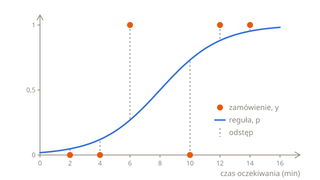
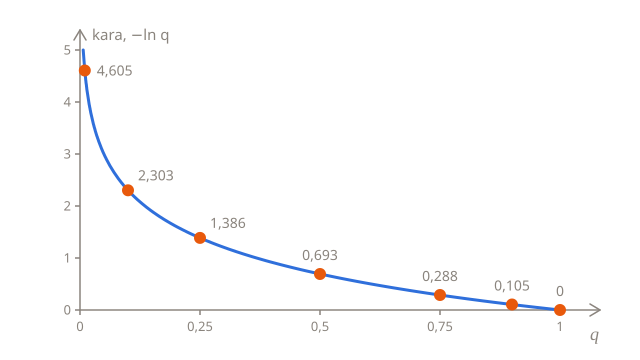
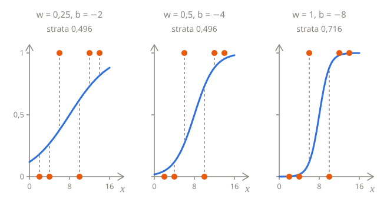

# Mierzenie błędu

Na końcu lekcji [Przewidywanie prawdopodobieństwa](01-probabilities.pl.md) nie było już czego liczyć: prawdziwe zamówienia przychodzą pojedynczo, każde ze swoją etykietą, anulowane albo nie. Żeby wybrać najlepszą regułę, potrzebujesz oceny, która mówi, jak bardzo reguła myli się na takich zamówieniach. Ta lekcja buduje dwie: dokładność, którą łatwo odczytać, i **stratę logarytmiczną** (ang. log loss), której używa trening.

## Sześć zamówień

Oto sześć zamówień z zeszłego tygodnia, z czasem oczekiwania w minutach, który pokazała aplikacja, i z informacją, czy zamówienie anulowano:

| Czas oczekiwania $x$ | 2   | 4   | 6   | 10  | 12  | 14  |
| -------------------- | --- | --- | --- | --- | --- | --- |
| Anulowane $y$        | 0   | 0   | 1   | 0   | 1   | 1   |

Zwykle im dłuższe oczekiwanie, tym bardziej prawdopodobne anulowanie, ale nie zawsze: klient, któremu aplikacja pokazała 6 minut, anulował, a ten, któremu pokazała 10 minut, zaczekał. Prawdziwe dane takie są. Czas oczekiwania to nie wszystko, a niektórym klientom spieszy się bardziej niż innym.

Reguła z poprzedniej lekcji, $w = 0{,}5$ i $b = -4$, przewiduje takie prawdopodobieństwa i decyzje:

| $x$ | $y$ | $p$   | Decyzja | Trafna? |
| --- | --- | ----- | ------- | ------- |
| 2   | 0   | 0,047 | 0       | tak     |
| 4   | 0   | 0,119 | 0       | tak     |
| 6   | 1   | 0,269 | 0       | nie     |
| 10  | 0   | 0,731 | 1       | nie     |
| 12  | 1   | 0,881 | 1       | tak     |
| 14  | 1   | 0,953 | 1       | tak     |

Na wykresie każde zamówienie to kropka na wysokości 1, jeśli je anulowano, i na wysokości 0, jeśli nie. Odstęp między kropką a krzywą pokazuje, jak daleko przewidywane prawdopodobieństwo było od tego, co się stało:



## Dokładność

Najprostsza ocena liczy trafne decyzje: 4 z 6, czyli 0,67. Odsetek trafnych decyzji to **dokładność** (ang. accuracy) i zwykle o nią pyta się najpierw, gdy mowa o klasyfikatorze.

To dobra ocena do raportowania, ale kiepska do treningu, z dwóch powodów. Po pierwsze, nie odróżnia pewnej predykcji od szczęśliwej: prawdopodobieństwo 0,51 liczy się tak samo jak 0,99, gdy decyzja jest trafna, a 0,49 tak samo jak 0,01, gdy jest chybiona. Po drugie, co gorsza, prawie nigdy się nie zmienia. Przesuń $w$ z 0,5 na 0,51, a każde prawdopodobieństwo trochę się zmieni, ale granica przesunie się tylko z 8 minut na około 7,8, żadne zamówienie jej nie przekroczy, a dokładność zostanie równa 4 z 6. Zmienia się dopiero wtedy, gdy granica przeskoczy przez jakieś zamówienie, więc prawie wszędzie mała zmiana $w$ albo $b$ nic nie zmienia, a przesunięcie nie powie, która strona jest lepsza. [Trening](../02-linear-regression/03-training.pl.md#gdzie-jest-w-dół) znajduje drogę w dół z nachylenia straty, a właśnie to mierzy przesunięcie, więc potrzebuje oceny, która zmienia się trochę przy każdej małej zmianie reguły.

## Kara za każde zamówienie

Lepsza ocena patrzy na prawdopodobieństwo, które reguła dała temu, co naprawdę się stało. Dla zamówienia, które anulowano, to $p$. Dla zamówienia, którego nie anulowano, to $1 - p$, czyli prawdopodobieństwo, które reguła dała odpowiedzi „nieanulowane”. Im wyższe to prawdopodobieństwo, tym lepiej reguła poradziła sobie z zamówieniem:

| $x$ | $y$ | $p$   | Prawdopodobieństwo tego, co się stało |
| --- | --- | ----- | ------------------------------------- |
| 2   | 0   | 0,047 | 1 − 0,047 = 0,953                     |
| 4   | 0   | 0,119 | 1 − 0,119 = 0,881                     |
| 6   | 1   | 0,269 | 0,269                                 |
| 10  | 0   | 0,731 | 1 − 0,731 = 0,269                     |
| 12  | 1   | 0,881 | 0,881                                 |
| 14  | 1   | 0,953 | 0,953                                 |

Każde zamówienie dostaje **karę**, która powinna wynosić 0, gdy reguła dała temu, co się stało, prawdopodobieństwo 1, i być tym większa, im mniejsze było to prawdopodobieństwo. Jeśli $q$ oznacza prawdopodobieństwo tego, co się stało, kara wynosi $-\ln q$:

| $q$      | 1   | 0,9   | 0,75  | 0,5   | 0,25  | 0,1   | 0,01  |
| -------- | --- | ----- | ----- | ----- | ----- | ----- | ----- |
| $-\ln q$ | 0   | 0,105 | 0,288 | 0,693 | 1,386 | 2,303 | 4,605 |

$\ln q$ to **logarytm naturalny** z $q$, który odwraca potęgowanie $e$: to potęga, do której trzeba podnieść $e$, żeby dostać $q$. $e^0 = 1$, więc $\ln 1 = 0$, a $e^{-0{,}693}$ to około 0,5, więc $\ln 0{,}5$ to około −0,693. Dla każdego $q$ między 0 a 1 ta potęga jest ujemna, a minus przed $\ln$ sprawia, że kara jest dodatnia. W Pythonie to `math.log(q)`, a wiele książek zapisuje ten logarytm jako $\log$.



Kara jest łagodna, gdy reguła miała rację, i surowa, gdy była pewna i się myliła. Reguła, która dała temu, co się stało, 0,9, płaci 0,105, a taka, która dała 0,5, czyli nie lepiej niż rzut monetą, płaci 0,693. Ale taka, która dała 0,01, na 99% pewna czegoś odwrotnego, płaci 4,605, tyle co 44 zamówienia po 0,9. A im bliżej 0 jest $q$, tym większa kara, i nie ma ona górnej granicy.

Dla sześciu zamówień kary wynoszą:

| $x$ | Prawdopodobieństwo tego, co się stało | Kara  |
| --- | ------------------------------------- | ----- |
| 2   | 0,953                                 | 0,049 |
| 4   | 0,881                                 | 0,127 |
| 6   | 0,269                                 | 1,313 |
| 10  | 0,269                                 | 1,313 |
| 12  | 0,881                                 | 0,127 |
| 14  | 0,953                                 | 0,049 |

Sumują się do 2,978, a 2,978 ÷ 6 zamówień = 0,496. Średnia kara to **strata logarytmiczna**. Prawie całą stanowią dwa zamówienia, przy których reguła się pomyliła.

Tak jak MSE, strata logarytmiczna powstaje w pięciu krokach:

1. **Przewidź** prawdopodobieństwo anulowania każdego zamówienia.
2. **Wybierz** prawdopodobieństwo tego, co się stało: $p$, jeśli zamówienie anulowano, i $1 - p$, jeśli nie.
3. **Weź jego logarytm** i zmień znak, żeby dostać karę.
4. **Dodaj** kary.
5. **Podziel** przez liczbę zamówień, żeby dostać średnią.

## W Pythonie

Te same pięć kroków w pętli:

```python run
import math

waits = [2, 4, 6, 10, 12, 14]
cancelled = [0, 0, 1, 0, 1, 1]
w = 0.5
b = -4


def sigmoid(z):
    return 1 / (1 + math.exp(-z))


total = 0
for i in range(len(waits)):
    p = sigmoid(w * waits[i] + b)
    if cancelled[i] == 1:
        q = p
    else:
        q = 1 - p
    total += -math.log(q)
print(round(total / len(waits), 3))
```

Wypisuje `0.496`. Zmień `w` i `b` i uruchom kod jeszcze raz, żeby ocenić inne reguły.

## Te same kroki w symbolach

$$
L(w, b) = -\frac{1}{n} \sum_{i=1}^{n} \Big( y_i \ln p_i + (1 - y_i) \ln (1 - p_i) \Big)
$$

Ten wzór wygląda na dłuższy niż wzór na MSE, ale część w nawiasie to tylko `if` z pętli, zapisany jako arytmetyka. $y_i$ to zawsze 1 albo 0, więc jeden z dwóch składników jest zawsze mnożony przez 0 i znika:

- Dla zamówienia, które anulowano, $y_i = 1$ i $1 - y_i = 0$, więc zostaje tylko $\ln p_i$.
- Dla zamówienia, którego nie anulowano, $y_i = 0$, więc zostaje tylko $\ln (1 - p_i)$.

W obu przypadkach zostaje logarytm prawdopodobieństwa tego, co się stało. Minus na początku zmienia znak ich wszystkich naraz, żeby kary były dodatnie, a $\frac{1}{n} \sum$ je uśrednia, tak jak w MSE. Każde $p_i$ to $\sigma(w x_i + b)$, więc tak jak MSE, strata logarytmiczna zależy tylko od $w$ i $b$.

Stratę logarytmiczną nazywa się też **binarną entropią krzyżową** (ang. binary cross-entropy), „binarną”, bo są dwie kategorie. To zwykła funkcja straty przy klasyfikacji. Modele językowe trenuje się z tą samą karą, liczoną od prawdopodobieństwa, które dały tokenowi, który naprawdę pojawił się jako następny, spośród wielu tysięcy możliwych: zobacz [pretrening](../../vocabulary/pretraining.pl.md).

## Porównywanie reguł

Oto strata logarytmiczna kilku reguł. Dwie mają tę samą granicę co reguła z poprzedniej lekcji, ale jedna jest o połowę mniej stroma, a druga dwa razy bardziej:

| $w$  | $b$   | Skąd się wzięła          | Dokładność | Strata logarytmiczna |
| ---- | ----- | ------------------------ | ---------- | -------------------- |
| 0,25 | −2    | o połowę mniej stroma    | 4 z 6      | 0,496                |
| 0,5  | −4    | poprzednia lekcja        | 4 z 6      | 0,496                |
| 1    | −8    | dwa razy bardziej stroma | 4 z 6      | 0,716                |
| 0,37 | −2,93 | najlepsza możliwa reguła | 4 z 6      | 0,479                |



Wszystkie cztery reguły mają granicę przy 8 minutach albo bardzo blisko, więc podejmują te same decyzje i dokładność nie potrafi ich odróżnić. Strata logarytmiczna potrafi. Stroma reguła jest tak pewna co do zamówień przy 6 i 10 minutach, że daje temu, co się tam stało, prawdopodobieństwo tylko 0,119 i płaci za każde z nich 2,127. Płaska reguła nigdy nie jest bardzo pewna, więc nigdy nie płaci aż tyle, ale płaci coś nawet za łatwe zamówienia: 0,201 przy 2 minutach, gdzie stroma reguła płaci 0,002. Najlepsza reguła leży pośrodku. W następnej lekcji zobaczysz, jak ją znaleźć bez zgadywania.

Jest bardziej płaska niż reguła z poprzedniej lekcji. Sześć zamówień to mała próbka, a w niej dwóch klientów na sześciu zachowało się wbrew swoim czasom oczekiwania, więcej, niż sugerowałyby policzone odsetki z zeszłego miesiąca, więc najlepsza reguła dla tych sześciu zamówień jest mniej pewna siebie.

## Punkt odniesienia

Czy strata logarytmiczna 0,479 to dobry wynik? Tak jak przy MSE, liczba coś znaczy dopiero obok **punktu odniesienia** (ang. baseline), czyli reguły, która ignoruje czas oczekiwania i przewiduje to samo prawdopodobieństwo dla każdego zamówienia.

Najlepsze takie prawdopodobieństwo to odsetek zamówień, które anulowano, tutaj 3 z 6, czyli 0,5. Każde zamówienie dostaje wtedy 0,5 dla tego, co się stało, czyli karę 0,693, a strata logarytmiczna też wynosi 0,693. Każde inne prawdopodobieństwo wypada gorzej: 0,4 albo 0,6 dla każdego zamówienia daje 0,714, a 0,3 daje 0,780.

Najlepsza reguła, z wynikiem 0,479, nauczyła się więc czegoś z czasu oczekiwania, choć czas oczekiwania daleko nie wyjaśnia wszystkiego. A stroma reguła, z wynikiem 0,716, wypada gorzej niż punkt odniesienia: nadmierna pewność siebie sprawia, że jest gorsza niż całkowita niewiedza o czasie oczekiwania.

Dokładność też potrzebuje punktu odniesienia, a najbardziej wtedy, gdy jedna z kategorii jest rzadka. Jeśli anulowane jest tylko 1 zamówienie na 20, reguła, która zawsze przewiduje „nieanulowane”, ma dokładność 0,95, choć nie wychwytuje ani jednego anulowania. Dokładność 0,95 coś znaczy tylko wtedy, gdy punkt odniesienia ma niższą.

## Podsumowanie

- Dokładność to odsetek trafnych decyzji. Łatwo ją odczytać, ale prawie nigdy się nie zmienia, gdy reguła zmienia się trochę, więc nie może kierować treningiem.
- Kara za jeden przykład to $-\ln q$, gdzie $q$ to prawdopodobieństwo, które reguła dała temu, co się stało: 0, gdy była pewna i miała rację, i ogromna, gdy była pewna i się myliła.
- Strata logarytmiczna to średnia kara: $L(w, b) = -\frac{1}{n} \sum_{i=1}^{n} \big( y_i \ln p_i + (1 - y_i) \ln (1 - p_i) \big)$.
- Punkt odniesienia przewiduje dla każdego przykładu odsetek jedynek. Reguła, która nie wypada od niego lepiej, nie nauczyła się niczego przydatnego.

## Sprawdź się

<details>
<summary>Reguła daje dwóm zamówieniom prawdopodobieństwo anulowania 0,9. Jedno anulowano, a drugiego nie. Ile wynosi kara każdego z nich?</summary>

0,105 dla tego, które anulowano, bo reguła dała temu, co się stało, prawdopodobieństwo 0,9. 2,303 dla tego, którego nie anulowano, bo reguła dała temu, co się stało, tylko 1 − 0,9 = 0,1.

</details>

<details>
<summary>Strata logarytmiczna reguły wynosi 0,75, a punktu odniesienia 0,693. Co to mówi?</summary>

Reguła radzi sobie gorzej, niż gdyby całkiem ignorowała czas oczekiwania. Może jest o wiele za pewna siebie, jak stroma reguła, a może ma odwrócony kierunek, z ujemną wagą tam, gdzie powinna być dodatnia. Tak czy inaczej, coś jest z nią nie tak.

</details>

<details>
<summary>Czy reguła może mieć stratę logarytmiczną równą dokładnie 0?</summary>

Tylko wtedy, gdy daje każdemu zamówieniu prawdopodobieństwo dokładnie 1 dla tego, co się stało, a sigmoida nigdy nie osiąga 0 ani 1. Strata może jednak zbliżyć się do 0 tak bardzo, jak tylko chcesz, gdy zamówienia anulowane i nieanulowane się nie nakładają. W sześciu zamówieniach się nakładają: klienci przy 6 i 10 minutach zrobili odwrotnie, niż sugerowały ich czasy oczekiwania.

</details>

## Twoja kolej

W ćwiczeniu [Strata logarytmiczna krok po kroku](../../../exercises/04-foundations/03-logistic-regression/02-error/01-log-loss-step-by-step/task.pl.md) zapiszesz stratę logarytmiczną jako małe funkcje, po jednej na każdy krok. W ćwiczeniu [Oceń klasyfikator](../../../exercises/04-foundations/03-logistic-regression/02-error/02-grade-a-classifier/task.pl.md) ocenisz dowolną regułę na dowolnych zamówieniach, dokładnością i stratą logarytmiczną, a do tego punkt odniesienia.
