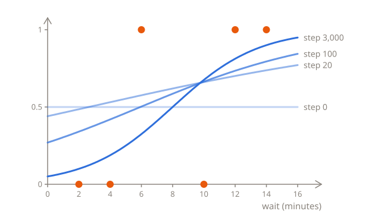
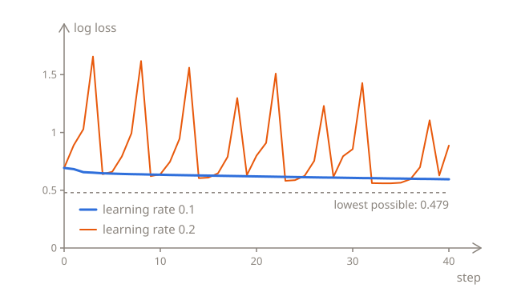

# Training

[Measuring the error](02-error.md) gave every rule a score, its log loss, and one rule, $w = 0.37$ and $b = -2.93$, scored best. This lesson finds it without guessing, with the method that trained the linear regression, [gradient descent](../02-linear-regression/03-training.md#both-parameters-at-once): work out the slope of the loss for each parameter, take a small step against the slopes, and repeat. The method stays the same, and even the slopes turn out almost the same.

## Which way is down?

As before, a nudge shows which way is down. This `loss` function works out the log loss of the six orders for any $w$ and $b$:

```python run
import math

waits = [2, 4, 6, 10, 12, 14]
cancelled = [0, 0, 1, 0, 1, 1]


def sigmoid(z):
    return 1 / (1 + math.exp(-z))


def loss(w, b):
    total = 0
    for i in range(len(waits)):
        p = sigmoid(w * waits[i] + b)
        if cancelled[i] == 1:
            total += -math.log(p)
        else:
            total += -math.log(1 - p)
    return total / len(waits)


print(round(loss(0, 0), 4))
print(round(loss(0.001, 0), 4))
```

At $w = 0$ and $b = 0$, the line's output is 0 for every order, so every order gets a probability of $\sigma(0) = 0.5$, and the loss is 0.6931, the same as the baseline's. Nudge $w$ up to 0.001, and the loss drops to 0.6918, by about 0.0013. So a bigger $w$ is the way down, and the slope there is about −1.3: the loss drops about 1.3 for each 1 added to $w$.

## A formula for the slope

The derivatives of the log loss, its exact slopes, are:

$$
\frac{\partial L}{\partial w} = \frac{1}{n} \sum_{i=1}^{n} \left( p_i - y_i \right) x_i
\qquad
\frac{\partial L}{\partial b} = \frac{1}{n} \sum_{i=1}^{n} \left( p_i - y_i \right)
$$

Put them next to the ones for the MSE, from linear regression:

$$
\frac{\partial L}{\partial w} = \frac{2}{n} \sum_{i=1}^{n} \left( \hat{y}_i - y_i \right) x_i
\qquad
\frac{\partial L}{\partial b} = \frac{2}{n} \sum_{i=1}^{n} \left( \hat{y}_i - y_i \right)
$$

They follow the same recipe: the prediction minus the label, times the feature for $w$, averaged over the examples. Only two things are different: the prediction is now a probability, $p_i$, and the 2 is gone. $p_i - y_i$ works as the error of a probability. For an order that was cancelled but got $p = 0.269$, it's 0.269 − 1 = −0.731, and for one that wasn't cancelled but got $p = 0.731$, it's 0.731 − 0 = 0.731. It's always between −1 and 1.

At $w = 0$ and $b = 0$, every $p$ is 0.5:

| $x$ | $y$ | $p - y$ | $(p - y) \times x$ |
| --- | --- | ------- | ------------------ |
| 2   | 0   | 0.5     | 1                  |
| 4   | 0   | 0.5     | 2                  |
| 6   | 1   | −0.5    | −3                 |
| 10  | 0   | 0.5     | 5                  |
| 12  | 1   | −0.5    | −6                 |
| 14  | 1   | −0.5    | −7                 |

The products add up to −8, and −8 ÷ 6 = −1.333, close to the −1.3 from the nudge. The slope for $b$ averages the errors alone, and three 0.5s and three −0.5s add up to 0. Half the orders were cancelled, so a probability of 0.5 is right on average, and moving $b$ alone wouldn't help.

<details>
<summary>Where does the formula come from?</summary>

Take one order that was cancelled. Its penalty is $-\ln p$, where $p = \sigma(z)$ and $z = wx + b$. Nudge $w$ by a small amount $h$, and follow the change through, one link at a time:

1. $z$ grows by $hx$.
2. $p$ grows by about $p(1 - p)$ times as much as $z$ did, so by $p(1 - p) hx$. $p(1 - p)$ is the slope of the sigmoid, which calculus works out. It's 0.5 × 0.5 = 0.25 at $z = 0$, where the S is steepest, and close to 0 far out on either side, where the S is almost flat.
3. The penalty $-\ln p$ changes by about $-\frac{1}{p}$ times as much as $p$ did. $-\frac{1}{p}$ is the slope of $-\ln p$: steep for a $p$ near 0, and gentle near 1. So the penalty changes by $-\frac{1}{p} \times p(1 - p) hx = -(1 - p) hx$.

Divided by $h$, the slope of the penalty is $-(1 - p) x = (p - 1) x$, which is $(p - y) x$ with $y = 1$. For an order that wasn't cancelled, the penalty is $-\ln (1 - p)$, and the same three links give $px$, which is $(p - y) x$ with $y = 0$. So every order's slope is $(p - y) x$, and the log loss, the average of the penalties, has the average of their slopes. For $b$, the first link gives $h$ instead of $hx$, so the $x$ drops out.

</details>

## Stepping downhill

Each step moves both parameters against their own slopes, just as in linear regression:

$$
w \leftarrow w - \eta \, \frac{\partial L}{\partial w}
\qquad
b \leftarrow b - \eta \, \frac{\partial L}{\partial b}
$$

From $w = 0$ and $b = 0$, with a learning rate of 0.1, the first step takes $w$ to 0 − 0.1 × (−1.333) = 0.133, and leaves $b$ at 0, as its slope is 0. After that, both of them move. The loop is the one that trained the linear regression, with two changes: the prediction goes through the sigmoid, and the slopes have no 2. Every 1,000 steps, it prints the step, the loss, $w$ and $b$:

```python run
import math

waits = [2, 4, 6, 10, 12, 14]
cancelled = [0, 0, 1, 0, 1, 1]
w = 0
b = 0
learning_rate = 0.1
n = len(waits)


def sigmoid(z):
    return 1 / (1 + math.exp(-z))


for step in range(3001):
    total = 0
    slope_w = 0
    slope_b = 0
    for i in range(n):
        p = sigmoid(w * waits[i] + b)
        if cancelled[i] == 1:
            total += -math.log(p)
        else:
            total += -math.log(1 - p)
        slope_w += (p - cancelled[i]) * waits[i] / n
        slope_b += (p - cancelled[i]) / n
    if step % 1000 == 0:
        print(step, round(total / n, 3), round(w, 2), round(b, 2))
    w = w - learning_rate * slope_w
    b = b - learning_rate * slope_b
```

The loss falls from 0.693, the baseline's, to 0.479, and the rule ends at $w = 0.37$ and $b = -2.93$, the best rule from the last lesson, with its boundary at about 8 minutes. It can't get below 0.479, because the orders overlap: no rule can be sure about the orders at 6 and 10 minutes, whose customers did the opposite of what their waits suggest.

On a chart, the rule starts flat, at 0.5 for every wait, then tilts and slides until it settles:



## The learning rate

As before, the learning rate is up to you. Try 0.01 and 0.2 in the code above:

- With **0.01**, the steps are 10 times shorter. After 3,000 steps, the loss is only down to 0.494, with $w = 0.27$ and $b = -1.99$. It gets there in the end, but it takes about 10 times as many steps.
- With **0.2**, the loss printed every 1,000 steps stays at 0.567, with $w = 0.54$ and $b = -3.29$, as if the training had settled on a worse rule. It hasn't settled at all. Change `step % 1000 == 0` to `step >= 2995` to print the last six steps, and you'll see it jump between two rules at every step, one with a loss of 0.567 and the other with 0.52. Every step overshoots the bottom, and the next one jumps back. Printing every 1,000th step only ever caught the same one of the two.



With the MSE, a learning rate that was too big made the training [diverge](../02-linear-regression/03-training.md#the-learning-rate): every step overshot by more than the last, until the numbers were too big for Python. With the log loss, the steps can't grow like that: $p - y$ is always between −1 and 1, so a single step can never change $w$ by more than the learning rate times the longest wait. Instead, with too big a learning rate, training keeps bouncing around, and never settles.

> [!TIP]
> If the loss grows or jumps around, the learning rate is too big. Printing the loss every 1,000 steps can hide the jumps, so print a few steps in a row as well.

## Why not solve it directly?

Linear regression has an exact solution, [the normal equation](../02-linear-regression/03-training.md#the-normal-equation), which finds the best $w$ and $b$ without any steps. Logistic regression has none. The best rule is where both slopes are 0, but every $p_i$ in them is the sigmoid of something with $w$ and $b$ in it, and no formula can solve those equations for $w$ and $b$. So logistic regression can only be trained step by step, like neural networks and language models. Gradient descent doesn't need a formula for the answer, only one for the slopes.

## The whole method on one page

Everything from the three lessons, in one place:

1. **The model** predicts a probability: $p = \sigma(wx + b)$, where $\sigma(z) = \frac{1}{1 + e^{-z}}$. A threshold of 0.5 turns it into a decision.
2. **The loss** is the log loss: $L(w, b) = -\frac{1}{n} \sum_{i=1}^{n} \big( y_i \ln p_i + (1 - y_i) \ln (1 - p_i) \big)$.
3. **The gradient** is the slope of the loss for each parameter:

$$
\frac{\partial L}{\partial w} = \frac{1}{n} \sum_{i=1}^{n} \left( p_i - y_i \right) x_i
\qquad
\frac{\partial L}{\partial b} = \frac{1}{n} \sum_{i=1}^{n} \left( p_i - y_i \right)
$$

4. **Each step** moves the parameters against the gradient, scaled by the learning rate $\eta$:

$$
w \leftarrow w - \eta \, \frac{\partial L}{\partial w}
\qquad
b \leftarrow b - \eta \, \frac{\partial L}{\partial b}
$$

5. **Repeat** until the loss stops dropping. If it grows or jumps around, lower the learning rate.

Next to [the method for linear regression](../02-linear-regression/03-training.md#the-whole-method-on-one-page), only the model and the loss are new. The gradient has the same shape, apart from the 2, and the steps are the same. Here's the same training written with NumPy, where `np.exp` works out $e$ to the power of every number in a list at once:

```python run
import numpy as np

waits = np.array([2, 4, 6, 10, 12, 14])
cancelled = np.array([0, 0, 1, 0, 1, 1])
w = 0
b = 0
learning_rate = 0.1

for step in range(5000):
    p = 1 / (1 + np.exp(-(w * waits + b)))
    w -= learning_rate * np.mean((p - cancelled) * waits)
    b -= learning_rate * np.mean(p - cancelled)

print(round(w, 2), round(b, 2))
```

## Going further

This part is optional. Nothing later in the chapter depends on it, and the test doesn't ask about it.

### Training on last month's orders

[Predicting a probability](01-probabilities.md) started with a rule, $w = 0.5$ and $b = -4$, that was chosen to match last month's counts. Training on the 700 orders themselves finds it too. The first half of the code builds the orders: for each of the seven waits, 100 orders, of which the first few were cancelled, as many as the counts say. The second half trains on them:

```python run
import numpy as np

groups = [2, 4, 6, 8, 10, 12, 14]
counts = [5, 12, 27, 50, 73, 88, 95]
waits = []
cancelled = []
for g in range(len(groups)):
    for k in range(100):
        waits.append(groups[g])
        if k < counts[g]:
            cancelled.append(1)
        else:
            cancelled.append(0)
waits = np.array(waits)
cancelled = np.array(cancelled)

w = 0
b = 0
learning_rate = 0.1
for step in range(5000):
    p = 1 / (1 + np.exp(-(w * waits + b)))
    w -= learning_rate * np.mean((p - cancelled) * waits)
    b -= learning_rate * np.mean(p - cancelled)

print(round(w, 2), round(b, 2))
```

It finds $w = 0.49$ and $b = -3.96$, almost exactly the rule from the first lesson, with its boundary at 8 minutes, and the same log loss to three decimal places, 0.427. It's steeper than the best rule for the six orders, because fewer of last month's customers went against their waits.

### When the groups don't overlap

In the six orders, the two groups overlap: a customer with a 6-minute wait cancelled, and one with a 10-minute wait didn't. Take four orders where they don't: waits of 2 and 4 minutes, not cancelled, and 12 and 14 minutes, cancelled. Any boundary between 4 and 12 minutes gets all four right, and the training never finishes. With a learning rate of 0.1:

| Steps   | $w$  | $b$   | Boundary | Log loss |
| ------- | ---- | ----- | -------- | -------- |
| 1,000   | 0.76 | −5.41 | 7.2      | 0.035    |
| 10,000  | 1.28 | −9.68 | 7.6      | 0.004    |
| 100,000 | 1.83 | −14.1 | 7.7      | 0.0004   |

The boundary hardly moves, but $w$ and $b$ keep growing. A steeper S is more sure about all four orders, and here being more sure is always right, so the loss keeps falling towards 0 without ever getting there, and the parameters would keep growing forever. In practice, training stops after a set number of steps, or the loss gets an extra penalty for big weights, which is called **regularization**. To see it happen, put these four orders into the loop from [Stepping downhill](#stepping-downhill).

### More than two categories

Logistic regression chooses between two categories. To choose among more, like which of ten digits is in an image, the model works out one $z$ for each category, each with its own weights and bias, and a function called **softmax** turns them into probabilities that add up to 1. With $K$ categories, category $k$ gets:

$$
p_k = \frac{e^{z_k}}{e^{z_1} + e^{z_2} + \dots + e^{z_K}}
$$

Every power of $e$ is positive, so every $p_k$ is between 0 and 1, and together they add up to 1. With two categories, where the second one's $z$ is always 0, softmax is the sigmoid: $\frac{e^z}{e^z + e^0} = \frac{1}{1 + e^{-z}}$. The loss is the same penalty as before, the negative logarithm of the probability given to what happened, and it's called **cross-entropy**. Language models are trained with it in [pretraining](../../vocabulary/pretraining.md), where the category to predict is the next token.

## Check yourself

<details>
<summary>Training on the six orders ends with a log loss of 0.479, not 0. Did it fail?</summary>

No. A loss of 0 needs a rule that's sure and right about every order, and none can be: the orders at 6 and 10 minutes went against their waits. 0.479 is the lowest loss any rule can get on them.

</details>

<details>
<summary>With a learning rate of 0.2, the loss printed every 1,000 steps is 0.567 each time. Has the training settled?</summary>

No. It jumps between two rules at every step, and printing every 1,000th step always catches the same one. Print a few steps in a row to see it, and lower the learning rate to let it settle.

</details>

<details>
<summary>An order that was cancelled gets a probability of 0.99. How much does it add to the slope for w?</summary>

Almost nothing. Its $p - y$ is 0.99 − 1 = −0.01, so it adds only −0.01 times its wait, divided by $n$. The orders that a rule already gets right, and is sure about, hardly move it: training is driven by the orders it gets wrong.

</details>

## Your turn

In [One training step](../../../exercises/04-foundations/03-logistic-regression/03-training/01-one-training-step/task.md), you'll work out the slopes of the log loss, and take a single step. In [Train a classifier](../../../exercises/04-foundations/03-logistic-regression/03-training/02-train-a-classifier/task.md), you'll put the steps in a loop, and train a rule on any orders.
