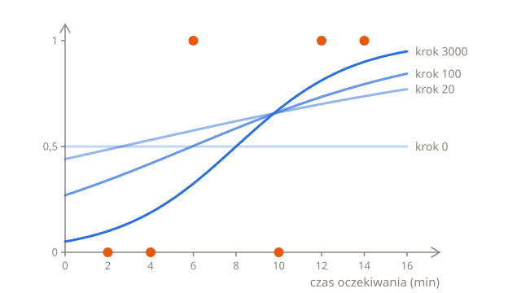
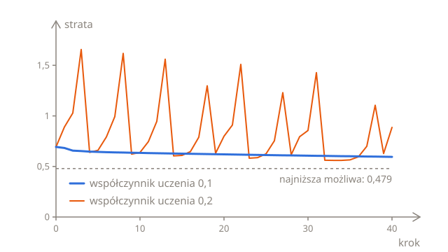

# Trening

Lekcja [Mierzenie błędu](02-error.pl.md) dała każdej regule ocenę, jej stratę logarytmiczną, a najlepiej wypadła jedna reguła: $w = 0{,}37$ i $b = -2{,}93$. Ta lekcja znajduje ją bez zgadywania, metodą, która wytrenowała regresję liniową, czyli [spadkiem gradientu](../02-linear-regression/03-training.pl.md#oba-parametry-naraz): policz nachylenie straty względem każdego parametru, zrób mały krok przeciwnie do nachyleń i powtarzaj. Metoda zostaje ta sama, a nawet nachylenia okazują się prawie takie same.

## Gdzie jest w dół?

Tak jak wcześniej, przesunięcie pokazuje, gdzie jest w dół. Ta funkcja `loss` liczy stratę logarytmiczną sześciu zamówień dla dowolnych $w$ i $b$:

```python run
import math

waits = [2, 4, 6, 10, 12, 14]
cancelled = [0, 0, 1, 0, 1, 1]


def sigmoid(z):
    return 1 / (1 + math.exp(-z))


def loss(w, b):
    total = 0
    for i in range(len(waits)):
        p = sigmoid(w * waits[i] + b)
        if cancelled[i] == 1:
            total += -math.log(p)
        else:
            total += -math.log(1 - p)
    return total / len(waits)


print(round(loss(0, 0), 4))
print(round(loss(0.001, 0), 4))
```

Przy $w = 0$ i $b = 0$ wynik prostej wynosi 0 dla każdego zamówienia, więc każde zamówienie dostaje prawdopodobieństwo $\sigma(0) = 0{,}5$, a strata wynosi 0,6931, tyle samo co strata punktu odniesienia. Przesuń $w$ w górę do 0,001, a strata spadnie do 0,6918, czyli o około 0,0013. Większe $w$ to więc droga w dół, a nachylenie wynosi tam około −1,3: strata spada mniej więcej o 1,3 na każde 1 dodane do $w$.

## Wzór na nachylenie

Pochodne straty logarytmicznej, czyli jej dokładne nachylenia, to:

$$
\frac{\partial L}{\partial w} = \frac{1}{n} \sum_{i=1}^{n} \left( p_i - y_i \right) x_i
\qquad
\frac{\partial L}{\partial b} = \frac{1}{n} \sum_{i=1}^{n} \left( p_i - y_i \right)
$$

Porównaj je z pochodnymi MSE z regresji liniowej:

$$
\frac{\partial L}{\partial w} = \frac{2}{n} \sum_{i=1}^{n} \left( \hat{y}_i - y_i \right) x_i
\qquad
\frac{\partial L}{\partial b} = \frac{2}{n} \sum_{i=1}^{n} \left( \hat{y}_i - y_i \right)
$$

Przepis jest ten sam: predykcja minus etykieta, dla $w$ pomnożona przez cechę, uśredniona po przykładach. Różnią się tylko dwie rzeczy: predykcja jest teraz prawdopodobieństwem, $p_i$, a dwójka zniknęła. $p_i - y_i$ działa jak błąd prawdopodobieństwa. Dla zamówienia, które anulowano, a które dostało $p = 0{,}269$, wynosi 0,269 − 1 = −0,731, a dla takiego, którego nie anulowano, a które dostało $p = 0{,}731$, wynosi 0,731 − 0 = 0,731. Zawsze mieści się między −1 a 1.

Przy $w = 0$ i $b = 0$ każde $p$ wynosi 0,5:

| $x$ | $y$ | $p - y$ | $(p - y) \times x$ |
| --- | --- | ------- | ------------------ |
| 2   | 0   | 0,5     | 1                  |
| 4   | 0   | 0,5     | 2                  |
| 6   | 1   | −0,5    | −3                 |
| 10  | 0   | 0,5     | 5                  |
| 12  | 1   | −0,5    | −6                 |
| 14  | 1   | −0,5    | −7                 |

Iloczyny sumują się do −8, a −8 ÷ 6 = −1,333, blisko −1,3 z przesunięcia. Nachylenie względem $b$ uśrednia same błędy, a trzy razy 0,5 i trzy razy −0,5 sumują się do 0. Anulowano połowę zamówień, więc prawdopodobieństwo 0,5 jest średnio trafne, a samo przesuwanie $b$ by nie pomogło.

<details>
<summary>Skąd się bierze ten wzór?</summary>

Weź jedno zamówienie, które anulowano. Jego kara to $-\ln p$, gdzie $p = \sigma(z)$, a $z = wx + b$. Przesuń $w$ o małą wartość $h$ i prześledź zmianę ogniwo po ogniwie:

1. $z$ rośnie o $hx$.
2. $p$ rośnie mniej więcej $p(1 - p)$ razy tyle co $z$, czyli o $p(1 - p) hx$. $p(1 - p)$ to nachylenie sigmoidy, które wyznacza rachunek różniczkowy. Wynosi 0,5 × 0,5 = 0,25 przy $z = 0$, gdzie krzywa jest najbardziej stroma, i jest bliskie 0 daleko po obu stronach, gdzie krzywa jest prawie płaska.
3. Kara $-\ln p$ zmienia się mniej więcej $-\frac{1}{p}$ razy tyle co $p$. $-\frac{1}{p}$ to nachylenie $-\ln p$: strome dla $p$ bliskiego 0 i łagodne blisko 1. Kara zmienia się więc o $-\frac{1}{p} \times p(1 - p) hx = -(1 - p) hx$.

Po podzieleniu przez $h$ nachylenie kary wynosi $-(1 - p) x = (p - 1) x$, czyli $(p - y) x$ przy $y = 1$. Dla zamówienia, którego nie anulowano, kara to $-\ln (1 - p)$, a te same trzy ogniwa dają $px$, czyli $(p - y) x$ przy $y = 0$. Nachylenie każdego zamówienia to więc $(p - y) x$, a strata logarytmiczna, czyli średnia kar, ma nachylenie równe średniej ich nachyleń. Dla $b$ pierwsze ogniwo daje $h$ zamiast $hx$, więc $x$ znika.

</details>

## Kroki w dół

Każdy krok przesuwa oba parametry przeciwnie do ich własnych nachyleń, dokładnie tak jak w regresji liniowej:

$$
w \leftarrow w - \eta \, \frac{\partial L}{\partial w}
\qquad
b \leftarrow b - \eta \, \frac{\partial L}{\partial b}
$$

Od $w = 0$ i $b = 0$, ze współczynnikiem uczenia 0,1, pierwszy krok przesuwa $w$ do 0 − 0,1 × (−1,333) = 0,133 i zostawia $b$ równe 0, bo jego nachylenie wynosi 0. Potem ruszają się już oba. Pętla to ta sama, która wytrenowała regresję liniową, z dwiema zmianami: predykcja przechodzi przez sigmoidę, a nachylenia nie mają dwójki. Co 1000 kroków kod wypisuje numer kroku, stratę, $w$ i $b$:

```python run
import math

waits = [2, 4, 6, 10, 12, 14]
cancelled = [0, 0, 1, 0, 1, 1]
w = 0
b = 0
learning_rate = 0.1
n = len(waits)


def sigmoid(z):
    return 1 / (1 + math.exp(-z))


for step in range(3001):
    total = 0
    slope_w = 0
    slope_b = 0
    for i in range(n):
        p = sigmoid(w * waits[i] + b)
        if cancelled[i] == 1:
            total += -math.log(p)
        else:
            total += -math.log(1 - p)
        slope_w += (p - cancelled[i]) * waits[i] / n
        slope_b += (p - cancelled[i]) / n
    if step % 1000 == 0:
        print(step, round(total / n, 3), round(w, 2), round(b, 2))
    w = w - learning_rate * slope_w
    b = b - learning_rate * slope_b
```

Strata spada z 0,693, czyli straty punktu odniesienia, do 0,479, a reguła kończy z $w = 0{,}37$ i $b = -2{,}93$, czyli jako najlepsza reguła z poprzedniej lekcji, z granicą przy około 8 minutach. Nie może zejść poniżej 0,479, bo zamówienia się nakładają: żadna reguła nie może być pewna co do zamówień przy 6 i 10 minutach, których klienci zrobili odwrotnie, niż sugerowały ich czasy oczekiwania.

Na wykresie reguła zaczyna płasko, od 0,5 dla każdego czasu oczekiwania, a potem przechyla się i przesuwa, aż się ustabilizuje:



## Współczynnik uczenia

Tak jak wcześniej, współczynnik uczenia wybierasz ty. Wpisz w kodzie powyżej `0.01` i `0.2`:

- Przy **0,01** kroki są 10 razy krótsze. Po 3000 krokach strata spada tylko do 0,494, z $w = 0{,}27$ i $b = -1{,}99$. W końcu trening dociera na miejsce, ale zajmuje to mniej więcej 10 razy więcej kroków.
- Przy **0,2** strata wypisywana co 1000 kroków za każdym razem wynosi 0,567, z $w = 0{,}54$ i $b = -3{,}29$, jakby trening ustabilizował się na gorszej regule. Wcale się nie ustabilizował. Zmień `step % 1000 == 0` na `step >= 2995`, żeby wypisać ostatnich sześć kroków, a zobaczysz, że w każdym kroku skacze między dwiema regułami, jedną ze stratą 0,567, a drugą z 0,52. Każdy krok przeskakuje dno, a następny skacze z powrotem. Wypisywanie co 1000 kroków za każdym razem trafiało na tę samą z nich.



Przy MSE za duży współczynnik uczenia sprawiał, że trening się [rozbiegał](../02-linear-regression/03-training.pl.md#współczynnik-uczenia): każdy krok przeskakiwał dno bardziej niż poprzedni, aż liczby stawały się za duże dla Pythona. Przy stracie logarytmicznej kroki nie mogą tak rosnąć: $p - y$ zawsze mieści się między −1 a 1, więc pojedynczy krok nigdy nie zmieni $w$ o więcej niż współczynnik uczenia razy najdłuższy czas oczekiwania. Za to przy za dużym współczynniku uczenia trening cały czas skacze i nigdy się nie stabilizuje.

> [!TIP]
> Jeśli strata rośnie albo skacze, współczynnik uczenia jest za duży. Wypisywanie straty co 1000 kroków może ukryć skoki, więc wypisz też kilka kroków z rzędu.

## Dlaczego nie rozwiązać tego wprost?

Regresja liniowa ma dokładne rozwiązanie, [równanie normalne](../02-linear-regression/03-training.pl.md#równanie-normalne), które znajduje najlepsze $w$ i $b$ bez żadnych kroków. Regresja logistyczna żadnego nie ma. Najlepsza reguła leży tam, gdzie oba nachylenia wynoszą 0, ale każde $p_i$ w nich to sigmoida czegoś, w czym są $w$ i $b$, i żaden wzór nie rozwiązuje tych równań względem $w$ i $b$. Dlatego regresję logistyczną da się trenować tylko krok po kroku, tak jak sieci neuronowe i modele językowe. Spadek gradientu nie potrzebuje wzoru na odpowiedź, tylko wzoru na nachylenia.

## Cała metoda na jednej stronie

Wszystko z trzech lekcji w jednym miejscu:

1. **Model** przewiduje prawdopodobieństwo: $p = \sigma(wx + b)$, gdzie $\sigma(z) = \frac{1}{1 + e^{-z}}$. Próg 0,5 zamienia je w decyzję.
2. **Funkcja straty** to strata logarytmiczna: $L(w, b) = -\frac{1}{n} \sum_{i=1}^{n} \big( y_i \ln p_i + (1 - y_i) \ln (1 - p_i) \big)$.
3. **Gradient** to nachylenie straty względem każdego parametru:

$$
\frac{\partial L}{\partial w} = \frac{1}{n} \sum_{i=1}^{n} \left( p_i - y_i \right) x_i
\qquad
\frac{\partial L}{\partial b} = \frac{1}{n} \sum_{i=1}^{n} \left( p_i - y_i \right)
$$

4. **Każdy krok** przesuwa parametry przeciwnie do gradientu, przeskalowanego przez współczynnik uczenia $\eta$:

$$
w \leftarrow w - \eta \, \frac{\partial L}{\partial w}
\qquad
b \leftarrow b - \eta \, \frac{\partial L}{\partial b}
$$

5. **Powtarzaj**, aż strata przestanie spadać. Jeśli rośnie albo skacze, zmniejsz współczynnik uczenia.

W porównaniu z [metodą dla regresji liniowej](../02-linear-regression/03-training.pl.md#cała-metoda-na-jednej-stronie) nowe są tylko model i funkcja straty. Gradient ma ten sam kształt, nie licząc dwójki, a kroki są takie same. Oto ten sam trening zapisany z użyciem NumPy, gdzie `np.exp` liczy $e$ do potęgi każdej liczby z listy naraz:

```python run
import numpy as np

waits = np.array([2, 4, 6, 10, 12, 14])
cancelled = np.array([0, 0, 1, 0, 1, 1])
w = 0
b = 0
learning_rate = 0.1

for step in range(5000):
    p = 1 / (1 + np.exp(-(w * waits + b)))
    w -= learning_rate * np.mean((p - cancelled) * waits)
    b -= learning_rate * np.mean(p - cancelled)

print(round(w, 2), round(b, 2))
```

## Dla chętnych

Ta część jest nieobowiązkowa. Nic dalej w rozdziale od niej nie zależy i test o nią nie pyta.

### Trening na zamówieniach z zeszłego miesiąca

Lekcja [Przewidywanie prawdopodobieństwa](01-probabilities.pl.md) zaczęła od reguły $w = 0{,}5$ i $b = -4$, dobranej do policzonych odsetków z zeszłego miesiąca. Trening na samych 700 zamówieniach też ją znajduje. Pierwsza połowa kodu buduje zamówienia: dla każdego z siedmiu czasów oczekiwania 100 zamówień, z których kilka pierwszych anulowano, tyle, ile podają policzone odsetki. Druga połowa na nich trenuje:

```python run
import numpy as np

groups = [2, 4, 6, 8, 10, 12, 14]
counts = [5, 12, 27, 50, 73, 88, 95]
waits = []
cancelled = []
for g in range(len(groups)):
    for k in range(100):
        waits.append(groups[g])
        if k < counts[g]:
            cancelled.append(1)
        else:
            cancelled.append(0)
waits = np.array(waits)
cancelled = np.array(cancelled)

w = 0
b = 0
learning_rate = 0.1
for step in range(5000):
    p = 1 / (1 + np.exp(-(w * waits + b)))
    w -= learning_rate * np.mean((p - cancelled) * waits)
    b -= learning_rate * np.mean(p - cancelled)

print(round(w, 2), round(b, 2))
```

Znajduje $w = 0{,}49$ i $b = -3{,}96$, prawie dokładnie regułę z pierwszej lekcji, z granicą przy 8 minutach i tą samą stratą logarytmiczną z dokładnością do trzech miejsc po przecinku, 0,427. Jest bardziej stroma niż najlepsza reguła dla sześciu zamówień, bo mniej klientów z zeszłego miesiąca zachowało się wbrew swoim czasom oczekiwania.

### Gdy grupy się nie nakładają

W sześciu zamówieniach obie grupy się nakładają: klient z czasem oczekiwania 6 minut anulował, a klient z 10 minutami nie. Weź cztery zamówienia, w których się nie nakładają: czasy oczekiwania 2 i 4 minuty, nieanulowane, oraz 12 i 14 minut, anulowane. Każda granica między 4 a 12 minutami daje cztery trafne decyzje, a trening nigdy się nie kończy. Przy współczynniku uczenia 0,1:

| Kroki   | $w$  | $b$   | Granica | Strata logarytmiczna |
| ------- | ---- | ----- | ------- | -------------------- |
| 1000    | 0,76 | −5,41 | 7,2     | 0,035                |
| 10 000  | 1,28 | −9,68 | 7,6     | 0,004                |
| 100 000 | 1,83 | −14,1 | 7,7     | 0,0004               |

Granica prawie się nie rusza, ale $w$ i $b$ cały czas rosną. Bardziej stroma krzywa jest pewniejsza co do wszystkich czterech zamówień, a tutaj większa pewność zawsze się opłaca, więc strata cały czas spada w stronę 0, nigdy do niego nie docierając, a parametry rosłyby w nieskończoność. W praktyce trening kończy się po ustalonej liczbie kroków albo funkcja straty dostaje dodatkową karę za duże wagi, co nazywa się **regularyzacją**. Żeby zobaczyć to na własne oczy, wstaw te cztery zamówienia do pętli z części [Kroki w dół](#kroki-w-dół).

### Więcej niż dwie kategorie

Regresja logistyczna wybiera między dwiema kategoriami. Żeby wybierać spośród większej liczby, na przykład to, która z dziesięciu cyfr jest na obrazku, model liczy osobne $z$ dla każdej kategorii, każde z własnymi wagami i wyrazem wolnym, a funkcja zwana **softmax** zamienia je w prawdopodobieństwa, które sumują się do 1. Przy $K$ kategoriach kategoria $k$ dostaje:

$$
p_k = \frac{e^{z_k}}{e^{z_1} + e^{z_2} + \dots + e^{z_K}}
$$

Każda potęga $e$ jest dodatnia, więc każde $p_k$ leży między 0 a 1, a razem sumują się do 1. Przy dwóch kategoriach, gdy $z$ drugiej jest zawsze równe 0, softmax to sigmoida: $\frac{e^z}{e^z + e^0} = \frac{1}{1 + e^{-z}}$. Funkcja straty to ta sama kara co wcześniej, minus logarytm prawdopodobieństwa danego temu, co się stało, i nazywa się ją **entropią krzyżową**. Modele językowe trenuje się z nią podczas [pretreningu](../../vocabulary/pretraining.pl.md), gdzie kategorią do przewidzenia jest następny token.

## Sprawdź się

<details>
<summary>Trening na sześciu zamówieniach kończy ze stratą logarytmiczną 0,479, a nie 0. Czy się nie udał?</summary>

Udał się. Strata 0 wymaga reguły, która jest pewna i ma rację przy każdym zamówieniu, a żadna taka nie istnieje: klienci, którzy czekali 6 i 10 minut, zrobili odwrotnie, niż sugerowały ich czasy oczekiwania. 0,479 to najmniejsza strata, jaką może na nich osiągnąć jakakolwiek reguła.

</details>

<details>
<summary>Przy współczynniku uczenia 0,2 strata wypisywana co 1000 kroków za każdym razem wynosi 0,567. Czy trening się ustabilizował?</summary>

Nie. W każdym kroku skacze między dwiema regułami, a wypisywanie co 1000 kroków zawsze trafia na tę samą. Wypisz kilka kroków z rzędu, żeby to zobaczyć, i zmniejsz współczynnik uczenia, żeby trening mógł się ustabilizować.

</details>

<details>
<summary>Zamówienie, które anulowano, dostaje prawdopodobieństwo 0,99. Ile dodaje do nachylenia względem w?</summary>

Prawie nic. Jego $p - y$ to 0,99 − 1 = −0,01, więc dodaje tylko −0,01 razy swój czas oczekiwania, podzielone przez $n$. Zamówienia, przy których reguła już ma rację i jest pewna, prawie jej nie przesuwają: trening napędzają zamówienia, przy których się myli.

</details>

## Twoja kolej

W ćwiczeniu [Jeden krok treningu](../../../exercises/04-foundations/03-logistic-regression/03-training/01-one-training-step/task.pl.md) policzysz nachylenia straty logarytmicznej i zrobisz jeden krok. W ćwiczeniu [Wytrenuj klasyfikator](../../../exercises/04-foundations/03-logistic-regression/03-training/02-train-a-classifier/task.pl.md) umieścisz kroki w pętli i wytrenujesz regułę na dowolnych zamówieniach.
