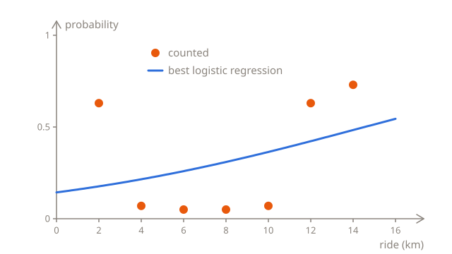
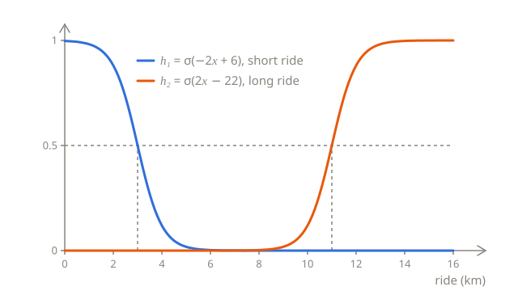
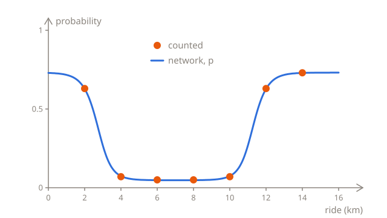
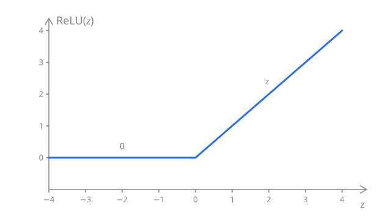

# Layers of neurons

The taxi company from the [logistic regression lessons](../03-logistic-regression/) has a new problem. When a customer orders a taxi, the app offers the ride to a driver nearby, who can accept it or turn it down. A turned-down order goes to the next driver, and the customer waits longer. The company would like to know how likely each order is to be turned down, so that it can add a bonus for the driver to the orders that probably will be.

This lesson answers the question with a model that logistic regression can't match, even though it's built from nothing but logistic regressions: a **neural network**.

## Counting turned-down orders

The company picked 100 orders for each of seven ride lengths, from 2 to 14 km, and counted how many of each hundred the first driver turned down:

| Ride (km)            | 2   | 4   | 6   | 8   | 10  | 12  | 14  |
| -------------------- | --- | --- | --- | --- | --- | --- | --- |
| Turned down (of 100) | 63  | 7   | 5   | 5   | 7   | 63  | 73  |

Drivers turn down short rides and long ones, and accept the ones in between. A 2 km ride pays too little to be worth the trip to the customer, and a 12 km one takes the driver out of town, where they may well have to drive back empty.

As in the last chapter, the label is a number: $y = 1$ for an order that was turned down, and $y = 0$ for one that was accepted. The model will predict the probability that $y$ is 1.

## One S isn't enough

Logistic regression, $p = \sigma(wx + b)$, draws an S. The S can be steep or gentle, it can sit further to the left or to the right, and with a negative $w$, it falls instead of rising, but it only ever goes one way. The counts go down and then up again, in the shape of a U, and no S can do that.

The best S for these counts, the one that [training](../03-logistic-regression/03-training.md) finds, has $w = 0.12$ and $b = -1.79$. It rises gently, from 0.18 at 2 km to 0.48 at 14 km, and misses both ends of the U:



It never even reaches 0.5, so with a threshold of 0.5, it predicts that every order will be accepted. Its log loss, over all 700 orders, is 0.601, hardly better than the 0.626 of the [baseline](../03-logistic-regression/02-error.md#a-baseline), which gives every order the same probability: 0.319, as 223 of the 700 orders were turned down. As far as logistic regression can tell, the length of the ride hardly matters. Given the length of the ride times itself as a second input, logistic regression can draw a U too, as [A new input](04-inputs.md#a-new-input) shows, but only because someone saw the U first, and chose that input for it.

## Two S's make a U

One S can't bend back, but two of them can make a U. Take one S that falls, from almost 1 to almost 0, around 3 km, and another that rises, from almost 0 to almost 1, around 11 km:

$$
h_1 = \sigma(-2x + 6)
\qquad
h_2 = \sigma(2x - 22)
$$

Each is a logistic regression, with its own weight and bias. The line inside $h_1$, $-2x + 6$, is 0 at $x = 3$, so that's where $h_1$ is 0.5, and the line inside $h_2$ is 0 at $x = 11$:



$h_1$ is close to 1 only for short rides, and $h_2$ only for long ones. Add them up, and the sum is close to 1 at both ends and close to 0 in between: that's the U. It still has to be turned into a probability of the right height, and that's a job for a third logistic regression, with $h_1$ and $h_2$ as its two inputs:

$$
p = \sigma(4h_1 + 4h_2 - 3)
$$

For a ride in the middle, $h_1$ and $h_2$ are both close to 0, so $z = 4h_1 + 4h_2 - 3$ is close to −3, and $p$ is close to $\sigma(-3) = 0.047$. For a short ride, $h_1$ is close to 1, so $z$ is close to 4 − 3 = 1, and $p$ is close to $\sigma(1) = 0.731$, and the same goes for a long ride, with $h_2$. Here's every ride from the counts, with the numbers rounded to 3 decimal places:

| Ride $x$ | $h_1$ | $h_2$ | $z$    | $p$   | Counted |
| -------- | ----- | ----- | ------ | ----- | ------- |
| 2        | 0.881 | 0.000 | 0.523  | 0.628 | 0.63    |
| 4        | 0.119 | 0.000 | −2.523 | 0.074 | 0.07    |
| 6        | 0.002 | 0.000 | −2.990 | 0.048 | 0.05    |
| 8        | 0.000 | 0.002 | −2.990 | 0.048 | 0.05    |
| 10       | 0.000 | 0.119 | −2.523 | 0.074 | 0.07    |
| 12       | 0.000 | 0.881 | 0.523  | 0.628 | 0.63    |
| 14       | 0.000 | 0.998 | 0.990  | 0.729 | 0.73    |

The predictions follow the counts all the way along the U:



Put together, the three logistic regressions make a single formula, with $x$ in it twice:

$$
p = \sigma\big(4\,\sigma(-2x + 6) + 4\,\sigma(2x - 22) - 3\big)
$$

In Python, it takes three lines, one for each logistic regression. The loop below prints the prediction for each ride length, and adds up the penalties, as in [A penalty for every order](../03-logistic-regression/02-error.md#a-penalty-for-every-order): each of the `count` orders that were turned down adds $-\ln p$, and each of the `100 - count` that were accepted adds $-\ln (1 - p)$:

```python run
import math


def sigmoid(z):
    return 1 / (1 + math.exp(-z))


def predict(km):
    h1 = sigmoid(-2 * km + 6)
    h2 = sigmoid(2 * km - 22)
    return sigmoid(4 * h1 + 4 * h2 - 3)


turned_down = {2: 63, 4: 7, 6: 5, 8: 5, 10: 7, 12: 63, 14: 73}

total = 0
for km, count in turned_down.items():
    p = predict(km)
    print(km, round(p, 3))
    total += count * -math.log(p) + (100 - count) * -math.log(1 - p)

print(round(total / 700, 3))
```

The log loss is 0.401, against 0.601 for the best S.

## Neurons, layers and networks

What you've just built is a neural network. Each of its three logistic regressions is a **neuron**: it multiplies each of its inputs by a weight, adds a bias, and puts the result through the sigmoid. The sigmoid is the neuron's **activation function**, and what comes out of it is the neuron's **activation**.

The neurons are arranged in **layers**. The length of the ride, $x$, is the **input**. $h_1$ and $h_2$ make up the **hidden layer**, called hidden because the data never says what they should be: it only has the length of each ride and whether it was turned down. The last neuron makes up the **output layer**, and its activation is the network's prediction, $p$:


Each neuron takes the activations of every neuron in the layer before it, so layers like these are called **fully connected**, or dense. The network has 7 parameters: a weight and a bias for each hidden neuron, $w_1$, $b_1$, $w_2$ and $b_2$, and for the output neuron, a weight for each hidden neuron, $v_1$ and $v_2$, and a bias, $c$:

$$
h_1 = \sigma(w_1 x + b_1)
\qquad
h_2 = \sigma(w_2 x + b_2)
\qquad
p = \sigma(v_1 h_1 + v_2 h_2 + c)
$$

Working out a prediction like this, layer by layer, from the input to the output, is called the **forward pass**. In code, the 7 parameters fit in a dict:

```python run
import math

net = {"w1": -2, "b1": 6, "w2": 2, "b2": -22, "v1": 4, "v2": 4, "c": -3}


def sigmoid(z):
    return 1 / (1 + math.exp(-z))


def predict(km, net):
    h1 = sigmoid(net["w1"] * km + net["b1"])
    h2 = sigmoid(net["w2"] * km + net["b2"])
    return sigmoid(net["v1"] * h1 + net["v2"] * h2 + net["c"])


for km in [2, 4, 6, 8, 10, 12, 14]:
    print(km, round(predict(km, net), 3))
```

Change the numbers and run it again. With `"b1": 10`, the first neuron's S moves from 3 to 5 km, and the network predicts that 4 km rides get turned down too, with a probability of 0.628. With `"v2": 0`, the output neuron ignores $h_2$, and the network forgets about long rides: from 6 km on, every ride gets about 0.05.

## Why the activation matters

The sigmoids in the hidden layer do more than keep the numbers between 0 and 1: without them, the network couldn't draw a U at all. Take them out, so that $h_1 = -2x + 6$ and $h_2 = 2x - 22$, and put those into the output neuron's line:

$$
z = 4(-2x + 6) + 4(2x - 22) - 3 = -8x + 24 + 8x - 88 - 3 = -67
$$

The $x$'s cancel out, and every ride gets the same $z$, −67, so the same probability, almost 0. With other weights, they wouldn't cancel out, but the result would still be a single line:

$$
z = v_1(w_1 x + b_1) + v_2(w_2 x + b_2) + c = (v_1 w_1 + v_2 w_2)\,x + (v_1 b_1 + v_2 b_2 + c)
$$

That's a weight times $x$ plus a bias, the same as a logistic regression with $w = v_1 w_1 + v_2 w_2$ and $b = v_1 b_1 + v_2 b_2 + c$. Lines multiplied by numbers and added up are still a line, so without activation functions, a network is no better than a single neuron, however many neurons and layers it has. The activation functions are what bend the lines into curves, and because they aren't lines themselves, they're called **non-linear**.

## ReLU

The sigmoid isn't the only activation function, and in the hidden layers of today's networks, it's rarely used. The most common one is the **ReLU**, short for rectified linear unit. It keeps a positive number as it is, and turns a negative one into 0:

$$
\text{ReLU}(z) = \max(0, z)
$$

$\max(0, z)$ is whichever is bigger, 0 or $z$, and in Python, it's `max(0, z)`:



A ReLU has no $e$ to work out, just a comparison, so it's quick, and as the next lesson shows, deep networks train better with it. It bends in only one place, but that's enough. Here's the U again, with ReLUs in the hidden layer: $h_1 = \text{ReLU}(-x + 3)$ is 0 from 3 km on, and grows for shorter rides, and $h_2 = \text{ReLU}(x - 11)$ is 0 up to 11 km, and grows for longer ones. The output neuron keeps the sigmoid, because its job is to give a probability:

```python run
import math


def sigmoid(z):
    return 1 / (1 + math.exp(-z))


def relu(z):
    return max(0, z)


def predict(km):
    h1 = relu(-km + 3)
    h2 = relu(km - 11)
    return sigmoid(4 * h1 + 4 * h2 - 3)


for km in [2, 4, 6, 8, 10, 12, 14]:
    print(km, round(predict(km), 3))
```

From 4 to 10 km, both ReLUs are 0, so $p = \sigma(-3) = 0.047$. At 2 km, $h_1$ is 1, and at 12 km, so is $h_2$, which gives $\sigma(1) = 0.731$. But a ReLU never flattens out: at 14 km, $h_2$ is already 3, and $p = \sigma(9)$, more than 0.9999, far above the 0.73 that was counted. With more hidden neurons, a network of ReLUs can bend as often as it needs to, and flatten out too.

## More neurons and more layers

Two hidden neurons were enough for a U. A shape with more bends needs more of them, and with enough hidden neurons, even a single hidden layer can follow any unbroken curve as closely as you like. With more than one input, each hidden neuron gets a weight for each input, like the logistic regression in [More than one input](../03-logistic-regression/01-probabilities.md#more-than-one-input).

Hidden layers can also be stacked, so that the activations of one layer are the inputs of the next. Each layer then works with what the layer before it found, and can combine simple patterns into more complex ones. A network with many hidden layers is called **deep**, and training networks like that is **deep learning**.

The output layer can have more than one neuron too. A network that reads handwritten digits has 10 output neurons, one for each digit from 0 to 9, and a function called the softmax, from [More than two categories](../03-logistic-regression/03-training.md#more-than-two-categories), turns what they give into 10 probabilities that add up to 1. Its input is a picture 28 pixels wide and 28 high, so 784 numbers, one for the brightness of each pixel. With two hidden layers, of 300 and 100 neurons, the network has:

| Layer         | Weights   | Biases | Parameters |
| ------------- | --------- | ------ | ---------- |
| First hidden  | 784 × 300 | 300    | 235,500    |
| Second hidden | 300 × 100 | 100    | 30,100     |
| Output        | 100 × 10  | 10     | 1,010      |

That's 266,610 parameters, and it's a small network by today's standards.

## Where do the weights come from?

The 7 parameters of the U were chosen by hand, by thinking about where each S should cross 0.5 and how high the U should go. That works for 7 parameters and a shape you can see. It doesn't for 266,610 parameters, or for a shape nobody can picture, like the one that turns 784 pixels into a digit.

Logistic regression found its parameters with gradient descent, from the slope of the loss for each of them, and a network can too. The only hard part is the slopes. The next lesson works them out for every weight, including the ones in the hidden layer, and the lesson after it trains the network.

## Summary

- A neuron multiplies each of its inputs by a weight, adds a bias, and puts the result through an activation function. With the sigmoid as its activation function, a neuron is a logistic regression.
- One neuron draws an S. A neural network connects neurons in layers, so that the activations of one layer are the inputs of the next, and it can draw other shapes, like a U.
- A prediction is worked out layer by layer, from the input through the hidden layers to the output: the forward pass.
- Without non-linear activation functions, all the layers would add up to a single line. In hidden layers, the most common activation function is the ReLU, $\max(0, z)$. An output neuron that gives a probability keeps the sigmoid.

## Check yourself

<details>
<summary>What does the network from this lesson predict for a 16 km ride?</summary>

About 0.731. $h_1 = \sigma(-26)$ is practically 0, and $h_2 = \sigma(10)$ is practically 1, so $z$ is about 4 − 3 = 1, and $p = \sigma(1) = 0.731$. Past 14 km, $h_2$ has flattened out, so every long ride gets about the same probability.

</details>

<details>
<summary>A network like the one in this lesson has three hidden neurons instead of two. How many parameters does it have?</summary>

10. Each hidden neuron has a weight and a bias, which makes 6 in the hidden layer, and the output neuron has a weight for each of the three hidden neurons, and a bias, which makes 4 more.

</details>

<details>
<summary>Why does the output neuron keep the sigmoid, even when the hidden neurons use the ReLU?</summary>

Because its activation is the probability, which has to be between 0 and 1. The sigmoid always gives a number between 0 and 1, but a ReLU gives any number from 0 up, like 3 for the 14 km ride above.

</details>

## Your turn

In [Forward pass](../../../exercises/04-foundations/04-neural-networks/01-layers/01-forward-pass/task.md), you'll write a neuron, and the network's prediction for any 7 parameters. In [Rush hour](../../../exercises/04-foundations/04-neural-networks/01-layers/02-rush-hour/task.md), you'll choose the 7 parameters yourself, for a network that expects orders to be turned down only in the evening rush hour.
