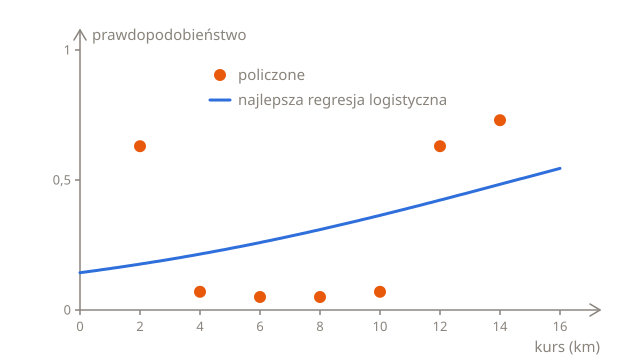
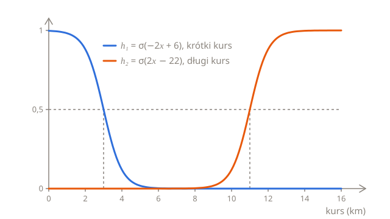
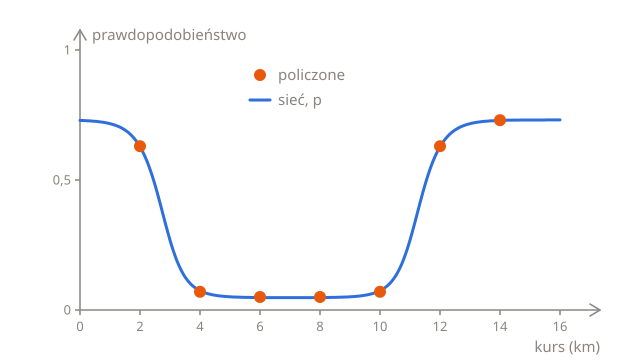
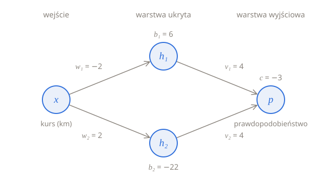
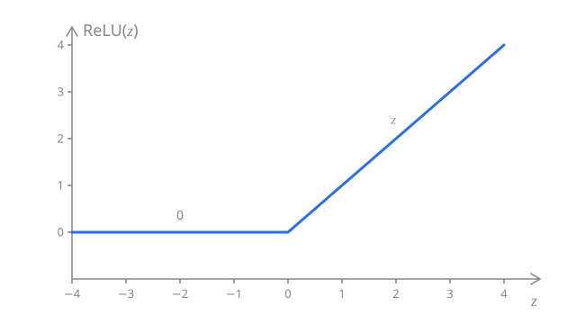

# Warstwy neuronów

Firma taksówkowa z [lekcji o regresji logistycznej](../03-logistic-regression/) ma nowy problem. Gdy klient zamawia taksówkę, aplikacja proponuje kurs kierowcy w pobliżu, a ten może go przyjąć albo odrzucić. Odrzucone zamówienie trafia do następnego kierowcy, a klient czeka dłużej. Firma chciałaby wiedzieć, jak prawdopodobne jest odrzucenie każdego zamówienia, żeby do tych, które pewnie zostaną odrzucone, dodać premię dla kierowcy.

Ta lekcja odpowiada na to pytanie modelem, któremu regresja logistyczna nie dorówna, choć zbudowano go wyłącznie z regresji logistycznych: **siecią neuronową**.

## Ile zamówień odrzucono

Firma wybrała po 100 zamówień dla każdej z siedmiu długości kursu, od 2 do 14 km, i policzyła, ile z każdej setki odrzucił pierwszy kierowca:

| Kurs (km)          | 2   | 4   | 6   | 8   | 10  | 12  | 14  |
| ------------------ | --- | --- | --- | --- | --- | --- | --- |
| Odrzucone (na 100) | 63  | 7   | 5   | 5   | 7   | 63  | 73  |

Kierowcy odrzucają krótkie kursy i długie, a przyjmują te pośrodku. Kurs na 2 km daje za mało, żeby opłacał się dojazd do klienta, a kurs na 12 km wywozi kierowcę za miasto, skąd bardzo możliwe, że wróci pusty.

Tak jak w poprzednim rozdziale, etykieta jest liczbą: $y = 1$ dla zamówienia, które odrzucono, i $y = 0$ dla takiego, które przyjęto. Model będzie przewidywał prawdopodobieństwo, że $y$ wynosi 1.

## Jedno S nie wystarczy

Regresja logistyczna, $p = \sigma(wx + b)$, rysuje krzywą w kształcie litery S. Ta krzywa może być stroma albo łagodna, może leżeć bardziej w lewo albo w prawo, a przy ujemnym $w$ opada, zamiast rosnąć, ale zawsze idzie tylko w jedną stronę. Policzone odsetki najpierw spadają, a potem znów rosną, w kształcie litery U, a tego żadne S nie potrafi.

Najlepsze S dla tych odsetków, czyli to, które znajduje [trening](../03-logistic-regression/03-training.pl.md), ma $w = 0{,}12$ i $b = -1{,}79$. Rośnie łagodnie, od 0,18 przy 2 km do 0,48 przy 14 km, i mija się z oboma końcami U:



Nigdy nie dochodzi nawet do 0,5, więc przy progu 0,5 przewiduje, że każde zamówienie zostanie przyjęte. Jego strata logarytmiczna na wszystkich 700 zamówieniach wynosi 0,601, niewiele mniej niż 0,626 [punktu odniesienia](../03-logistic-regression/02-error.pl.md#punkt-odniesienia), który każdemu zamówieniu daje to samo prawdopodobieństwo: 0,319, bo odrzucono 223 z 700 zamówień. Z punktu widzenia regresji logistycznej długość kursu prawie nie ma znaczenia. Z długością kursu pomnożoną przez samą siebie jako drugim wejściem regresja logistyczna też potrafi narysować U, co pokazuje część [Nowe wejście](04-inputs.pl.md#nowe-wejście), ale tylko dlatego, że ktoś najpierw zobaczył U i wybrał dla niej to wejście.

## Z dwóch S powstaje U

Jedno S nie zawróci, ale dwa mogą złożyć się w U. Weź jedno S, które opada od prawie 1 do prawie 0 w okolicy 3 km, i drugie, które rośnie od prawie 0 do prawie 1 w okolicy 11 km:

$$
h_1 = \sigma(-2x + 6)
\qquad
h_2 = \sigma(2x - 22)
$$

Każde z nich to regresja logistyczna z własną wagą i własnym wyrazem wolnym. Prosta wewnątrz $h_1$, $-2x + 6$, wynosi 0 przy $x = 3$, więc tam $h_1$ wynosi 0,5, a prosta wewnątrz $h_2$ wynosi 0 przy $x = 11$:



$h_1$ jest bliskie 1 tylko dla krótkich kursów, a $h_2$ tylko dla długich. Dodaj je, a suma będzie bliska 1 na obu końcach i bliska 0 pośrodku: oto U. Trzeba je jeszcze zamienić w prawdopodobieństwo o odpowiedniej wysokości, a to zadanie dla trzeciej regresji logistycznej, z $h_1$ i $h_2$ jako dwoma wejściami:

$$
p = \sigma(4h_1 + 4h_2 - 3)
$$

Dla kursu ze środka $h_1$ i $h_2$ są bliskie 0, więc $z = 4h_1 + 4h_2 - 3$ jest bliskie −3, a $p$ jest bliskie $\sigma(-3) = 0{,}047$. Dla krótkiego kursu $h_1$ jest bliskie 1, więc $z$ jest bliskie 4 − 3 = 1, a $p$ jest bliskie $\sigma(1) = 0{,}731$, i tak samo jest dla długiego kursu, z $h_2$. Oto wszystkie kursy z tabeli, z liczbami zaokrąglonymi do 3 miejsc po przecinku:

| Kurs $x$ | $h_1$ | $h_2$ | $z$    | $p$   | Policzone |
| -------- | ----- | ----- | ------ | ----- | --------- |
| 2        | 0,881 | 0,000 | 0,523  | 0,628 | 0,63      |
| 4        | 0,119 | 0,000 | −2,523 | 0,074 | 0,07      |
| 6        | 0,002 | 0,000 | −2,990 | 0,048 | 0,05      |
| 8        | 0,000 | 0,002 | −2,990 | 0,048 | 0,05      |
| 10       | 0,000 | 0,119 | −2,523 | 0,074 | 0,07      |
| 12       | 0,000 | 0,881 | 0,523  | 0,628 | 0,63      |
| 14       | 0,000 | 0,998 | 0,990  | 0,729 | 0,73      |

Predykcje podążają za policzonymi odsetkami wzdłuż całego U:



Razem trzy regresje logistyczne tworzą jeden wzór, w którym $x$ występuje dwa razy:

$$
p = \sigma\big(4\,\sigma(-2x + 6) + 4\,\sigma(2x - 22) - 3\big)
$$

W Pythonie to trzy linijki, po jednej na każdą regresję logistyczną. Pętla poniżej wypisuje predykcję dla każdej długości kursu i sumuje kary, tak jak w części [Kara za każde zamówienie](../03-logistic-regression/02-error.pl.md#kara-za-każde-zamówienie): każde z `count` zamówień, które odrzucono, dodaje $-\ln p$, a każde ze `100 - count`, które przyjęto, dodaje $-\ln (1 - p)$:

```python run
import math


def sigmoid(z):
    return 1 / (1 + math.exp(-z))


def predict(km):
    h1 = sigmoid(-2 * km + 6)
    h2 = sigmoid(2 * km - 22)
    return sigmoid(4 * h1 + 4 * h2 - 3)


turned_down = {2: 63, 4: 7, 6: 5, 8: 5, 10: 7, 12: 63, 14: 73}

total = 0
for km, count in turned_down.items():
    p = predict(km)
    print(km, round(p, 3))
    total += count * -math.log(p) + (100 - count) * -math.log(1 - p)

print(round(total / 700, 3))
```

Strata logarytmiczna wynosi 0,401, a dla najlepszego S wynosiła 0,601.

## Neurony, warstwy i sieci

To, co właśnie powstało, to sieć neuronowa. Każda z jej trzech regresji logistycznych to **neuron**: mnoży każde ze swoich wejść przez wagę, dodaje wyraz wolny i przepuszcza wynik przez sigmoidę. Sigmoida to **funkcja aktywacji** neuronu, a to, co z niej wychodzi, to **aktywacja** neuronu.

Neurony są ułożone w **warstwy**. Długość kursu, $x$, to **wejście**. $h_1$ i $h_2$ tworzą **warstwę ukrytą**, nazywaną tak, bo dane nigdy nie mówią, ile powinny wynosić: są w nich tylko długość każdego kursu i informacja, czy go odrzucono. Ostatni neuron tworzy **warstwę wyjściową**, a jego aktywacja to predykcja sieci, $p$:



Każdy neuron dostaje aktywacje wszystkich neuronów z poprzedniej warstwy, dlatego takie warstwy nazywa się **w pełni połączonymi** (ang. fully connected) albo gęstymi (ang. dense). Sieć ma 7 parametrów: wagę i wyraz wolny każdego neuronu ukrytego, $w_1$, $b_1$, $w_2$ i $b_2$, a w neuronie wyjściowym wagę dla każdego neuronu ukrytego, $v_1$ i $v_2$, oraz wyraz wolny, $c$:

$$
h_1 = \sigma(w_1 x + b_1)
\qquad
h_2 = \sigma(w_2 x + b_2)
\qquad
p = \sigma(v_1 h_1 + v_2 h_2 + c)
$$

Liczenie predykcji w ten sposób, warstwa po warstwie, od wejścia do wyjścia, nazywa się **przejściem w przód** (ang. forward pass). W kodzie 7 parametrów mieści się w słowniku:

```python run
import math

net = {"w1": -2, "b1": 6, "w2": 2, "b2": -22, "v1": 4, "v2": 4, "c": -3}


def sigmoid(z):
    return 1 / (1 + math.exp(-z))


def predict(km, net):
    h1 = sigmoid(net["w1"] * km + net["b1"])
    h2 = sigmoid(net["w2"] * km + net["b2"])
    return sigmoid(net["v1"] * h1 + net["v2"] * h2 + net["c"])


for km in [2, 4, 6, 8, 10, 12, 14]:
    print(km, round(predict(km, net), 3))
```

Zmień liczby i uruchom kod jeszcze raz. Przy `"b1": 10` S pierwszego neuronu przesuwa się z 3 na 5 km, a sieć przewiduje, że kursy na 4 km też są odrzucane, z prawdopodobieństwem 0,628. Przy `"v2": 0` neuron wyjściowy pomija $h_2$, a sieć zapomina o długich kursach: od 6 km każdy kurs dostaje około 0,05.

## Po co jest funkcja aktywacji

Sigmoidy w warstwie ukrytej robią więcej, niż tylko trzymają liczby między 0 a 1: bez nich sieć w ogóle nie narysowałaby U. Usuń je, tak żeby $h_1 = -2x + 6$ i $h_2 = 2x - 22$, i wstaw je do prostej neuronu wyjściowego:

$$
z = 4(-2x + 6) + 4(2x - 22) - 3 = -8x + 24 + 8x - 88 - 3 = -67
$$

Wyrazy z $x$ się znoszą i każdy kurs dostaje to samo $z$, −67, a więc to samo prawdopodobieństwo, prawie 0. Przy innych wagach nie zniosłyby się, ale wynik nadal byłby jedną prostą:

$$
z = v_1(w_1 x + b_1) + v_2(w_2 x + b_2) + c = (v_1 w_1 + v_2 w_2)\,x + (v_1 b_1 + v_2 b_2 + c)
$$

To waga razy $x$ plus wyraz wolny, czyli to samo co regresja logistyczna z $w = v_1 w_1 + v_2 w_2$ i $b = v_1 b_1 + v_2 b_2 + c$. Proste pomnożone przez liczby i dodane do siebie to nadal prosta, więc bez funkcji aktywacji sieć nie jest lepsza od pojedynczego neuronu, niezależnie od tego, ile ma neuronów i warstw. To funkcje aktywacji wyginają proste w krzywe, a ponieważ same nie są prostymi, nazywa się je **nieliniowymi**.

## ReLU

Sigmoida nie jest jedyną funkcją aktywacji, a w warstwach ukrytych dzisiejszych sieci używa się jej rzadko. Najczęściej używa się **ReLU**, skrót od ang. rectified linear unit. ReLU zostawia liczbę dodatnią taką, jaka jest, a ujemną zamienia w 0:

$$
\text{ReLU}(z) = \max(0, z)
$$

$\max(0, z)$ to większa z dwóch liczb, 0 albo $z$, a w Pythonie to `max(0, z)`:



ReLU nie wymaga liczenia $e$, tylko porównania, więc jest szybkie, a jak pokaże następna lekcja, głębokie sieci trenują się z nim lepiej. Zagina się tylko w jednym miejscu, ale to wystarczy. Oto znów U, tym razem z ReLU w warstwie ukrytej: $h_1 = \text{ReLU}(-x + 3)$ wynosi 0 od 3 km i rośnie dla krótszych kursów, a $h_2 = \text{ReLU}(x - 11)$ wynosi 0 do 11 km i rośnie dla dłuższych. Neuron wyjściowy zostaje przy sigmoidzie, bo jego zadaniem jest podać prawdopodobieństwo:

```python run
import math


def sigmoid(z):
    return 1 / (1 + math.exp(-z))


def relu(z):
    return max(0, z)


def predict(km):
    h1 = relu(-km + 3)
    h2 = relu(km - 11)
    return sigmoid(4 * h1 + 4 * h2 - 3)


for km in [2, 4, 6, 8, 10, 12, 14]:
    print(km, round(predict(km), 3))
```

Od 4 do 10 km oba ReLU wynoszą 0, więc $p = \sigma(-3) = 0{,}047$. Przy 2 km $h_1$ wynosi 1, a przy 12 km tyle samo wynosi $h_2$, co daje $\sigma(1) = 0{,}731$. Ale ReLU nigdy się nie spłaszcza: przy 14 km $h_2$ wynosi już 3, a $p = \sigma(9)$, ponad 0,9999, daleko powyżej policzonego 0,73. Z większą liczbą neuronów ukrytych sieć z ReLU może się zaginać tyle razy, ile potrzebuje, a także spłaszczać.

## Więcej neuronów i więcej warstw

Do U wystarczyły dwa neurony ukryte. Kształt z większą liczbą zagięć potrzebuje ich więcej, a przy odpowiednio wielu neuronach ukrytych nawet jedna warstwa ukryta może odwzorować dowolną nieprzerwaną krzywą tak dokładnie, jak tylko chcesz. Przy więcej niż jednym wejściu każdy neuron ukryty dostaje wagę dla każdego wejścia, tak jak regresja logistyczna w części [Więcej niż jedno wejście](../03-logistic-regression/01-probabilities.pl.md#więcej-niż-jedno-wejście).

Warstwy ukryte można też układać jedna na drugiej, tak żeby aktywacje jednej warstwy były wejściami następnej. Każda warstwa pracuje wtedy z tym, co znalazła warstwa przed nią, i może łączyć proste wzorce w bardziej złożone. Sieć z wieloma warstwami ukrytymi nazywa się **głęboką**, a trenowanie takich sieci to **uczenie głębokie** (ang. deep learning).

Warstwa wyjściowa też może mieć więcej niż jeden neuron. Sieć, która odczytuje odręcznie pisane cyfry, ma 10 neuronów wyjściowych, po jednym dla każdej cyfry od 0 do 9, a funkcja softmax z części [Więcej niż dwie kategorie](../03-logistic-regression/03-training.pl.md#więcej-niż-dwie-kategorie) zamienia to, co dają, w 10 prawdopodobieństw, które sumują się do 1. Jej wejście to obrazek o szerokości 28 pikseli i wysokości 28, czyli 784 liczby, po jednej dla jasności każdego piksela. Z dwiema warstwami ukrytymi, o 300 i 100 neuronach, sieć ma:

| Warstwa         | Wagi      | Wyrazy wolne | Parametry |
| --------------- | --------- | ------------ | --------- |
| Pierwsza ukryta | 784 × 300 | 300          | 235 500   |
| Druga ukryta    | 300 × 100 | 100          | 30 100    |
| Wyjściowa       | 100 × 10  | 10           | 1010      |

To razem 266 610 parametrów, a jak na dzisiejsze standardy to mała sieć.

## Skąd się biorą wagi?

7 parametrów U dobrano ręcznie, zastanawiając się, gdzie każde S powinno przecinać 0,5 i jak wysoko powinno sięgać U. To działa przy 7 parametrach i kształcie, który widać. Nie działa przy 266 610 parametrach ani przy kształcie, którego nikt nie potrafi sobie wyobrazić, takim jak ten, który zamienia 784 piksele w cyfrę.

Regresja logistyczna znajdowała swoje parametry metodą spadku gradientu, z nachylenia straty względem każdego z nich, i sieć też to potrafi. Jedyna trudność to nachylenia. Następna lekcja wyznacza je dla każdej wagi, także tych w warstwie ukrytej, a kolejna trenuje sieć.

## Podsumowanie

- Neuron mnoży każde ze swoich wejść przez wagę, dodaje wyraz wolny i przepuszcza wynik przez funkcję aktywacji. Neuron z sigmoidą jako funkcją aktywacji to regresja logistyczna.
- Jeden neuron rysuje S. Sieć neuronowa łączy neurony w warstwy, tak żeby aktywacje jednej warstwy były wejściami następnej, i może rysować inne kształty, na przykład U.
- Predykcję liczy się warstwa po warstwie, od wejścia przez warstwy ukryte do wyjścia: to przejście w przód.
- Bez nieliniowych funkcji aktywacji wszystkie warstwy złożyłyby się w jedną prostą. W warstwach ukrytych najczęstszą funkcją aktywacji jest ReLU, $\max(0, z)$. Neuron wyjściowy, który podaje prawdopodobieństwo, zostaje przy sigmoidzie.

## Sprawdź się

<details>
<summary>Co sieć z tej lekcji przewiduje dla kursu na 16 km?</summary>

Około 0,731. $h_1 = \sigma(-26)$ to praktycznie 0, a $h_2 = \sigma(10)$ to praktycznie 1, więc $z$ wynosi około 4 − 3 = 1, a $p = \sigma(1) = 0{,}731$. Za 14 km $h_2$ już się spłaszczyło, więc każdy długi kurs dostaje mniej więcej to samo prawdopodobieństwo.

</details>

<details>
<summary>Sieć taka jak w tej lekcji ma trzy neurony ukryte zamiast dwóch. Ile ma parametrów?</summary>

10. Każdy neuron ukryty ma wagę i wyraz wolny, co daje 6 w warstwie ukrytej, a neuron wyjściowy ma wagę dla każdego z trzech neuronów ukrytych i wyraz wolny, czyli jeszcze 4.

</details>

<details>
<summary>Dlaczego neuron wyjściowy zostaje przy sigmoidzie, nawet gdy neurony ukryte używają ReLU?</summary>

Bo jego aktywacja to prawdopodobieństwo, które musi leżeć między 0 a 1. Sigmoida zawsze daje liczbę między 0 a 1, a ReLU daje dowolną liczbę od 0 w górę, na przykład 3 dla kursu na 14 km powyżej.

</details>

## Twoja kolej

W ćwiczeniu [Przejście w przód](../../../exercises/04-foundations/04-neural-networks/01-layers/01-forward-pass/task.pl.md) zapiszesz neuron i predykcję sieci dla dowolnych 7 parametrów. W ćwiczeniu [Godziny szczytu](../../../exercises/04-foundations/04-neural-networks/01-layers/02-rush-hour/task.pl.md) samodzielnie dobierzesz 7 parametrów sieci, która spodziewa się odrzuceń tylko w wieczornych godzinach szczytu.
