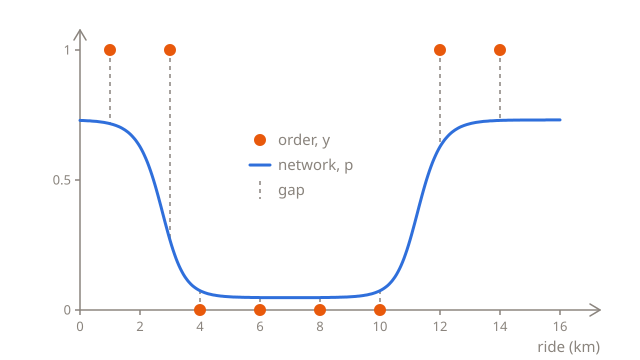
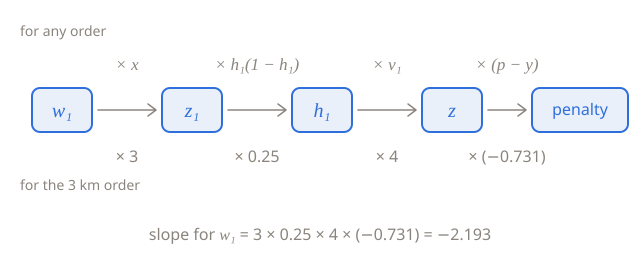

# Backpropagation

[Layers of neurons](01-layers.md) ended with a network whose 7 parameters were chosen by hand. To train them with gradient descent, as in the [logistic regression chapter](../03-logistic-regression/03-training.md), you need the slope of the loss for each of them. For the three parameters of the output neuron, that's nothing new, since the output neuron is a logistic regression. The four in the hidden layer are further from the loss: a change to one of them has to pass through the rest of the network before it reaches the loss. This lesson follows it through, link by link, and ends up with a method that works for any number of layers: **backpropagation**.

## Eight orders

Real orders don't come in neat groups of a hundred. Each has its own length and its own label, like these eight from last week:

| Ride $x$ (km)   | 1   | 3   | 4   | 6   | 8   | 10  | 12  | 14  |
| --------------- | --- | --- | --- | --- | --- | --- | --- | --- |
| Turned down $y$ | 1   | 1   | 0   | 0   | 0   | 0   | 1   | 1   |

The network from the last lesson gives them these probabilities. Each order's penalty is $-\ln q$, where $q$ is the probability of what happened: $p$ for an order that was turned down, and $1 - p$ for one that wasn't:

| $x$ | $y$ | $p$   | Penalty |
| --- | --- | ----- | ------- |
| 1   | 1   | 0.717 | 0.333   |
| 3   | 1   | 0.269 | 1.313   |
| 4   | 0   | 0.074 | 0.077   |
| 6   | 0   | 0.048 | 0.049   |
| 8   | 0   | 0.048 | 0.049   |
| 10  | 0   | 0.074 | 0.077   |
| 12  | 1   | 0.628 | 0.465   |
| 14  | 1   | 0.729 | 0.316   |

The penalties add up to 2.680, so the log loss is 2.680 ÷ 8 = 0.335, well below the 0.693 of the baseline, which gives every order 0.5, as half of them were turned down. The 3 km order costs the most. A driver turned it down, but the network gave that a probability of only 0.269, because 3 km is where $h_1$ is halfway down its S, at 0.5:



## The output neuron

The output neuron is a logistic regression with two inputs, $h_1$ and $h_2$, so its slopes follow the recipe from [A formula for the slope](../03-logistic-regression/03-training.md#a-formula-for-the-slope): the error, $p - y$, times the input that the weight multiplies, and for the bias, the error alone. Until the end of the lesson, $L$ is the penalty of a single order, and the slopes are that order's:

$$
\frac{\partial L}{\partial v_1} = (p - y)\,h_1
\qquad
\frac{\partial L}{\partial v_2} = (p - y)\,h_2
\qquad
\frac{\partial L}{\partial c} = p - y
$$

For the 3 km order, $p - y = 0.269 - 1 = -0.731$, and $h_1 = 0.5$, so the slope for $v_1$ is −0.731 × 0.5 = −0.366. It's negative, so a bigger $v_1$ would make this order's penalty smaller: it would add more of $h_1$ to $z$, and give the order a higher probability of being turned down, which it was.

## One link at a time

$w_1$ is further away. A change to it passes through four links before it reaches the penalty:

1. $z_1 = w_1 x + b_1$ changes $x$ times as much as $w_1$.
2. $h_1 = \sigma(z_1)$ changes $h_1(1 - h_1)$ times as much as $z_1$. That's the slope of the sigmoid, which calculus works out: 0.25 at $z_1 = 0$, where the S is steepest, and close to 0 far out on either side, where the S is almost flat.
3. $z = v_1 h_1 + v_2 h_2 + c$ changes $v_1$ times as much as $h_1$.
4. The penalty changes $p - y$ times as much as $z$. That's the slope for $c$ from above, as a change to $c$ changes $z$ by just as much.

Each link multiplies the change, so the whole chain multiplies it by all four:

$$
\frac{\partial L}{\partial w_1} = x \times h_1(1 - h_1) \times v_1 \times (p - y)
$$

That's the **chain rule**: the slope along a chain of links is the product of the slopes of the links. For the 3 km order, $z_1 = -2 \times 3 + 6 = 0$, so $h_1 = 0.5$, and the slope of the sigmoid is 0.5 × 0.5 = 0.25:



$$
\frac{\partial L}{\partial w_1} = 3 \times 0.25 \times 4 \times (-0.731) = -2.193
$$

A small change to $w_1$ changes this order's penalty about 2.193 times as much, the other way. Make $w_1$ bigger, from −2 towards −1.9, and the first S moves a little to the right, so $h_1$ grows at 3 km, and so does $p$.

## Passing the error back

Links 2 to 4 would be the same for $b_1$: together, they say how much the penalty changes for a change to $z_1$. That product is worth working out once, and giving a name:

$$
\delta_1 = (p - y)\,v_1\,h_1(1 - h_1)
$$

$\delta$ is the Greek letter delta, and $\delta_1$ is the **error** of the first hidden neuron, in the same sense that $p - y$ is the error of the output neuron: it says how much, and which way, the neuron's $z$ should change. To match, the output neuron's error is written $\delta = p - y$. With the errors, every slope takes the same form: the error of the neuron that the parameter belongs to, times the input that the parameter multiplies. A bias doesn't multiply anything, so its slope is the error alone:

$$
\frac{\partial L}{\partial w_1} = \delta_1 x
\qquad
\frac{\partial L}{\partial b_1} = \delta_1
\qquad
\frac{\partial L}{\partial w_2} = \delta_2 x
\qquad
\frac{\partial L}{\partial b_2} = \delta_2
$$

where $\delta_2 = \delta\,v_2\,h_2(1 - h_2)$, the same as $\delta_1$, but with the second neuron's weight and activation. The output neuron's error comes from the label, and each hidden neuron's error comes from the output neuron's, passed back through the weight between them and the slope of the hidden neuron's activation function. So working out the slopes takes two passes through the network:

1. The **forward pass** works out every activation, from the input to the output: $h_1$ and $h_2$, and then $p$.
2. The **backward pass** works out every error, from the output back towards the input: $\delta$ first, and then $\delta_1$ and $\delta_2$ from it. Each slope is then a neuron's error times an input.

That's backpropagation, short for "backward propagation of errors".

## One order, worked out

For the 3 km order, the forward pass gives $z_1 = 0$ and $h_1 = 0.5$, $z_2 = 2 \times 3 - 22 = -16$ and $h_2 = 0.0000001$, and $z = 4 \times 0.5 + 4 \times 0.0000001 - 3$, which is practically −1, so $p = 0.269$. The backward pass gives:

- $\delta = 0.269 - 1 = -0.731$
- $\delta_1 = -0.731 \times 4 \times 0.5 \times 0.5 = -0.731$
- $\delta_2 = -0.731 \times 4 \times 0.0000001 \times 0.9999999$, which is practically 0

And the seven slopes:

| Parameter | Slope        | For 3 km |
| --------- | ------------ | -------- |
| $w_1$     | $\delta_1 x$ | −2.193   |
| $b_1$     | $\delta_1$   | −0.731   |
| $w_2$     | $\delta_2 x$ | 0.000    |
| $b_2$     | $\delta_2$   | 0.000    |
| $v_1$     | $\delta h_1$ | −0.366   |
| $v_2$     | $\delta h_2$ | 0.000    |
| $c$       | $\delta$     | −0.731   |

The second hidden neuron gets practically nothing from this order. At 3 km, its S is almost flat, so a change to $w_2$ or $b_2$ would hardly change $h_2$, or the penalty.

## Checking with a nudge

A formula this long is easy to get wrong, in the math or in the code, so it's worth checking with a nudge, as in [Which way is down?](../02-linear-regression/03-training.md#which-way-is-down) This time, the nudge goes both ways: work out the penalty with $w_1$ a little bigger, and with $w_1$ a little smaller, and divide the difference by the distance between the two. A nudge both ways is more accurate than one way, as the curve bends about as much on either side, and the two sides make up for each other:

```python run
import math


def sigmoid(z):
    return 1 / (1 + math.exp(-z))


def predict(km, net):
    h1 = sigmoid(net["w1"] * km + net["b1"])
    h2 = sigmoid(net["w2"] * km + net["b2"])
    return sigmoid(net["v1"] * h1 + net["v2"] * h2 + net["c"])


def penalty(km, turned_down, net):
    p = predict(km, net)
    if turned_down == 1:
        return -math.log(p)
    return -math.log(1 - p)


net = {"w1": -2, "b1": 6, "w2": 2, "b2": -22, "v1": 4, "v2": 4, "c": -3}

up = dict(net)
up["w1"] = net["w1"] + 0.001
down = dict(net)
down["w1"] = net["w1"] - 0.001

print(round((penalty(3, 1, up) - penalty(3, 1, down)) / 0.002, 3))
```

`dict(net)` makes a copy of `net`, so changing `up` and `down` leaves `net` as it was. With `up = net`, both names would stand for the same dict, and changing `up["w1"]` would change `net["w1"]` too.

The nudge gives −2.193, the same as the chain rule. Why not always nudge, then? A nudge both ways takes two forward passes for each parameter. That's 14 for this network, but for the digit network from the last lesson, with 266,610 parameters, it's 533,220 forward passes for every step of training. Backpropagation gets all the slopes from one forward pass and one backward pass, and the backward pass takes about as long as the forward one. So training uses backpropagation, and nudges are for checking it: if the two disagree, there's a mistake somewhere.

## All eight orders

The log loss is the average of the penalties, so its slope for each parameter is the average of the orders' slopes, just as in logistic regression. `order_slopes` below does the forward and the backward pass for one order, and returns its seven slopes in a dict. The loop adds up the orders' slopes, each divided by the number of orders:

```python run
import math


def sigmoid(z):
    return 1 / (1 + math.exp(-z))


def order_slopes(km, turned_down, net):
    h1 = sigmoid(net["w1"] * km + net["b1"])
    h2 = sigmoid(net["w2"] * km + net["b2"])
    p = sigmoid(net["v1"] * h1 + net["v2"] * h2 + net["c"])
    delta = p - turned_down
    delta1 = delta * net["v1"] * h1 * (1 - h1)
    delta2 = delta * net["v2"] * h2 * (1 - h2)
    return {
        "w1": delta1 * km,
        "b1": delta1,
        "w2": delta2 * km,
        "b2": delta2,
        "v1": delta * h1,
        "v2": delta * h2,
        "c": delta,
    }


net = {"w1": -2, "b1": 6, "w2": 2, "b2": -22, "v1": 4, "v2": 4, "c": -3}
kms = [1, 3, 4, 6, 8, 10, 12, 14]
turned_down = [1, 1, 0, 0, 0, 0, 1, 1]

slopes = {}
for name in net:
    slopes[name] = 0
for i in range(len(kms)):
    one = order_slopes(kms[i], turned_down[i], net)
    for name in net:
        slopes[name] += one[name] / len(kms)

for name in net:
    print(name, round(slopes[name], 3))
```

Every slope is negative, so gradient descent will make every parameter a little bigger. The biggest slopes, for $w_1$ and $w_2$, come mostly from one order each. Before the division by 8, the slopes for $w_1$ add up to −2.09, and the 3 km order gives −2.193 of that. The slopes for $w_2$ add up to −1.6, and the 12 km order gives −1.875. Both orders were turned down but got a low probability, and both are close to where an S is steepest, where a change to its weight moves the probability the most.

## Deeper networks

With more hidden layers, the errors go back the same way, one layer at a time. A neuron's error comes from the errors of the layer after it: each of them times the weight that connects it to the neuron, all added up, and then times the slope of the neuron's own activation function. Here, the layer after the hidden one has only one neuron, so there's only one thing to add up, and $\delta_1 = \delta\,v_1 \times h_1(1 - h_1)$. The slopes are then, as before, each neuron's error times the input that the weight multiplies.

However deep the network, the backward pass works out all the slopes in about the time of one forward pass. But the errors of the first layers come out of a long chain of multiplications, and with the sigmoid, that's a problem. Its slope, $h(1 - h)$, is never more than 0.25, so every sigmoid layer that an error passes back through multiplies it by 0.25 or less, besides the weights. Unless the weights are big, the error shrinks with every layer: 0.25 × 0.25 is 0.0625, and after 10 layers, $0.25^{10}$ is less than a millionth. The first layers then get slopes of almost 0, and hardly learn at all. That's the **vanishing gradient** problem, and for a long time, it made deep networks very hard to train.

The ReLU is $z$ itself for any positive $z$, so its slope there is 1, and an error passes back through it without shrinking. That's the main reason deep networks use the ReLU. For a negative $z$, the ReLU is flat at 0, so its slope is 0, and none of the error passes back through that neuron, for that example.

## Letting the computer do it

You'll rarely write a backward pass by hand. Libraries like PyTorch, which most of today's neural networks are built with, record every step of the forward pass, and do the backward pass themselves. Here's the 3 km order in PyTorch, with each parameter as a tensor, PyTorch's name for a number, or a list or a table of numbers:

```python
import torch

w1 = torch.tensor(-2.0, requires_grad=True)
b1 = torch.tensor(6.0, requires_grad=True)
w2 = torch.tensor(2.0, requires_grad=True)
b2 = torch.tensor(-22.0, requires_grad=True)
v1 = torch.tensor(4.0, requires_grad=True)
v2 = torch.tensor(4.0, requires_grad=True)
c = torch.tensor(-3.0, requires_grad=True)

km = 3
h1 = torch.sigmoid(w1 * km + b1)
h2 = torch.sigmoid(w2 * km + b2)
p = torch.sigmoid(v1 * h1 + v2 * h2 + c)
penalty = -torch.log(p)

penalty.backward()
print(w1.grad)
```

`requires_grad=True` asks PyTorch to keep track of everything worked out from that parameter. `penalty.backward()` does the backward pass, and puts each parameter's slope in its `grad`, short for gradient. The code prints `tensor(-2.1932)`, the same slope as above, with 4 decimal places, and `b1.grad`, `v1.grad` and the others hold the other six. PyTorch doesn't run in the browser, so this example has no **Run** button.

## Summary

- The slope for a weight is the error of the neuron that the weight belongs to, times the input that the weight multiplies. For a bias, it's the error alone.
- The output neuron's error is $\delta = p - y$. A hidden neuron's error is the output neuron's error, times the weight between them, times the slope of the hidden neuron's activation function: $\delta_1 = \delta\,v_1\,h_1(1 - h_1)$. That's the chain rule: the slope along a chain of links is the product of the slopes of the links.
- Backpropagation works out every slope with one forward pass, for the activations, and one backward pass, for the errors. The slope of the loss is the average of the slopes for the single examples.
- A nudge both ways checks a slope, but it takes two forward passes for every parameter, which is far too slow for training.
- The sigmoid's slope is 0.25 at most, so in a deep network, it can shrink the errors of the first layers to almost nothing. The ReLU's slope is 1 for any positive $z$.

## Check yourself

<details>
<summary>For the 3 km order, the slopes for w₂, b₂ and v₂ are practically 0. Why?</summary>

At 3 km, $h_2 = \sigma(-16)$, about 0.0000001, far out on the flat part of its S. So $h_2(1 - h_2)$, and with it $\delta_2$, is practically 0: a change to $w_2$ or $b_2$ would hardly change $h_2$. And $v_2$ multiplies $h_2$, so a change to $v_2$ would hardly change $z$. For these three parameters, it's other orders that count, like the one at 12 km.

</details>

<details>
<summary>A nudge and backpropagation give the same slopes. Why does training use backpropagation?</summary>

Because it's much faster. A nudge both ways takes two forward passes for each parameter, so 533,220 of them for a network with 266,610 parameters. Backpropagation gets all the slopes from one forward pass and one backward pass, however many parameters there are.

</details>

<details>
<summary>A network has 10 hidden layers, all with the sigmoid. Why do the weights of its first layer hardly change in training?</summary>

To reach the first layer, an error has to pass back through all the layers after it, and each sigmoid multiplies it by its slope, which is 0.25 at most. Unless the weights are big, the error gets smaller with every layer, and by the first layer, it's almost nothing, and so are the slopes. With the ReLU, whose slope is 1 for any positive $z$, the error doesn't shrink like that.

</details>

## Your turn

In [Seven slopes](../../../exercises/04-foundations/04-neural-networks/02-backpropagation/01-seven-slopes/task.md), you'll write the forward and the backward pass for one order, and return its seven slopes. In [Check with a nudge](../../../exercises/04-foundations/04-neural-networks/02-backpropagation/02-check-with-a-nudge/task.md), you'll work out the slope for any parameter with a nudge both ways, without changing the network.
