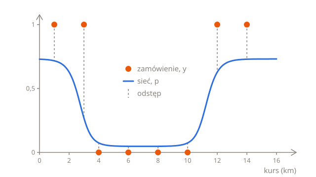
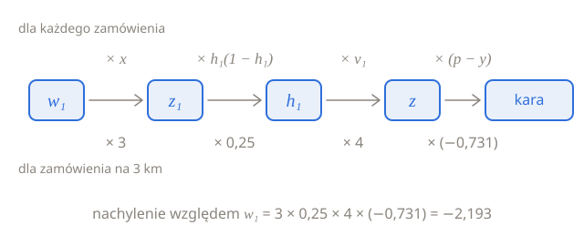

# Propagacja wsteczna

Lekcja [Warstwy neuronów](01-layers.pl.md) skończyła się siecią, której 7 parametrów dobrano ręcznie. Żeby wytrenować je metodą spadku gradientu, tak jak w [rozdziale o regresji logistycznej](../03-logistic-regression/03-training.pl.md), potrzebujesz nachylenia straty względem każdego z nich. Dla trzech parametrów neuronu wyjściowego to nic nowego, bo neuron wyjściowy jest regresją logistyczną. Cztery parametry warstwy ukrytej są dalej od straty: zmiana któregoś z nich musi przejść przez resztę sieci, zanim dotrze do straty. Ta lekcja śledzi ją ogniwo po ogniwie i kończy się metodą, która działa dla dowolnej liczby warstw: **propagacją wsteczną** (ang. backpropagation).

## Osiem zamówień

Prawdziwe zamówienia nie przychodzą w równych grupach po sto. Każde ma własną długość i własną etykietę, tak jak tych osiem z zeszłego tygodnia:

| Kurs $x$ (km) | 1   | 3   | 4   | 6   | 8   | 10  | 12  | 14  |
| ------------- | --- | --- | --- | --- | --- | --- | --- | --- |
| Odrzucone $y$ | 1   | 1   | 0   | 0   | 0   | 0   | 1   | 1   |

Sieć z poprzedniej lekcji daje im takie prawdopodobieństwa. Kara każdego zamówienia to $-\ln q$, gdzie $q$ to prawdopodobieństwo tego, co się stało: $p$ dla zamówienia, które odrzucono, i $1 - p$ dla takiego, którego nie odrzucono:

| $x$ | $y$ | $p$   | Kara  |
| --- | --- | ----- | ----- |
| 1   | 1   | 0,717 | 0,333 |
| 3   | 1   | 0,269 | 1,313 |
| 4   | 0   | 0,074 | 0,077 |
| 6   | 0   | 0,048 | 0,049 |
| 8   | 0   | 0,048 | 0,049 |
| 10  | 0   | 0,074 | 0,077 |
| 12  | 1   | 0,628 | 0,465 |
| 14  | 1   | 0,729 | 0,316 |

Kary sumują się do 2,680, więc strata logarytmiczna wynosi 2,680 ÷ 8 = 0,335, wyraźnie mniej niż 0,693 punktu odniesienia, który każdemu zamówieniu daje 0,5, bo odrzucono połowę z nich. Najwięcej kosztuje zamówienie na 3 km. Kierowca je odrzucił, ale sieć dała temu prawdopodobieństwo tylko 0,269, bo przy 3 km $h_1$ jest w połowie drogi w dół swojego S, na wysokości 0,5:



## Neuron wyjściowy

Neuron wyjściowy to regresja logistyczna z dwoma wejściami, $h_1$ i $h_2$, więc jego nachylenia liczy się według przepisu z części [Wzór na nachylenie](../03-logistic-regression/03-training.pl.md#wzór-na-nachylenie): błąd, $p - y$, razy wejście, które mnoży dana waga, a dla wyrazu wolnego sam błąd. Do końca lekcji $L$ oznacza karę jednego zamówienia, a nachylenia to nachylenia tego zamówienia:

$$
\frac{\partial L}{\partial v_1} = (p - y)\,h_1
\qquad
\frac{\partial L}{\partial v_2} = (p - y)\,h_2
\qquad
\frac{\partial L}{\partial c} = p - y
$$

Dla zamówienia na 3 km $p - y = 0{,}269 - 1 = -0{,}731$, a $h_1 = 0{,}5$, więc nachylenie względem $v_1$ wynosi −0,731 × 0,5 = −0,366. Jest ujemne, więc większe $v_1$ zmniejszyłoby karę tego zamówienia: dodałoby więcej $h_1$ do $z$ i dało zamówieniu wyższe prawdopodobieństwo odrzucenia, a przecież je odrzucono.

## Ogniwo po ogniwie

$w_1$ jest dalej. Jego zmiana przechodzi przez cztery ogniwa, zanim dotrze do kary:

1. $z_1 = w_1 x + b_1$ zmienia się $x$ razy tyle co $w_1$.
2. $h_1 = \sigma(z_1)$ zmienia się $h_1(1 - h_1)$ razy tyle co $z_1$. To nachylenie sigmoidy, które wyznacza rachunek różniczkowy: 0,25 przy $z_1 = 0$, gdzie S jest najbardziej strome, i blisko 0 daleko po obu stronach, gdzie S jest prawie płaskie.
3. $z = v_1 h_1 + v_2 h_2 + c$ zmienia się $v_1$ razy tyle co $h_1$.
4. Kara zmienia się $p - y$ razy tyle co $z$. To nachylenie względem $c$ z poprzedniej części, bo zmiana $c$ zmienia $z$ dokładnie o tyle samo.

Każde ogniwo mnoży zmianę, więc cały łańcuch mnoży ją przez wszystkie cztery:

$$
\frac{\partial L}{\partial w_1} = x \times h_1(1 - h_1) \times v_1 \times (p - y)
$$

To **reguła łańcuchowa**: nachylenie wzdłuż łańcucha ogniw to iloczyn nachyleń poszczególnych ogniw. Dla zamówienia na 3 km $z_1 = -2 \times 3 + 6 = 0$, więc $h_1 = 0{,}5$, a nachylenie sigmoidy wynosi 0,5 × 0,5 = 0,25:



$$
\frac{\partial L}{\partial w_1} = 3 \times 0{,}25 \times 4 \times (-0{,}731) = -2{,}193
$$

Mała zmiana $w_1$ zmienia karę tego zamówienia mniej więcej 2,193 raza tyle, w przeciwną stronę. Zwiększ $w_1$ z −2 w stronę −1,9, a pierwsze S przesunie się trochę w prawo, więc $h_1$ przy 3 km wzrośnie, a razem z nim $p$.

## Przekazywanie błędu wstecz

Ogniwa od 2 do 4 byłyby takie same dla $b_1$: razem mówią, jak bardzo zmienia się kara przy zmianie $z_1$. Ten iloczyn warto policzyć raz i nadać mu nazwę:

$$
\delta_1 = (p - y)\,v_1\,h_1(1 - h_1)
$$

$\delta$ to grecka litera delta, a $\delta_1$ to **błąd** pierwszego neuronu ukrytego, w tym samym sensie, w jakim $p - y$ jest błędem neuronu wyjściowego: mówi, o ile i w którą stronę powinno się zmienić $z$ tego neuronu. Dla spójności błąd neuronu wyjściowego zapisuje się jako $\delta = p - y$. Z błędami każde nachylenie ma tę samą postać: błąd neuronu, do którego należy parametr, razy wejście, które ten parametr mnoży. Wyraz wolny niczego nie mnoży, więc jego nachylenie to sam błąd:

$$
\frac{\partial L}{\partial w_1} = \delta_1 x
\qquad
\frac{\partial L}{\partial b_1} = \delta_1
\qquad
\frac{\partial L}{\partial w_2} = \delta_2 x
\qquad
\frac{\partial L}{\partial b_2} = \delta_2
$$

gdzie $\delta_2 = \delta\,v_2\,h_2(1 - h_2)$, tak jak $\delta_1$, ale z wagą i aktywacją drugiego neuronu. Błąd neuronu wyjściowego bierze się z etykiety, a błąd każdego neuronu ukrytego z błędu neuronu wyjściowego, przekazanego wstecz przez wagę między nimi i nachylenie funkcji aktywacji neuronu ukrytego. Policzenie nachyleń wymaga więc dwóch przejść przez sieć:

1. **Przejście w przód** liczy wszystkie aktywacje, od wejścia do wyjścia: $h_1$ i $h_2$, a potem $p$.
2. **Przejście wstecz** (ang. backward pass) liczy wszystkie błędy, od wyjścia z powrotem w stronę wejścia: najpierw $\delta$, a z niego $\delta_1$ i $\delta_2$. Każde nachylenie to wtedy błąd neuronu razy wejście.

Stąd nazwa: propagacja wsteczna błędów, w skrócie propagacja wsteczna.

## Jedno zamówienie od początku do końca

Dla zamówienia na 3 km przejście w przód daje $z_1 = 0$ i $h_1 = 0{,}5$, $z_2 = 2 \times 3 - 22 = -16$ i $h_2 = 0{,}0000001$ oraz $z = 4 \times 0{,}5 + 4 \times 0{,}0000001 - 3$, czyli praktycznie −1, więc $p = 0{,}269$. Przejście wstecz daje:

- $\delta = 0{,}269 - 1 = -0{,}731$
- $\delta_1 = -0{,}731 \times 4 \times 0{,}5 \times 0{,}5 = -0{,}731$
- $\delta_2 = -0{,}731 \times 4 \times 0{,}0000001 \times 0{,}9999999$, czyli praktycznie 0

A siedem nachyleń:

| Parametr | Nachylenie   | Dla 3 km |
| -------- | ------------ | -------- |
| $w_1$    | $\delta_1 x$ | −2,193   |
| $b_1$    | $\delta_1$   | −0,731   |
| $w_2$    | $\delta_2 x$ | 0,000    |
| $b_2$    | $\delta_2$   | 0,000    |
| $v_1$    | $\delta h_1$ | −0,366   |
| $v_2$    | $\delta h_2$ | 0,000    |
| $c$      | $\delta$     | −0,731   |

Drugi neuron ukryty praktycznie nic z tego zamówienia nie dostaje. Przy 3 km jego S jest prawie płaskie, więc zmiana $w_2$ albo $b_2$ prawie nie zmieniłaby $h_2$ ani kary.

## Sprawdzanie przesunięciem

Tak długi wzór łatwo pomylić, w matematyce albo w kodzie, więc warto go sprawdzić przesunięciem, tak jak w części [Gdzie jest w dół?](../02-linear-regression/03-training.pl.md#gdzie-jest-w-dół) Tym razem przesunięcie idzie w obie strony: policz karę z $w_1$ trochę większym i z $w_1$ trochę mniejszym i podziel różnicę przez odległość między nimi. Przesunięcie w obie strony jest dokładniejsze niż w jedną, bo krzywa wygina się mniej więcej tak samo po obu stronach i obie strony nawzajem się równoważą:

```python run
import math


def sigmoid(z):
    return 1 / (1 + math.exp(-z))


def predict(km, net):
    h1 = sigmoid(net["w1"] * km + net["b1"])
    h2 = sigmoid(net["w2"] * km + net["b2"])
    return sigmoid(net["v1"] * h1 + net["v2"] * h2 + net["c"])


def penalty(km, turned_down, net):
    p = predict(km, net)
    if turned_down == 1:
        return -math.log(p)
    return -math.log(1 - p)


net = {"w1": -2, "b1": 6, "w2": 2, "b2": -22, "v1": 4, "v2": 4, "c": -3}

up = dict(net)
up["w1"] = net["w1"] + 0.001
down = dict(net)
down["w1"] = net["w1"] - 0.001

print(round((penalty(3, 1, up) - penalty(3, 1, down)) / 0.002, 3))
```

`dict(net)` tworzy kopię `net`, więc zmiany w `up` i `down` zostawiają `net` bez zmian. Przy `up = net` obie nazwy oznaczałyby ten sam słownik, a zmiana `up["w1"]` zmieniłaby też `net["w1"]`.

Przesunięcie daje −2,193, tyle samo co reguła łańcuchowa. Dlaczego więc nie przesuwać zawsze? Przesunięcie w obie strony wymaga dwóch przejść w przód dla każdego parametru. Dla tej sieci to 14, ale dla sieci rozpoznającej cyfry z poprzedniej lekcji, z 266 610 parametrami, to 533 220 przejść w przód na każdy krok treningu. Propagacja wsteczna liczy wszystkie nachylenia w jednym przejściu w przód i jednym wstecz, a przejście wstecz trwa mniej więcej tyle co przejście w przód. Dlatego trening używa propagacji wstecznej, a przesunięcia służą do jej sprawdzania: jeśli wyniki się nie zgadzają, gdzieś jest pomyłka.

## Wszystkie osiem zamówień

Strata logarytmiczna to średnia kar, więc jej nachylenie względem każdego parametru to średnia nachyleń zamówień, tak samo jak w regresji logistycznej. Funkcja `order_slopes` poniżej robi przejście w przód i wstecz dla jednego zamówienia i zwraca jego siedem nachyleń w słowniku. Pętla sumuje nachylenia zamówień, każde podzielone przez liczbę zamówień:

```python run
import math


def sigmoid(z):
    return 1 / (1 + math.exp(-z))


def order_slopes(km, turned_down, net):
    h1 = sigmoid(net["w1"] * km + net["b1"])
    h2 = sigmoid(net["w2"] * km + net["b2"])
    p = sigmoid(net["v1"] * h1 + net["v2"] * h2 + net["c"])
    delta = p - turned_down
    delta1 = delta * net["v1"] * h1 * (1 - h1)
    delta2 = delta * net["v2"] * h2 * (1 - h2)
    return {
        "w1": delta1 * km,
        "b1": delta1,
        "w2": delta2 * km,
        "b2": delta2,
        "v1": delta * h1,
        "v2": delta * h2,
        "c": delta,
    }


net = {"w1": -2, "b1": 6, "w2": 2, "b2": -22, "v1": 4, "v2": 4, "c": -3}
kms = [1, 3, 4, 6, 8, 10, 12, 14]
turned_down = [1, 1, 0, 0, 0, 0, 1, 1]

slopes = {}
for name in net:
    slopes[name] = 0
for i in range(len(kms)):
    one = order_slopes(kms[i], turned_down[i], net)
    for name in net:
        slopes[name] += one[name] / len(kms)

for name in net:
    print(name, round(slopes[name], 3))
```

Każde nachylenie jest ujemne, więc spadek gradientu trochę zwiększy każdy parametr. Największe nachylenia, względem $w_1$ i $w_2$, biorą się głównie z jednego zamówienia każde. Przed podzieleniem przez 8 nachylenia względem $w_1$ sumują się do −2,09, z czego −2,193 daje zamówienie na 3 km. Nachylenia względem $w_2$ sumują się do −1,6, z czego −1,875 daje zamówienie na 12 km. Oba zamówienia odrzucono, choć dostały niskie prawdopodobieństwo, i oba leżą blisko miejsca, w którym S jest najbardziej strome, a tam zmiana wagi najbardziej zmienia prawdopodobieństwo.

## Głębsze sieci

Przy większej liczbie warstw ukrytych błędy wracają tak samo, warstwa po warstwie. Błąd neuronu bierze się z błędów następnej warstwy: każdy z nich razy waga, która łączy go z tym neuronem, wszystko zsumowane, a potem razy nachylenie funkcji aktywacji samego neuronu. Tutaj warstwa za ukrytą ma tylko jeden neuron, więc do zsumowania jest tylko jedna rzecz i $\delta_1 = \delta\,v_1 \times h_1(1 - h_1)$. Nachylenia to potem, tak jak wcześniej, błąd każdego neuronu razy wejście, które mnoży waga.

Niezależnie od głębokości sieci przejście wstecz liczy wszystkie nachylenia mniej więcej w czasie jednego przejścia w przód. Ale błędy pierwszych warstw powstają z długiego łańcucha mnożeń, a przy sigmoidzie to problem. Jej nachylenie, $h(1 - h)$, nigdy nie przekracza 0,25, więc każda warstwa z sigmoidą, przez którą błąd wraca, mnoży go przez 0,25 albo mniej, nie licząc wag. Jeśli wagi nie są duże, błąd maleje z każdą warstwą: 0,25 × 0,25 to 0,0625, a po 10 warstwach $0{,}25^{10}$ to mniej niż jedna milionowa. Pierwsze warstwy dostają wtedy nachylenia bliskie 0 i prawie się nie uczą. To problem **zanikającego gradientu** (ang. vanishing gradient), przez który długo bardzo trudno było trenować głębokie sieci.

ReLU zwraca każde dodatnie $z$ bez zmian, więc jego nachylenie wynosi tam 1, a błąd przechodzi przez nie wstecz, nie malejąc. To główny powód, dla którego głębokie sieci używają ReLU. Dla ujemnego $z$ ReLU jest płaskie na poziomie 0, więc jego nachylenie wynosi 0 i przez ten neuron nie wraca nic z błędu, przynajmniej dla tego przykładu.

## Niech zrobi to komputer

Przejście wstecz rzadko pisze się ręcznie. Biblioteki takie jak PyTorch, w których buduje się większość dzisiejszych sieci neuronowych, zapisują każdy krok przejścia w przód i same robią przejście wstecz. Oto zamówienie na 3 km w PyTorchu, z każdym parametrem jako tensorem, bo tak PyTorch nazywa liczbę albo listę lub tabelę liczb:

```python
import torch

w1 = torch.tensor(-2.0, requires_grad=True)
b1 = torch.tensor(6.0, requires_grad=True)
w2 = torch.tensor(2.0, requires_grad=True)
b2 = torch.tensor(-22.0, requires_grad=True)
v1 = torch.tensor(4.0, requires_grad=True)
v2 = torch.tensor(4.0, requires_grad=True)
c = torch.tensor(-3.0, requires_grad=True)

km = 3
h1 = torch.sigmoid(w1 * km + b1)
h2 = torch.sigmoid(w2 * km + b2)
p = torch.sigmoid(v1 * h1 + v2 * h2 + c)
penalty = -torch.log(p)

penalty.backward()
print(w1.grad)
```

`requires_grad=True` prosi PyTorcha, żeby śledził wszystko, co zostanie policzone z tego parametru. `penalty.backward()` robi przejście wstecz i zapisuje nachylenie każdego parametru w jego `grad`, skrót od ang. gradient. Kod wypisuje `tensor(-2.1932)`, czyli to samo nachylenie co wyżej, z 4 miejscami po przecinku, a `b1.grad`, `v1.grad` i reszta zawierają pozostałe sześć. PyTorch nie działa w przeglądarce, więc ten przykład nie ma przycisku **Uruchom**.

## Podsumowanie

- Nachylenie względem wagi to błąd neuronu, do którego należy waga, razy wejście, które ta waga mnoży. Dla wyrazu wolnego to sam błąd.
- Błąd neuronu wyjściowego to $\delta = p - y$. Błąd neuronu ukrytego to błąd neuronu wyjściowego razy waga między nimi razy nachylenie funkcji aktywacji neuronu ukrytego: $\delta_1 = \delta\,v_1\,h_1(1 - h_1)$. To reguła łańcuchowa: nachylenie wzdłuż łańcucha ogniw to iloczyn nachyleń ogniw.
- Propagacja wsteczna liczy wszystkie nachylenia w jednym przejściu w przód, po aktywacje, i jednym przejściu wstecz, po błędy. Nachylenie straty to średnia nachyleń dla pojedynczych przykładów.
- Przesunięcie w obie strony sprawdza nachylenie, ale wymaga dwóch przejść w przód dla każdego parametru, co jest o wiele za wolne do treningu.
- Nachylenie sigmoidy wynosi najwyżej 0,25, więc w głębokiej sieci może zmniejszyć błędy pierwszych warstw prawie do zera. Nachylenie ReLU wynosi 1 dla każdego dodatniego $z$.

## Sprawdź się

<details>
<summary>Dla zamówienia na 3 km nachylenia względem w₂, b₂ i v₂ wynoszą praktycznie 0. Dlaczego?</summary>

Przy 3 km $h_2 = \sigma(-16)$, około 0,0000001, daleko na płaskiej części swojego S. Dlatego $h_2(1 - h_2)$, a razem z nim $\delta_2$, wynosi praktycznie 0: zmiana $w_2$ albo $b_2$ prawie nie zmieniłaby $h_2$. A $v_2$ mnoży $h_2$, więc zmiana $v_2$ prawie nie zmieniłaby $z$. Dla tych trzech parametrów liczą się inne zamówienia, na przykład to na 12 km.

</details>

<details>
<summary>Przesunięcie i propagacja wsteczna dają te same nachylenia. Dlaczego trening używa propagacji wstecznej?</summary>

Bo jest dużo szybsza. Przesunięcie w obie strony wymaga dwóch przejść w przód dla każdego parametru, czyli 533 220 przejść dla sieci z 266 610 parametrami. Propagacja wsteczna liczy wszystkie nachylenia w jednym przejściu w przód i jednym wstecz, niezależnie od liczby parametrów.

</details>

<details>
<summary>Sieć ma 10 warstw ukrytych, wszystkie z sigmoidą. Dlaczego wagi jej pierwszej warstwy prawie się nie zmieniają podczas treningu?</summary>

Żeby dotrzeć do pierwszej warstwy, błąd musi wrócić przez wszystkie warstwy za nią, a każda sigmoida mnoży go przez swoje nachylenie, które wynosi najwyżej 0,25. Jeśli wagi nie są duże, błąd maleje z każdą warstwą, a do pierwszej warstwy prawie nic z niego nie dociera, więc jej nachylenia też są prawie zerowe. Z ReLU, którego nachylenie wynosi 1 dla każdego dodatniego $z$, błąd tak nie maleje.

</details>

## Twoja kolej

W ćwiczeniu [Siedem nachyleń](../../../exercises/04-foundations/04-neural-networks/02-backpropagation/01-seven-slopes/task.pl.md) zapiszesz przejście w przód i wstecz dla jednego zamówienia i zwrócisz jego siedem nachyleń. W ćwiczeniu [Sprawdź przesunięciem](../../../exercises/04-foundations/04-neural-networks/02-backpropagation/02-check-with-a-nudge/task.pl.md) policzysz nachylenie względem dowolnego parametru przesunięciem w obie strony, nie zmieniając sieci.
