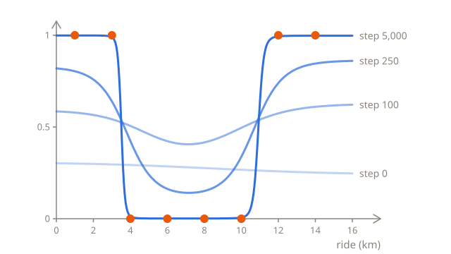
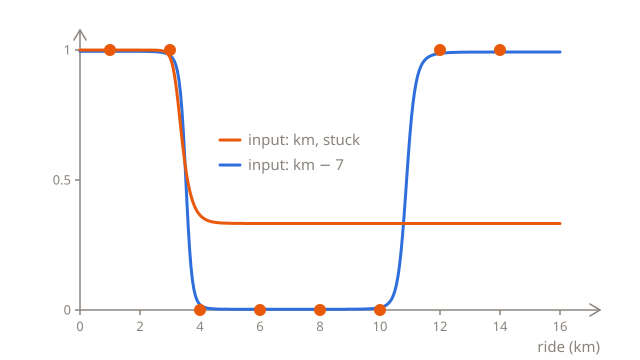
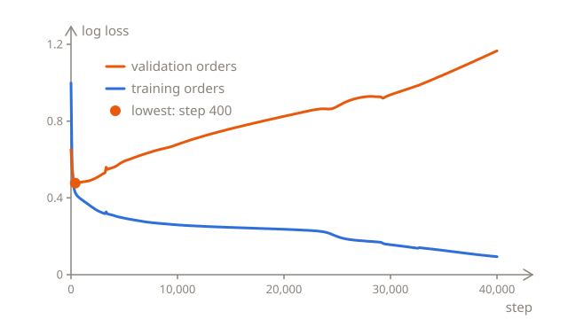
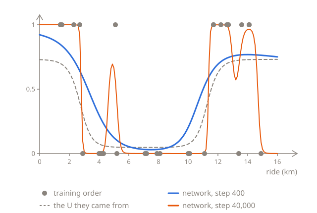

# Training a network

[Backpropagation](02-backpropagation.md) works out the slope of the loss for every parameter of a network. With the slopes, a step of gradient descent is the same as in [logistic regression](../03-logistic-regression/03-training.md#stepping-downhill): every parameter moves against its own slope, scaled by the learning rate $\eta$:

$$
w_1 \leftarrow w_1 - \eta \, \frac{\partial L}{\partial w_1}
\qquad
b_1 \leftarrow b_1 - \eta \, \frac{\partial L}{\partial b_1}
\qquad
\dots
\qquad
c \leftarrow c - \eta \, \frac{\partial L}{\partial c}
$$

Here's one step from the network of the last lesson, with the slopes worked out there for the eight orders, and a learning rate of 0.5:

| Parameter | Before | Slope  | After   |
| --------- | ------ | ------ | ------- |
| $w_1$     | −2     | −0.261 | −1.870  |
| $b_1$     | 6      | −0.090 | 6.045   |
| $w_2$     | 2      | −0.200 | 2.100   |
| $b_2$     | −22    | −0.016 | −21.992 |
| $v_1$     | 4      | −0.079 | 4.040   |
| $v_2$     | 4      | −0.074 | 4.037   |
| $c$       | −3     | −0.177 | −2.912  |

The loss drops from 0.335 to 0.277, and more steps would take it further. But those 7 parameters were chosen by hand, in the first lesson, and a network that learns from scratch has to start somewhere. That's the first of two questions that logistic regression didn't have to ask: where to start, and when to stop.

## Where to start

Logistic regression started from $w = 0$ and $b = 0$. Start the network from all zeros, and it never moves: every slope is exactly 0. Every neuron gives $\sigma(0) = 0.5$ for every order, and the output neuron's weights, $v_1$ and $v_2$, are 0, so the errors passed back to the hidden neurons, $\delta_1$ and $\delta_2$, are 0 too, and so are the slopes for $w_1$, $b_1$, $w_2$ and $b_2$. The slopes for $v_1$, $v_2$ and $c$ come from the output neuron's error, $p - y$, which is 0.5 for an order that was accepted and −0.5 for one that was turned down, and with half the orders turned down, they cancel out.

With other orders, the output neuron would move, but the hidden neurons would still be stuck together. They start the same, so they give the same activation for every order, and $v_1$ and $v_2$, whose slopes are $\delta h_1$ and $\delta h_2$, move the same way. So both hidden neurons get the same errors and the same slopes, at every step, and stay twins forever. That happens from any start where both hidden neurons have the same weight and bias, and the same weight to the output neuron, not only from 0, and two hidden neurons that are always the same can't draw a U: for that, one S has to fall and the other has to rise.

So every weight and bias starts as a different random number. Python's `random` module makes random numbers: `random.uniform(-1, 1)` gives a random number between −1 and 1, and `random.seed(7)` makes the numbers that follow the same every time the code runs, so that a result can be repeated. Change the 7, and you get different ones:

```python run
import random

random.seed(7)
net = {}
for name in ["w1", "b1", "w2", "b2", "v1", "v2", "c"]:
    net[name] = random.uniform(-1, 1)

for name in net:
    print(name, round(net[name], 3))
```

Now the two hidden neurons start different, get different slopes, and can learn different things.

## Measuring from the middle

Where does each hidden neuron's S start? It's halfway up, at 0.5, where its $z$ is 0, so where $wx + b = 0$, at $x = -b/w$. For the start above, that's −(−0.698) ÷ (−0.352) = −1.98 km for the first hidden neuron, and −(−0.855) ÷ 0.302 = 2.83 km for the second. With $w$ and $b$ both between −1 and 1, the middle of an S lands between −1 and 1 km half the time, whenever $b$ is closer to 0 than $w$ is. That's at the far left of the orders, which go from 1 to 14 km, and a long way from where the S's are needed, at about 3.5 and 11 km.

The network doesn't have to get the ride's length as it is, though. It can get the ride's distance from 7 km, about the middle of the orders: $x = \text{km} - 7$, so a 3 km ride is −4, and a 12 km ride is 5. It's the same network, as an S on km is an S on km − 7 too, with a different bias. The first S from the first lesson, $\sigma(-2 \times \text{km} + 6)$, is $\sigma(-2x - 8)$, as $-2(x + 7) + 6 = -2x - 8$. But now, the middle of a random S lands between 6 and 8 km half the time, right among the orders. For the start above, that's 7 − 1.98 = 5.02 km for the first neuron, and 7 + 2.83 = 9.83 km for the second.

Centring the inputs on 0 like this is a standard step before training a network. With several inputs, like a ride's length and its price, each one is usually scaled too, so that they're all about the same size. Both together are often called **normalization**, and [Preparing the inputs](04-inputs.md) shows why the scaling matters. Once a network has been trained on km − 7, the shift is part of it, and every new order has to be shifted the same way: a new 12 km ride goes in as 5 too.

## Training the network

Here's the whole training, on the centred input. It has the functions from the last lesson, with `x` for the input, and `slopes`, which averages the slopes of the orders it's given, like the loop at the end of the last lesson. It starts from seed 7, and takes 5,000 steps with a learning rate of 0.5. Every 1,000 steps, it prints the step and the loss, and at the end, the probability for each order, and where each hidden neuron's S is halfway up, in km:

```python run
import math
import random


def sigmoid(z):
    return 1 / (1 + math.exp(-z))


def predict(x, net):
    h1 = sigmoid(net["w1"] * x + net["b1"])
    h2 = sigmoid(net["w2"] * x + net["b2"])
    return sigmoid(net["v1"] * h1 + net["v2"] * h2 + net["c"])


def loss(xs, turned_down, net):
    total = 0
    for i in range(len(xs)):
        p = predict(xs[i], net)
        if turned_down[i] == 1:
            total += -math.log(p)
        else:
            total += -math.log(1 - p)
    return total / len(xs)


def order_slopes(x, turned_down, net):
    h1 = sigmoid(net["w1"] * x + net["b1"])
    h2 = sigmoid(net["w2"] * x + net["b2"])
    p = sigmoid(net["v1"] * h1 + net["v2"] * h2 + net["c"])
    delta = p - turned_down
    delta1 = delta * net["v1"] * h1 * (1 - h1)
    delta2 = delta * net["v2"] * h2 * (1 - h2)
    return {
        "w1": delta1 * x,
        "b1": delta1,
        "w2": delta2 * x,
        "b2": delta2,
        "v1": delta * h1,
        "v2": delta * h2,
        "c": delta,
    }


def slopes(xs, turned_down, net):
    total = {}
    for name in net:
        total[name] = 0
    for i in range(len(xs)):
        one = order_slopes(xs[i], turned_down[i], net)
        for name in net:
            total[name] += one[name] / len(xs)
    return total


kms = [1, 3, 4, 6, 8, 10, 12, 14]
turned_down = [1, 1, 0, 0, 0, 0, 1, 1]
xs = [km - 7 for km in kms]
learning_rate = 0.5

random.seed(7)
net = {}
for name in ["w1", "b1", "w2", "b2", "v1", "v2", "c"]:
    net[name] = random.uniform(-1, 1)

for step in range(5001):
    if step % 1000 == 0:
        print(step, round(loss(xs, turned_down, net), 3))
    gradient = slopes(xs, turned_down, net)
    for name in net:
        net[name] -= learning_rate * gradient[name]

print([round(predict(x, net), 3) for x in xs])
print(round(-net["b1"] / net["w1"] + 7, 1), round(-net["b2"] / net["w2"] + 7, 1))
```

The loss falls from 0.809 to 0.005, and the network ends up sure about every order: over 0.98 for the four that were turned down, and under 0.02 for the four that weren't. Its S's are halfway up at 3.5 km, the falling one, and at 10.9 km, the rising one: the U, found without any help. On a chart, the network starts almost flat, and the U grows out of it:



The loss won't stop at 0.005. As in [When the groups don't overlap](../03-logistic-regression/03-training.md#when-the-groups-dont-overlap), a network can get all eight orders right: every order under 3.5 km or over 10.9 km was turned down, and no other. So with more steps, the walls of the U keep getting steeper, the network keeps getting more sure, and the loss keeps falling towards 0, without ever getting there.

## Not every start works

Seed 7 is one start. To see how much the start matters, the code below trains from 20 of them, seeds 0 to 19, each once with km as the input and once with km − 7, and prints the two losses after 5,000 steps. It takes a few seconds:

```python run
import math
import random


def sigmoid(z):
    return 1 / (1 + math.exp(-z))


def predict(x, net):
    h1 = sigmoid(net["w1"] * x + net["b1"])
    h2 = sigmoid(net["w2"] * x + net["b2"])
    return sigmoid(net["v1"] * h1 + net["v2"] * h2 + net["c"])


def loss(xs, turned_down, net):
    total = 0
    for i in range(len(xs)):
        p = predict(xs[i], net)
        if turned_down[i] == 1:
            total += -math.log(p)
        else:
            total += -math.log(1 - p)
    return total / len(xs)


def order_slopes(x, turned_down, net):
    h1 = sigmoid(net["w1"] * x + net["b1"])
    h2 = sigmoid(net["w2"] * x + net["b2"])
    p = sigmoid(net["v1"] * h1 + net["v2"] * h2 + net["c"])
    delta = p - turned_down
    delta1 = delta * net["v1"] * h1 * (1 - h1)
    delta2 = delta * net["v2"] * h2 * (1 - h2)
    return {
        "w1": delta1 * x,
        "b1": delta1,
        "w2": delta2 * x,
        "b2": delta2,
        "v1": delta * h1,
        "v2": delta * h2,
        "c": delta,
    }


def slopes(xs, turned_down, net):
    total = {}
    for name in net:
        total[name] = 0
    for i in range(len(xs)):
        one = order_slopes(xs[i], turned_down[i], net)
        for name in net:
            total[name] += one[name] / len(xs)
    return total


def train(xs, turned_down, seed):
    random.seed(seed)
    net = {}
    for name in ["w1", "b1", "w2", "b2", "v1", "v2", "c"]:
        net[name] = random.uniform(-1, 1)
    for step in range(5000):
        gradient = slopes(xs, turned_down, net)
        for name in net:
            net[name] -= 0.5 * gradient[name]
    return net


kms = [1, 3, 4, 6, 8, 10, 12, 14]
turned_down = [1, 1, 0, 0, 0, 0, 1, 1]
xs = [km - 7 for km in kms]

for seed in range(20):
    on_km = loss(kms, turned_down, train(kms, turned_down, seed))
    from_middle = loss(xs, turned_down, train(xs, turned_down, seed))
    print(seed, round(on_km, 3), round(from_middle, 3))
```

From the middle, every start ends below 0.02. With km, 11 of the 20 get stuck at about 0.49. Here's one of them, seed 1, next to the same start from the middle:



With km, seed 1 starts both hidden neurons with their middles near 1 km. The one whose S falls learns the short end. The one whose S rises should move to the long end, around 11 km, but it stays near 1 km, and for every order from 4 km on, it's on its flat top, at practically 1. There, a small change to its weight or bias hardly changes anything, so those orders can't pull it towards the long end, where it's needed. The network ends up giving every ride from 4 km on about the same probability, a third, as 2 of the 6 orders from 4 km on were turned down.

That's a flat spot in the loss: every slope is close to 0, so gradient descent hardly moves, even though the loss could go much lower. After 50,000 steps, seed 1 is still at 0.478. Linear and logistic regression have no flat spots like that, as the only place where every slope of their loss is 0 is the bottom. A network's loss can have many, and where training ends up depends on where it starts. Centring the inputs makes the bad starts rarer, and when a run gets stuck anyway, it can start again from another seed.

## Mini-batches and epochs

Every step so far worked out the slopes of all eight orders. That's fine for eight, but a real training set can have millions of examples, and a single step would then take millions of forward and backward passes. Instead, each step can use a few examples, a **mini-batch**. Their slopes aren't exactly those of the whole loss, but they point roughly the same way, and a step takes a fraction of the time. The examples are shuffled and split into mini-batches, and once every example has been used, that's an **epoch**. The next epoch shuffles them again.

Here's the same start, seed 7, trained in mini-batches of 2 orders, for 1,250 epochs. The list `order` holds the orders' positions in `xs`, from 0 to 7, and `random.shuffle(order)` puts them in a random order:

```python run
import math
import random


def sigmoid(z):
    return 1 / (1 + math.exp(-z))


def predict(x, net):
    h1 = sigmoid(net["w1"] * x + net["b1"])
    h2 = sigmoid(net["w2"] * x + net["b2"])
    return sigmoid(net["v1"] * h1 + net["v2"] * h2 + net["c"])


def loss(xs, turned_down, net):
    total = 0
    for i in range(len(xs)):
        p = predict(xs[i], net)
        if turned_down[i] == 1:
            total += -math.log(p)
        else:
            total += -math.log(1 - p)
    return total / len(xs)


def order_slopes(x, turned_down, net):
    h1 = sigmoid(net["w1"] * x + net["b1"])
    h2 = sigmoid(net["w2"] * x + net["b2"])
    p = sigmoid(net["v1"] * h1 + net["v2"] * h2 + net["c"])
    delta = p - turned_down
    delta1 = delta * net["v1"] * h1 * (1 - h1)
    delta2 = delta * net["v2"] * h2 * (1 - h2)
    return {
        "w1": delta1 * x,
        "b1": delta1,
        "w2": delta2 * x,
        "b2": delta2,
        "v1": delta * h1,
        "v2": delta * h2,
        "c": delta,
    }


def slopes(xs, turned_down, net):
    total = {}
    for name in net:
        total[name] = 0
    for i in range(len(xs)):
        one = order_slopes(xs[i], turned_down[i], net)
        for name in net:
            total[name] += one[name] / len(xs)
    return total


kms = [1, 3, 4, 6, 8, 10, 12, 14]
turned_down = [1, 1, 0, 0, 0, 0, 1, 1]
xs = [km - 7 for km in kms]

random.seed(7)
net = {}
for name in ["w1", "b1", "w2", "b2", "v1", "v2", "c"]:
    net[name] = random.uniform(-1, 1)

order = list(range(len(xs)))
for epoch in range(1, 1251):
    random.shuffle(order)
    for first in range(0, len(order), 2):
        batch = order[first:first + 2]
        batch_xs = [xs[i] for i in batch]
        batch_turned_down = [turned_down[i] for i in batch]
        gradient = slopes(batch_xs, batch_turned_down, net)
        for name in net:
            net[name] -= 0.5 * gradient[name]
    if epoch % 250 == 0:
        print(epoch, round(loss(xs, turned_down, net), 3))
```

Each epoch takes 4 steps, so that's 5,000 steps too, and the loss ends at 0.005, as low as after the 5,000 steps on all eight orders. But each step worked out the slopes of only 2 orders, so the whole training took a quarter of the work: as much as 1,250 steps on all eight orders, which only get the loss down to 0.035.

Gradient descent on mini-batches, shuffled at random, is called **stochastic gradient descent**, or SGD, where stochastic means random. Most networks are trained with it, or with a variant of it, and their mini-batches usually have tens or hundreds of examples.

## Overfitting and validation

The network gets all eight orders right, but the company doesn't need predictions for last week's orders, whose outcomes it already knows. It needs them for new ones. As [What is machine learning?](../01-what-is-machine-learning.md#training-validation-and-test-data) warned, a model can fit its training data perfectly and still fail on new data. That's overfitting, and a network, which can draw almost any shape, is especially prone to it.

To see it happen, take a network with 10 hidden neurons, so 31 parameters, and 30 new orders to train it on. Each has a random length, between 1 and 15 km, and was turned down at random too, with the probability that the network from the first lesson gives for its length. So the U from the first lesson is the truth here, and the best a network can do is find it. 400 more orders, made the same way, are the **validation set**: the network never trains on them, but every 100 steps, its loss is measured on them too:



On the training orders, the loss keeps falling, to 0.09 after 40,000 steps. On the validation orders, it falls only until step 400, to 0.48, not far from the 0.42 that the U itself gets on them. Then it rises, to 1.17, worse than the 0.693 of the baseline, which gives every order 0.5, as half the training orders were turned down, and doesn't look at the km at all. Here's the network at step 400, and at step 40,000:



At step 400, it's close to the U. By step 40,000, it has learned the training orders themselves, and the chance in their outcomes with them. It jumps up to about 0.7 near 5 km, for the one order at 5.1 km that happened to be turned down, and drops to 0.03 at 15 km, for the order at 14.9 km that happened not to be. On new orders, jumps like those are just wrong.

The simplest fix is to keep the network from the step where the validation loss was lowest, and to stop training once it hasn't improved for a while. That's **early stopping**. More training data helps too, and so does a smaller network, with fewer parameters to memorize with, or regularization, the extra penalty for big weights from logistic regression. The validation loss is also how to choose between networks of different sizes, or between learning rates: on the training data, the network that memorizes the most would always look best.

## The whole method on one page

Everything from the first three lessons, in one place:

1. **The model** is a network of neurons in layers. Each neuron multiplies its inputs by weights, adds a bias, and puts the result through an activation function. The network here has two hidden neurons, $h_1 = \sigma(w_1 x + b_1)$ and $h_2 = \sigma(w_2 x + b_2)$, and an output neuron, $p = \sigma(v_1 h_1 + v_2 h_2 + c)$.
2. **The loss** is the log loss, as in logistic regression.
3. **The gradient** comes from backpropagation. A forward pass works out the activations, and a backward pass the errors: $\delta = p - y$ at the output, and $\delta_1 = \delta\,v_1\,h_1(1 - h_1)$ and $\delta_2 = \delta\,v_2\,h_2(1 - h_2)$ in the hidden layer. The slope for a weight is its neuron's error times the input it multiplies, and for a bias, the error alone.
4. **Each step** moves every parameter against its slope, scaled by the learning rate $\eta$, with the slopes of a mini-batch.
5. **The start** is small random weights and biases, with the inputs centred on 0.
6. **Stop** when the loss on the validation set stops dropping, and keep the network from its lowest point.

Next to [the method for logistic regression](../03-logistic-regression/03-training.md#the-whole-method-on-one-page), the loss and the steps are the same. What's new is the model, the backward pass for the slopes, and the care about where to start and when to stop.

## Going further

This part is optional. Nothing later in the chapter depends on it, and the test doesn't ask about it.

### The same network in PyTorch

[Letting the computer do it](02-backpropagation.md#letting-the-computer-do-it) showed PyTorch doing the backward pass. It also has layers, losses and training steps ready to use, so the whole training from this lesson takes a few lines:

```python
import torch
from torch import nn

kms = torch.tensor([[1.0], [3.0], [4.0], [6.0], [8.0], [10.0], [12.0], [14.0]])
turned_down = torch.tensor([[1.0], [1.0], [0.0], [0.0], [0.0], [0.0], [1.0], [1.0]])
xs = kms - 7

model = nn.Sequential(nn.Linear(1, 2), nn.Sigmoid(), nn.Linear(2, 1), nn.Sigmoid())
loss_function = nn.BCELoss()
optimizer = torch.optim.SGD(model.parameters(), lr=0.5)

for step in range(5000):
    optimizer.zero_grad()
    loss = loss_function(model(xs), turned_down)
    loss.backward()
    optimizer.step()
```

- Each order is a row, with a column for each input, here just the one. `kms - 7` takes 7 away from every number at once.
- `nn.Linear(1, 2)` is the hidden layer before its activation: 2 neurons with 1 input each, so $w_1$, $b_1$, $w_2$ and $b_2$. `nn.Sigmoid()` is the activation. `nn.Linear(2, 1)` is the output neuron, with 2 inputs, so $v_1$, $v_2$ and $c$, and then comes the sigmoid again. `nn.Sequential` puts them in a row, and `model(xs)` does the forward pass for all eight orders at once.
- `nn.BCELoss()` is the log loss, under its other name, [binary cross-entropy](../03-logistic-regression/02-error.md#the-same-steps-in-symbols), or BCE.
- `torch.optim.SGD` takes the steps: `optimizer.step()` moves every parameter against its slope, scaled by `lr`, the learning rate. `loss.backward()` adds each slope to what's already in `grad`, so `optimizer.zero_grad()` sets them all back to 0 before every step.

PyTorch starts each layer with random weights and biases too, between $-1/\sqrt{n}$ and $1/\sqrt{n}$, where $n$ is the number of inputs of each of the layer's neurons: between −1 and 1 in the hidden layer, as in this lesson, and between about −0.71 and 0.71 at the output. Its random numbers aren't Python's, so it starts, and ends, with different parameters than the code above. PyTorch doesn't run in the browser, so this example has no **Run** button.

## Check yourself

<details>
<summary>Why can't a network start with every weight at 0, like logistic regression did?</summary>

Because its hidden neurons would start the same, and stay the same: they'd give the same activation for every order, get the same errors and the same slopes, and change the same way at every step. Two hidden neurons that are always the same can't draw a U. For the eight orders, it's even worse: at all zeros, every slope is exactly 0, and training doesn't move at all. A random start makes every neuron different.

</details>

<details>
<summary>After 40,000 steps, a network's loss is 0.09 on its training orders, and 1.17 on its validation orders. What happened, and what would have been better?</summary>

It overfit: it learned the training orders, down to their chance outcomes, instead of the U they came from. Its validation loss was lowest at step 400, at 0.48, so stopping there, early stopping, would have given a much better network. More training orders, or fewer hidden neurons, would help too.

</details>

<details>
<summary>Training gets stuck at a loss of 0.49, with every slope close to 0, while other starts get close to 0. What can you do?</summary>

The network is in a flat spot, where the slopes are close to 0, even though the loss could go much lower, so more steps hardly help. Start again from another random start, and centre the inputs on 0, if they aren't already: for the eight orders, that took the stuck starts from 11 of 20 to none.

</details>

## Your turn

In [Slopes for a batch](../../../exercises/04-foundations/04-neural-networks/03-training/01-batch-slopes/task.md), you'll average the slopes of a mini-batch, and take a step with them. In [Train a network](../../../exercises/04-foundations/04-neural-networks/03-training/02-train-a-network/task.md), you'll make a random start, and train a network from it.
