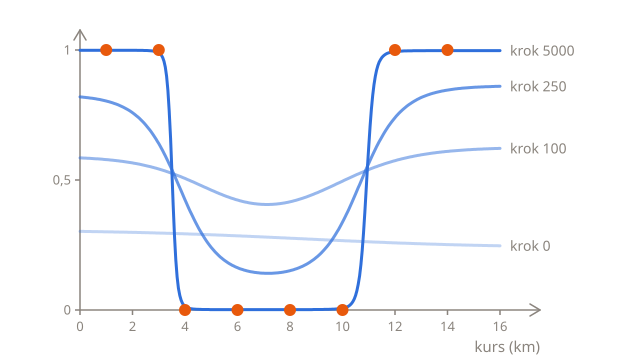
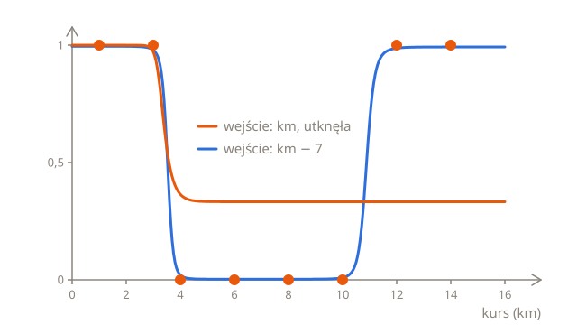
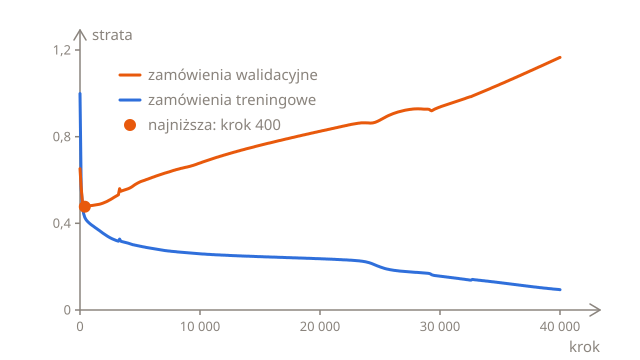
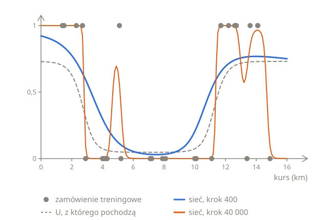

# Trening sieci

[Propagacja wsteczna](02-backpropagation.pl.md) liczy nachylenie straty względem każdego parametru sieci. Z nachyleniami krok spadku gradientu wygląda tak samo jak w [regresji logistycznej](../03-logistic-regression/03-training.pl.md#kroki-w-dół): każdy parametr przesuwa się przeciwnie do swojego nachylenia, pomnożonego przez współczynnik uczenia $\eta$:

$$
w_1 \leftarrow w_1 - \eta \, \frac{\partial L}{\partial w_1}
\qquad
b_1 \leftarrow b_1 - \eta \, \frac{\partial L}{\partial b_1}
\qquad
\dots
\qquad
c \leftarrow c - \eta \, \frac{\partial L}{\partial c}
$$

Oto jeden krok od sieci z poprzedniej lekcji, z nachyleniami policzonymi tam dla ośmiu zamówień i ze współczynnikiem uczenia 0,5:

| Parametr | Przed | Nachylenie | Po      |
| -------- | ----- | ---------- | ------- |
| $w_1$    | −2    | −0,261     | −1,870  |
| $b_1$    | 6     | −0,090     | 6,045   |
| $w_2$    | 2     | −0,200     | 2,100   |
| $b_2$    | −22   | −0,016     | −21,992 |
| $v_1$    | 4     | −0,079     | 4,040   |
| $v_2$    | 4     | −0,074     | 4,037   |
| $c$      | −3    | −0,177     | −2,912  |

Strata spada z 0,335 do 0,277, a kolejne kroki obniżyłyby ją dalej. Ale te 7 parametrów dobrano ręcznie, w pierwszej lekcji, a sieć, która uczy się od zera, musi od czegoś zacząć. To pierwsze z dwóch pytań, których regresja logistyczna nie musiała sobie zadawać: od czego zacząć i kiedy skończyć.

## Od czego zacząć

Regresja logistyczna zaczynała od $w = 0$ i $b = 0$. Zacznij sieć od samych zer, a w ogóle się nie ruszy: każde nachylenie wynosi dokładnie 0. Każdy neuron daje $\sigma(0) = 0{,}5$ dla każdego zamówienia, a wagi neuronu wyjściowego, $v_1$ i $v_2$, wynoszą 0, więc błędy przekazane wstecz do neuronów ukrytych, $\delta_1$ i $\delta_2$, też wynoszą 0, tak samo jak nachylenia względem $w_1$, $b_1$, $w_2$ i $b_2$. Nachylenia względem $v_1$, $v_2$ i $c$ biorą się z błędu neuronu wyjściowego, $p - y$, który wynosi 0,5 dla zamówienia przyjętego i −0,5 dla odrzuconego, a że odrzucono połowę zamówień, błędy się znoszą.

Przy innych zamówieniach neuron wyjściowy by się ruszył, ale neurony ukryte nadal byłyby ze sobą sklejone. Zaczynają tak samo, więc dają tę samą aktywację dla każdego zamówienia, a $v_1$ i $v_2$, których nachylenia to $\delta h_1$ i $\delta h_2$, zmieniają się tak samo. Oba neurony ukryte dostają więc te same błędy i te same nachylenia, w każdym kroku, i na zawsze zostają bliźniakami. Dzieje się tak przy każdym starcie, w którym oba neurony ukryte mają tę samą wagę i ten sam wyraz wolny oraz tę samą wagę do neuronu wyjściowego, nie tylko przy zerach, a dwa neurony ukryte, które zawsze są takie same, nie narysują U: do tego jedno S musi opadać, a drugie rosnąć.

Dlatego każda waga i każdy wyraz wolny zaczynają od innej losowej liczby. Losowe liczby w Pythonie daje moduł `random`: `random.uniform(-1, 1)` zwraca losową liczbę między −1 a 1, a `random.seed(7)`, z **ziarnem** (ang. seed) 7, sprawia, że kolejne liczby są takie same przy każdym uruchomieniu kodu, więc wynik można powtórzyć. Zmień 7, a dostaniesz inne:

```python run
import random

random.seed(7)
net = {}
for name in ["w1", "b1", "w2", "b2", "v1", "v2", "c"]:
    net[name] = random.uniform(-1, 1)

for name in net:
    print(name, round(net[name], 3))
```

Teraz dwa neurony ukryte zaczynają inaczej, dostają inne nachylenia i mogą nauczyć się czegoś innego.

## Mierzenie od środka

Gdzie zaczyna się S każdego neuronu ukrytego? W połowie wysokości, na poziomie 0,5, jest tam, gdzie jego $z$ wynosi 0, czyli gdzie $wx + b = 0$, przy $x = -b/w$. Dla startu powyżej to −(−0,698) ÷ (−0,352) = −1,98 km dla pierwszego neuronu ukrytego i −(−0,855) ÷ 0,302 = 2,83 km dla drugiego. Gdy $w$ i $b$ leżą między −1 a 1, środek S wypada między −1 a 1 km w połowie przypadków: zawsze, gdy $b$ jest bliżej 0 niż $w$. To skrajnie na lewo od zamówień, które mają od 1 do 14 km, i daleko od miejsc, w których S są potrzebne, około 3,5 i 11 km.

Sieć nie musi jednak dostawać długości kursu takiej, jaka jest. Może dostawać jego odległość od 7 km, czyli mniej więcej od środka zamówień: $x = \text{km} - 7$, więc kurs na 3 km to −4, a na 12 km to 5. To ta sama sieć, bo S względem km jest też S względem km − 7, tylko z innym wyrazem wolnym. Pierwsze S z pierwszej lekcji, $\sigma(-2 \times \text{km} + 6)$, to $\sigma(-2x - 8)$, bo $-2(x + 7) + 6 = -2x - 8$. Ale teraz środek losowego S wypada między 6 a 8 km w połowie przypadków, w samym środku zamówień. Dla startu powyżej to 7 − 1,98 = 5,02 km dla pierwszego neuronu i 7 + 2,83 = 9,83 km dla drugiego.

Takie wyśrodkowanie wejść na 0 to standardowy krok przed treningiem sieci. Gdy wejść jest kilka, jak długość kursu i jego cena, każde zwykle też się skaluje, żeby wszystkie miały mniej więcej ten sam rozmiar. Jedno i drugie razem często nazywa się **normalizacją** (ang. normalization), a lekcja [Przygotowanie wejść](04-inputs.pl.md) pokazuje, dlaczego skalowanie ma znaczenie. Gdy sieć wytrenowano już na km − 7, to przesunięcie jest jej częścią i każde nowe zamówienie trzeba przesunąć tak samo: nowy kurs na 12 km też wchodzi jako 5.

## Trenowanie sieci

Oto cały trening, na wyśrodkowanym wejściu. Ma funkcje z poprzedniej lekcji, z `x` jako wejściem, oraz `slopes`, która uśrednia nachylenia podanych zamówień, tak jak pętla na końcu poprzedniej lekcji. Zaczyna od ziarna 7 i robi 5000 kroków ze współczynnikiem uczenia 0,5. Co 1000 kroków wypisuje krok i stratę, a na końcu prawdopodobieństwo dla każdego zamówienia i miejsce, w którym S każdego neuronu ukrytego jest w połowie wysokości, w km:

```python run
import math
import random


def sigmoid(z):
    return 1 / (1 + math.exp(-z))


def predict(x, net):
    h1 = sigmoid(net["w1"] * x + net["b1"])
    h2 = sigmoid(net["w2"] * x + net["b2"])
    return sigmoid(net["v1"] * h1 + net["v2"] * h2 + net["c"])


def loss(xs, turned_down, net):
    total = 0
    for i in range(len(xs)):
        p = predict(xs[i], net)
        if turned_down[i] == 1:
            total += -math.log(p)
        else:
            total += -math.log(1 - p)
    return total / len(xs)


def order_slopes(x, turned_down, net):
    h1 = sigmoid(net["w1"] * x + net["b1"])
    h2 = sigmoid(net["w2"] * x + net["b2"])
    p = sigmoid(net["v1"] * h1 + net["v2"] * h2 + net["c"])
    delta = p - turned_down
    delta1 = delta * net["v1"] * h1 * (1 - h1)
    delta2 = delta * net["v2"] * h2 * (1 - h2)
    return {
        "w1": delta1 * x,
        "b1": delta1,
        "w2": delta2 * x,
        "b2": delta2,
        "v1": delta * h1,
        "v2": delta * h2,
        "c": delta,
    }


def slopes(xs, turned_down, net):
    total = {}
    for name in net:
        total[name] = 0
    for i in range(len(xs)):
        one = order_slopes(xs[i], turned_down[i], net)
        for name in net:
            total[name] += one[name] / len(xs)
    return total


kms = [1, 3, 4, 6, 8, 10, 12, 14]
turned_down = [1, 1, 0, 0, 0, 0, 1, 1]
xs = [km - 7 for km in kms]
learning_rate = 0.5

random.seed(7)
net = {}
for name in ["w1", "b1", "w2", "b2", "v1", "v2", "c"]:
    net[name] = random.uniform(-1, 1)

for step in range(5001):
    if step % 1000 == 0:
        print(step, round(loss(xs, turned_down, net), 3))
    gradient = slopes(xs, turned_down, net)
    for name in net:
        net[name] -= learning_rate * gradient[name]

print([round(predict(x, net), 3) for x in xs])
print(round(-net["b1"] / net["w1"] + 7, 1), round(-net["b2"] / net["w2"] + 7, 1))
```

Strata spada z 0,809 do 0,005, a sieć jest na końcu pewna każdego zamówienia: daje ponad 0,98 czterem, które odrzucono, i poniżej 0,02 czterem, których nie odrzucono. Jej S są w połowie wysokości przy 3,5 km, to opadające, i przy 10,9 km, to rosnące: to U, znalezione bez żadnej pomocy. Na wykresie sieć zaczyna prawie płasko, a U stopniowo z niej wyrasta:



Strata nie zatrzyma się na 0,005. Tak jak w części [Gdy grupy się nie nakładają](../03-logistic-regression/03-training.pl.md#gdy-grupy-się-nie-nakładają), sieć może trafić wszystkie osiem zamówień: odrzucono każde zamówienie poniżej 3,5 km lub powyżej 10,9 km i żadne inne. Z kolejnymi krokami ścianki U są więc coraz bardziej strome, sieć jest coraz pewniejsza, a strata dalej spada w stronę 0, nigdy do niego nie docierając.

## Nie każdy start się udaje

Ziarno 7 to jeden start. Żeby zobaczyć, jak bardzo start ma znaczenie, kod poniżej trenuje sieć od 20 startów, z ziarnami od 0 do 19, każdy raz z km na wejściu i raz z km − 7, i wypisuje obie straty po 5000 kroków. Trwa to kilka sekund:

```python run
import math
import random


def sigmoid(z):
    return 1 / (1 + math.exp(-z))


def predict(x, net):
    h1 = sigmoid(net["w1"] * x + net["b1"])
    h2 = sigmoid(net["w2"] * x + net["b2"])
    return sigmoid(net["v1"] * h1 + net["v2"] * h2 + net["c"])


def loss(xs, turned_down, net):
    total = 0
    for i in range(len(xs)):
        p = predict(xs[i], net)
        if turned_down[i] == 1:
            total += -math.log(p)
        else:
            total += -math.log(1 - p)
    return total / len(xs)


def order_slopes(x, turned_down, net):
    h1 = sigmoid(net["w1"] * x + net["b1"])
    h2 = sigmoid(net["w2"] * x + net["b2"])
    p = sigmoid(net["v1"] * h1 + net["v2"] * h2 + net["c"])
    delta = p - turned_down
    delta1 = delta * net["v1"] * h1 * (1 - h1)
    delta2 = delta * net["v2"] * h2 * (1 - h2)
    return {
        "w1": delta1 * x,
        "b1": delta1,
        "w2": delta2 * x,
        "b2": delta2,
        "v1": delta * h1,
        "v2": delta * h2,
        "c": delta,
    }


def slopes(xs, turned_down, net):
    total = {}
    for name in net:
        total[name] = 0
    for i in range(len(xs)):
        one = order_slopes(xs[i], turned_down[i], net)
        for name in net:
            total[name] += one[name] / len(xs)
    return total


def train(xs, turned_down, seed):
    random.seed(seed)
    net = {}
    for name in ["w1", "b1", "w2", "b2", "v1", "v2", "c"]:
        net[name] = random.uniform(-1, 1)
    for step in range(5000):
        gradient = slopes(xs, turned_down, net)
        for name in net:
            net[name] -= 0.5 * gradient[name]
    return net


kms = [1, 3, 4, 6, 8, 10, 12, 14]
turned_down = [1, 1, 0, 0, 0, 0, 1, 1]
xs = [km - 7 for km in kms]

for seed in range(20):
    on_km = loss(kms, turned_down, train(kms, turned_down, seed))
    from_middle = loss(xs, turned_down, train(xs, turned_down, seed))
    print(seed, round(on_km, 3), round(from_middle, 3))
```

Od środka każdy start kończy poniżej 0,02. Z km 11 z 20 utyka na około 0,49. Oto jeden z nich, ziarno 1, obok tego samego startu od środka:



Z km ziarno 1 ustawia środki obu neuronów ukrytych blisko 1 km. Ten, którego S opada, uczy się krótkiego końca. Ten, którego S rośnie, powinien przesunąć się na długi koniec, w okolice 11 km, ale zostaje blisko 1 km, a dla każdego zamówienia od 4 km jest na płaskim szczycie, praktycznie na poziomie 1. Tam mała zmiana jego wagi czy wyrazu wolnego prawie nic nie zmienia, więc te zamówienia nie mogą przyciągnąć go w stronę długiego końca, gdzie jest potrzebny. W końcu sieć daje każdemu kursowi od 4 km mniej więcej to samo prawdopodobieństwo, jedną trzecią, bo z 6 zamówień od 4 km w górę odrzucono 2.

To płaskie miejsce straty: każde nachylenie jest bliskie 0, więc spadek gradientu prawie się nie rusza, choć strata mogłaby być dużo niższa. Po 50 000 kroków ziarno 1 wciąż ma 0,478. Regresja liniowa i logistyczna nie mają takich płaskich miejsc, bo jedynym miejscem, w którym każde nachylenie ich straty wynosi 0, jest dno. Strata sieci może mieć ich wiele, a to, gdzie skończy się trening, zależy od tego, gdzie się zaczął. Wyśrodkowanie wejść sprawia, że złe starty zdarzają się rzadziej, a gdy trening mimo to utknie, można zacząć od nowa z innym ziarnem.

## Minipaczki i epoki

Każdy dotychczasowy krok liczył nachylenia wszystkich ośmiu zamówień. Przy ośmiu to nic, ale prawdziwy zbiór treningowy może mieć miliony przykładów, a wtedy jeden krok wymagałby milionów przejść w przód i wstecz. Zamiast tego każdy krok może użyć kilku przykładów, **minipaczki** (ang. mini-batch). Ich nachylenia nie są dokładnie nachyleniami całej straty, ale wskazują mniej więcej ten sam kierunek, a krok zajmuje ułamek czasu. Przykłady się tasuje i dzieli na minipaczki, a gdy każdy przykład zostanie użyty, mija **epoka** (ang. epoch). Następna epoka znów je tasuje.

Oto ten sam start, ziarno 7, trenowany minipaczkami po 2 zamówienia przez 1250 epok. Lista `order` zawiera pozycje zamówień w `xs`, od 0 do 7, a `random.shuffle(order)` układa je w losowej kolejności:

```python run
import math
import random


def sigmoid(z):
    return 1 / (1 + math.exp(-z))


def predict(x, net):
    h1 = sigmoid(net["w1"] * x + net["b1"])
    h2 = sigmoid(net["w2"] * x + net["b2"])
    return sigmoid(net["v1"] * h1 + net["v2"] * h2 + net["c"])


def loss(xs, turned_down, net):
    total = 0
    for i in range(len(xs)):
        p = predict(xs[i], net)
        if turned_down[i] == 1:
            total += -math.log(p)
        else:
            total += -math.log(1 - p)
    return total / len(xs)


def order_slopes(x, turned_down, net):
    h1 = sigmoid(net["w1"] * x + net["b1"])
    h2 = sigmoid(net["w2"] * x + net["b2"])
    p = sigmoid(net["v1"] * h1 + net["v2"] * h2 + net["c"])
    delta = p - turned_down
    delta1 = delta * net["v1"] * h1 * (1 - h1)
    delta2 = delta * net["v2"] * h2 * (1 - h2)
    return {
        "w1": delta1 * x,
        "b1": delta1,
        "w2": delta2 * x,
        "b2": delta2,
        "v1": delta * h1,
        "v2": delta * h2,
        "c": delta,
    }


def slopes(xs, turned_down, net):
    total = {}
    for name in net:
        total[name] = 0
    for i in range(len(xs)):
        one = order_slopes(xs[i], turned_down[i], net)
        for name in net:
            total[name] += one[name] / len(xs)
    return total


kms = [1, 3, 4, 6, 8, 10, 12, 14]
turned_down = [1, 1, 0, 0, 0, 0, 1, 1]
xs = [km - 7 for km in kms]

random.seed(7)
net = {}
for name in ["w1", "b1", "w2", "b2", "v1", "v2", "c"]:
    net[name] = random.uniform(-1, 1)

order = list(range(len(xs)))
for epoch in range(1, 1251):
    random.shuffle(order)
    for first in range(0, len(order), 2):
        batch = order[first:first + 2]
        batch_xs = [xs[i] for i in batch]
        batch_turned_down = [turned_down[i] for i in batch]
        gradient = slopes(batch_xs, batch_turned_down, net)
        for name in net:
            net[name] -= 0.5 * gradient[name]
    if epoch % 250 == 0:
        print(epoch, round(loss(xs, turned_down, net), 3))
```

Każda epoka to 4 kroki, więc to też 5000 kroków, a strata kończy na 0,005, tak nisko jak po 5000 kroków na wszystkich ośmiu zamówieniach. Ale każdy krok liczył nachylenia tylko 2 zamówień, więc cały trening wymagał jednej czwartej pracy: tyle co 1250 kroków na wszystkich ośmiu zamówieniach, które obniżają stratę tylko do 0,035.

Spadek gradientu na minipaczkach, tasowanych losowo, nazywa się **stochastycznym spadkiem gradientu** (ang. stochastic gradient descent, SGD), gdzie „stochastyczny” znaczy „losowy”. Tak albo jego odmianą trenuje się większość sieci, a ich minipaczki mają zwykle kilkadziesiąt albo kilkaset przykładów.

## Nadmierne dopasowanie i walidacja

Sieć trafia wszystkie osiem zamówień, ale firma nie potrzebuje predykcji dla zamówień z zeszłego tygodnia, których wynik już zna. Potrzebuje ich dla nowych. Jak ostrzegała lekcja [Czym jest uczenie maszynowe?](../01-what-is-machine-learning.pl.md#dane-treningowe-walidacyjne-i-testowe), model może idealnie pasować do danych treningowych, a mimo to zawodzić na nowych danych. To nadmierne dopasowanie, a sieć, która potrafi narysować prawie każdy kształt, jest na nie szczególnie podatna.

Żeby zobaczyć je w działaniu, weź sieć z 10 neuronami ukrytymi, czyli z 31 parametrami, i 30 nowych zamówień do treningu. Każde ma losową długość, od 1 do 15 km, i też losowo zostało odrzucone albo nie, z prawdopodobieństwem, jakie dla jego długości daje sieć z pierwszej lekcji. U z pierwszej lekcji jest tu więc prawdą, a najlepsze, co sieć może zrobić, to je znaleźć. 400 kolejnych zamówień, zrobionych tak samo, to **zbiór walidacyjny**: sieć nigdy się na nich nie trenuje, ale co 100 kroków mierzy się na nich też jej stratę:



Na zamówieniach treningowych strata cały czas spada, do 0,09 po 40 000 kroków. Na zamówieniach walidacyjnych spada tylko do kroku 400, do 0,48, niedaleko 0,42, które dostaje na nich samo U. Potem rośnie, do 1,17, czyli gorzej niż 0,693 punktu odniesienia, który daje każdemu zamówieniu 0,5, bo odrzucono połowę zamówień treningowych, i w ogóle nie patrzy na km. Oto sieć w kroku 400 i w kroku 40 000:



W kroku 400 jest blisko U. W kroku 40 000 zna już same zamówienia treningowe, razem z przypadkiem w ich wynikach. Podskakuje do około 0,7 w okolicy 5 km, dla jednego zamówienia na 5,1 km, które akurat odrzucono, i spada do 0,03 przy 15 km, dla zamówienia na 14,9 km, którego akurat nie odrzucono. Na nowych zamówieniach takie skoki to po prostu pomyłki.

Najprostsze rozwiązanie to zachować sieć z kroku, w którym strata walidacyjna była najniższa, i przerwać trening, gdy od jakiegoś czasu się nie poprawia. To **wczesne zatrzymanie** (ang. early stopping). Pomaga też więcej danych treningowych, mniejsza sieć, z mniejszą liczbą parametrów do zapamiętywania, albo regularyzacja, znana z regresji logistycznej dodatkowa kara za duże wagi. Według straty walidacyjnej wybiera się też między sieciami różnej wielkości albo między współczynnikami uczenia: na danych treningowych zawsze najlepiej wyglądałaby sieć, która najwięcej zapamiętała.

## Cała metoda na jednej stronie

Wszystko z pierwszych trzech lekcji w jednym miejscu:

1. **Model** to sieć neuronów ułożonych w warstwy. Każdy neuron mnoży swoje wejścia przez wagi, dodaje wyraz wolny i przepuszcza wynik przez funkcję aktywacji. Sieć z tego rozdziału ma dwa neurony ukryte, $h_1 = \sigma(w_1 x + b_1)$ i $h_2 = \sigma(w_2 x + b_2)$, oraz neuron wyjściowy, $p = \sigma(v_1 h_1 + v_2 h_2 + c)$.
2. **Strata** to strata logarytmiczna, tak jak w regresji logistycznej.
3. **Gradient** daje propagacja wsteczna. Przejście w przód liczy aktywacje, a przejście wstecz błędy: $\delta = p - y$ na wyjściu oraz $\delta_1 = \delta\,v_1\,h_1(1 - h_1)$ i $\delta_2 = \delta\,v_2\,h_2(1 - h_2)$ w warstwie ukrytej. Nachylenie względem wagi to błąd jej neuronu razy wejście, które ta waga mnoży, a względem wyrazu wolnego sam błąd.
4. **Każdy krok** przesuwa każdy parametr przeciwnie do jego nachylenia, pomnożonego przez współczynnik uczenia $\eta$, z nachyleniami minipaczki.
5. **Start** to małe losowe wagi i wyrazy wolne, z wejściami wyśrodkowanymi na 0.
6. **Koniec** następuje, gdy strata na zbiorze walidacyjnym przestaje spadać, a zostaje sieć z jej najniższego punktu.

W porównaniu z [metodą dla regresji logistycznej](../03-logistic-regression/03-training.pl.md#cała-metoda-na-jednej-stronie) strata i kroki są takie same. Nowe są: model, przejście wstecz, które daje nachylenia, i pytania o to, od czego zacząć i kiedy skończyć.

## Dla chętnych

Ta część jest nieobowiązkowa. Nic dalej w rozdziale od niej nie zależy i test o nią nie pyta.

### Ta sama sieć w PyTorchu

Część [Niech zrobi to komputer](02-backpropagation.pl.md#niech-zrobi-to-komputer) pokazała, jak PyTorch robi przejście wstecz. Ma też gotowe warstwy, funkcje straty i kroki treningu, więc cały trening z tej lekcji mieści się w kilku linijkach:

```python
import torch
from torch import nn

kms = torch.tensor([[1.0], [3.0], [4.0], [6.0], [8.0], [10.0], [12.0], [14.0]])
turned_down = torch.tensor([[1.0], [1.0], [0.0], [0.0], [0.0], [0.0], [1.0], [1.0]])
xs = kms - 7

model = nn.Sequential(nn.Linear(1, 2), nn.Sigmoid(), nn.Linear(2, 1), nn.Sigmoid())
loss_function = nn.BCELoss()
optimizer = torch.optim.SGD(model.parameters(), lr=0.5)

for step in range(5000):
    optimizer.zero_grad()
    loss = loss_function(model(xs), turned_down)
    loss.backward()
    optimizer.step()
```

- Każde zamówienie to wiersz, z kolumną dla każdego wejścia, tu tylko jednego. `kms - 7` odejmuje 7 od każdej liczby naraz.
- `nn.Linear(1, 2)` to warstwa ukryta przed funkcją aktywacji: 2 neurony z 1 wejściem każdy, czyli $w_1$, $b_1$, $w_2$ i $b_2$. `nn.Sigmoid()` to funkcja aktywacji. `nn.Linear(2, 1)` to neuron wyjściowy z 2 wejściami, czyli $v_1$, $v_2$ i $c$, a po nim znowu jest sigmoida. `nn.Sequential` ustawia je po kolei, a `model(xs)` robi przejście w przód dla wszystkich ośmiu zamówień naraz.
- `nn.BCELoss()` to strata logarytmiczna pod swoją drugą nazwą, [binarna entropia krzyżowa](../03-logistic-regression/02-error.pl.md#te-same-kroki-w-symbolach), w skrócie BCE (ang. binary cross-entropy).
- `torch.optim.SGD` robi kroki: `optimizer.step()` przesuwa każdy parametr przeciwnie do jego nachylenia, pomnożonego przez `lr`, współczynnik uczenia. `loss.backward()` dodaje każde nachylenie do tego, co już jest w `grad`, więc `optimizer.zero_grad()` zeruje je wszystkie przed każdym krokiem.

PyTorch też zaczyna każdą warstwę od losowych wag i wyrazów wolnych, między $-1/\sqrt{n}$ a $1/\sqrt{n}$, gdzie $n$ to liczba wejść każdego neuronu tej warstwy: między −1 a 1 w warstwie ukrytej, tak jak w tej lekcji, i mniej więcej między −0,71 a 0,71 na wyjściu. Jego losowe liczby nie są liczbami Pythona, więc zaczyna i kończy z innymi parametrami niż kod wyżej. PyTorch nie działa w przeglądarce, więc ten przykład nie ma przycisku **Uruchom**.

## Sprawdź się

<details>
<summary>Dlaczego sieć nie może zacząć ze wszystkimi wagami równymi 0, tak jak regresja logistyczna?</summary>

Bo jej neurony ukryte zaczęłyby tak samo i takie by zostały: dawałyby tę samą aktywację dla każdego zamówienia, dostawały te same błędy i te same nachylenia i zmieniały się tak samo w każdym kroku. Dwa neurony ukryte, które zawsze są takie same, nie narysują U. Przy ośmiu zamówieniach jest jeszcze gorzej: przy samych zerach każde nachylenie wynosi dokładnie 0 i trening w ogóle się nie rusza. Losowy start sprawia, że każdy neuron jest inny.

</details>

<details>
<summary>Po 40 000 kroków strata sieci wynosi 0,09 na zamówieniach treningowych i 1,17 na walidacyjnych. Co się stało i co byłoby lepsze?</summary>

To nadmierne dopasowanie: sieć nauczyła się zamówień treningowych, aż po ich przypadkowe wyniki, zamiast U, z którego pochodzą. Jej strata walidacyjna była najniższa w kroku 400, 0,48, więc zatrzymanie treningu w tym miejscu, czyli wczesne zatrzymanie, dałoby dużo lepszą sieć. Pomogłoby też więcej zamówień treningowych albo mniej neuronów ukrytych.

</details>

<details>
<summary>Trening utyka na stracie 0,49, z każdym nachyleniem bliskim 0, choć inne starty dochodzą blisko 0. Co możesz zrobić?</summary>

Sieć jest w płaskim miejscu, gdzie nachylenia są bliskie 0, choć strata mogłaby być dużo niższa, więc kolejne kroki niewiele dają. Zacznij od nowa z innego losowego startu i wyśrodkuj wejścia na 0, jeśli jeszcze nie są wyśrodkowane: przy ośmiu zamówieniach to zmniejszyło liczbę startów, które utknęły, z 11 na 20 do zera.

</details>

## Twoja kolej

W ćwiczeniu [Nachylenia minipaczki](../../../exercises/04-foundations/04-neural-networks/03-training/01-batch-slopes/task.pl.md) uśrednisz nachylenia minipaczki i zrobisz nimi krok. W ćwiczeniu [Wytrenuj sieć](../../../exercises/04-foundations/04-neural-networks/03-training/02-train-a-network/task.pl.md) przygotujesz losowy start i wytrenujesz od niego sieć.
