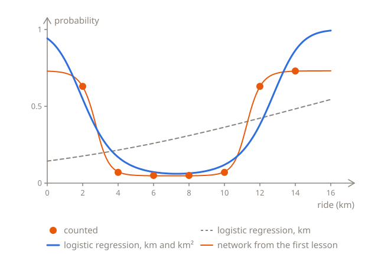

# Preparing the inputs

In [Measuring from the middle](03-training.md#measuring-from-the-middle), the network got each ride's distance from 7 km instead of its length, and the starts that got stuck went from 11 of 20 to none. What goes into a model can matter as much as the model itself, and this lesson takes that further, with the 700 orders from [Counting turned-down orders](01-layers.md#counting-turned-down-orders). It does three things with them: works out a new input from the one there is, puts inputs of very different sizes on the same scale, and prepares new orders the same way as the ones the model was trained on.

## A new input

On the length of the ride alone, logistic regression can only draw an S. But it can take more than one input, as in [More than one input](../03-logistic-regression/01-probabilities.md#more-than-one-input), and the second input doesn't have to be something new about the order. It can be worked out from the first: the length of the ride times itself, km²:

$$
p = \sigma(w_1 \, \text{km} + w_2 \, \text{km}^2 + b)
$$

Training on the 700 orders finds $w_1 = -1.51$, $w_2 = 0.103$ and $b = 2.8$, as you'll see further down. For a 2 km ride, $z = -1.51 \times 2 + 0.103 \times 4 + 2.8 = 0.19$, so $p = 0.548$. For an 8 km ride, $z = -1.51 \times 8 + 0.103 \times 64 + 2.8 = -2.69$, so $p = 0.064$, and for a 14 km ride, $z = -1.51 \times 14 + 0.103 \times 196 + 2.8 = 1.85$, so $p = 0.864$. The probability goes down, and then up again. Here are all seven lengths, and the log loss, worked out as in [Two S's make a U](01-layers.md#two-ss-make-a-u):

```python run
import math


def sigmoid(z):
    return 1 / (1 + math.exp(-z))


def predict(km):
    return sigmoid(-1.51 * km + 0.103 * km * km + 2.8)


turned_down = {2: 63, 4: 7, 6: 5, 8: 5, 10: 7, 12: 63, 14: 73}

total = 0
for km, count in turned_down.items():
    p = predict(km)
    print(km, round(p, 3))
    total += count * -math.log(p) + (100 - count) * -math.log(1 - p)

print(round(total / 700, 3))
```

The log loss is 0.439, far better than the 0.601 of the best S, and not far from the 0.401 of the network from the first lesson:



The U comes from the two weights pulling against each other. The weight for km is negative, so on its own, it pulls $z$ down more and more as rides get longer. The weight for km² is positive, so it pushes $z$ up, and km² grows much faster than km: from 2 to 14 km, km grows 7 times, and km² 49 times. For short rides, the pull wins, and for long ones, the push, so $z$ falls, bottoms out at about 7.3 km, and rises again. It's 0 at about 2.2 km and at about 12.5 km, so those are the decision boundaries: with a threshold of 0.5, rides shorter than 2.2 km or longer than 12.5 km are predicted to be turned down, and the ones in between aren't.

Inputs are also called features, and working out new ones from the ones you have, like km² from km, is called **feature engineering**.

## Inputs that a network makes itself

The U from km² is good, but not as good as the network's: 0.439 against 0.401. With km and km², $z$ is a parabola, which bends by the same amount everywhere, so the U can't stay flat from 4 to 10 km and then rise steeply, as the counts do. It's too high at 4 and 10 km, 0.169 and 0.119 instead of 0.07, and too low at 2 and 12 km, 0.548 and 0.38 instead of 0.63.

The bigger difference is where km² came from. Someone had to look at the counts, see the U, and think of km². The network from the first lesson got km alone, and its hidden neurons, $h_1$ for short rides and $h_2$ for long ones, are inputs that it works out for itself, from weights that training finds. That's what a hidden layer does: it makes the inputs that the output neuron needs.

Guessing inputs gets hard fast. A network that reads handwritten digits gets 784 pixels. To give logistic regression the square of every pixel and the product of every two, as well as the pixels themselves, would take 784 + 784 + 306,936 = 308,504 inputs. The 306,936 is 784 × 783 ÷ 2, as each of the 784 pixels pairs up with 783 others, and that counts every pair twice. And there would still be no telling whether those are the inputs that tell a 4 from a 9. Hand-made inputs still help where there are only a few, and people understand them well, like the length of a ride, and with the right ones, a simple model can do the job.

## Inputs of very different sizes

Training finds $w_1 = -1.51$, $w_2 = 0.103$ and $b = 2.8$, but not quickly. The slopes are the ones from [A formula for the slope](../03-logistic-regression/03-training.md#a-formula-for-the-slope), with one for each weight: the average of $p - y$ times the weight's input. The 100 orders of each length all get the same $p$, and `count` of them were turned down, so together, their $p - y$ add up to $100p - \text{count}$, and the loop only has to go through the seven lengths.

The function `train` starts from 0, goes up to step `steps`, printing the loss at steps 100, 1,000, 10,000 and 100,000, and returns the weights and the bias. `inputs` has the two inputs for each length, as a pair in round brackets, `(km, km * km)`, which Python calls a tuple. `x1, x2 = inputs[km]` takes the pair apart, the way `for km, count in turned_down.items()` does: $x_1$ is for $w_1$, and $x_2$ for $w_2$. And `return w1, w2, b` puts the three numbers in a tuple, so that `train` can return them all. Here it is on km and km², with a learning rate of 0.0005, for 100,000 steps. It can take a second or two:

```python run
import math


def sigmoid(z):
    return 1 / (1 + math.exp(-z))


turned_down = {2: 63, 4: 7, 6: 5, 8: 5, 10: 7, 12: 63, 14: 73}


def train(inputs, learning_rate, steps):
    w1 = 0
    w2 = 0
    b = 0
    for step in range(steps + 1):
        total = 0
        slope_w1 = 0
        slope_w2 = 0
        slope_b = 0
        for km, count in turned_down.items():
            x1, x2 = inputs[km]
            p = sigmoid(w1 * x1 + w2 * x2 + b)
            total += count * -math.log(p) + (100 - count) * -math.log(1 - p)
            slope_w1 += (100 * p - count) * x1 / 700
            slope_w2 += (100 * p - count) * x2 / 700
            slope_b += (100 * p - count) / 700
        if step in [100, 1000, 10000, 100000]:
            print(step, round(total / 700, 3))
        w1 = w1 - learning_rate * slope_w1
        w2 = w2 - learning_rate * slope_w2
        b = b - learning_rate * slope_b
    return w1, w2, b


inputs = {}
for km in turned_down:
    inputs[km] = (km, km * km)

train(inputs, 0.0005, 100000)
```

After 100,000 steps, the loss is still 0.456, and it only gets below 0.44 after 346,721 steps.

Why so slow? A step changes $z$ through every weight: by the change to the weight, times the input it multiplies. For a 14 km ride, $w_2$ multiplies 196, $w_1$ 14, and $b$ just 1. The slopes are lopsided the same way, as each is an average of errors times the same input: at the start, they're 4.37 for $w_2$, 1.04 for $w_1$ and 0.181 for $b$. So with a learning rate of 0.0005, the first step changes $z$ for a 14 km ride by 0.43 through $w_2$, by 0.007 through $w_1$, and by less than 0.0001 through $b$.

A learning rate that moved $w_1$ and $b$ along faster would be too big for $w_2$. Try 0.001 in the code above, and the loss at step 100 is 0.801, more than the 0.693 it started from: $w_2$ swings from 0 to −0.004, then to 0.003, then to −0.009, overshooting at every step. The swings die down in the end, and the loss gets below 0.44 after about 170,000 steps, but with 0.002, it's still at 0.70 after 100,000 steps. Even the best learning rate, about 0.0012, takes about 120,000 steps. The learning rate has to suit $w_2$, whose input is the biggest, and then it's far too small for the others.

## Standardizing the inputs

The fix is to put all the inputs on the same scale before training. For each input, take away its average over the training orders, and divide by how spread out it is:

$$
\frac{x - \text{average}}{\text{spread}}
$$

The spread here is the **standard deviation**: take each value's distance from the average, square it, average the squares, and take the square root. The 700 orders have 100 of each length, so their averages and spreads are the same as those of the seven lengths. For km, the average is 8, and the distances from it are −6, −4, −2, 0, 2, 4 and 6. Their squares, 36, 16, 4, 0, 4, 16 and 36, add up to 112, so they average 16, whose square root is 4. So a 14 km ride goes in as (14 − 8) ÷ 4 = 1.5, and a 2 km ride as −1.5. In Python, with `math.sqrt` for the square root:

```python run
import math


def average(values):
    return sum(values) / len(values)


def spread(values):
    middle = average(values)
    total = 0
    for value in values:
        distance = value - middle
        total += distance * distance
    return math.sqrt(total / len(values))


kms = [2, 4, 6, 8, 10, 12, 14]
squares = [km * km for km in kms]
print(average(kms), spread(kms))
print(average(squares), round(spread(squares), 2))
```

For km², the average is 80, and the spread 65.48, so a 14 km ride's 196 goes in as (196 − 80) ÷ 65.48 = 1.77. Here are all seven lengths, rounded to 2 decimal places:

| Ride (km)         | 2     | 4     | 6     | 8     | 10   | 12   | 14   |
| ----------------- | ----- | ----- | ----- | ----- | ---- | ---- | ---- |
| km, standardized  | −1.5  | −1    | −0.5  | 0     | 0.5  | 1    | 1.5  |
| km², standardized | −1.16 | −0.98 | −0.67 | −0.24 | 0.31 | 0.98 | 1.77 |

Both inputs now have an average of 0 and a spread of 1, and that's what **standardization** means. It's the most common kind of the normalization from [Measuring from the middle](03-training.md#measuring-from-the-middle): it centres each input on 0, and scales it too. Another kind, min-max scaling, puts each input between 0 and 1 instead, by taking away its smallest value, and dividing by the difference between its biggest and smallest.

Here's the same training on the standardized inputs, with a learning rate of 1, 2,000 times as big, for 10,000 steps. At the end, it prints the weights and the bias:

```python run
import math


def sigmoid(z):
    return 1 / (1 + math.exp(-z))


turned_down = {2: 63, 4: 7, 6: 5, 8: 5, 10: 7, 12: 63, 14: 73}


def train(inputs, learning_rate, steps):
    w1 = 0
    w2 = 0
    b = 0
    for step in range(steps + 1):
        total = 0
        slope_w1 = 0
        slope_w2 = 0
        slope_b = 0
        for km, count in turned_down.items():
            x1, x2 = inputs[km]
            p = sigmoid(w1 * x1 + w2 * x2 + b)
            total += count * -math.log(p) + (100 - count) * -math.log(1 - p)
            slope_w1 += (100 * p - count) * x1 / 700
            slope_w2 += (100 * p - count) * x2 / 700
            slope_b += (100 * p - count) / 700
        if step in [100, 1000, 10000, 100000]:
            print(step, round(total / 700, 3))
        w1 = w1 - learning_rate * slope_w1
        w2 = w2 - learning_rate * slope_w2
        b = b - learning_rate * slope_b
    return w1, w2, b


inputs = {}
for km in turned_down:
    inputs[km] = ((km - 8) / 4, (km * km - 80) / 65.48)

w1, w2, b = train(inputs, 1, 10000)
print(round(w1, 2), round(w2, 2), round(b, 2))
```

By step 1,000, the loss is 0.439, as low as it gets. It gets below 0.44 at step 678, instead of 346,721, so about 500 times sooner:


The chart spaces the steps so that each mark is 10 times the one before: from 1 to 10 takes as much room as from 100,000 to 1,000,000. With the steps spaced evenly, the first 678 would take up less than a thousandth of its width.

Standardized, each input is about as big as the others, and as the 1 that $b$ multiplies, so a step changes $z$ about as much through each weight, and one learning rate suits them all. The weights have changed, but the model hasn't, as standardizing only takes away a number and divides by another. Work out the brackets, and it's the same U as before:

$$
-6.04 \times \frac{\text{km} - 8}{4} = -1.51 \, \text{km} + 12.08
\qquad
6.75 \times \frac{\text{km}^2 - 80}{65.48} = 0.103 \, \text{km}^2 - 8.25
$$

and the bias is $-1.03 + 12.08 - 8.25 = 2.8$.

## New orders

The weights −6.04, 6.75 and −1.03 only work on inputs that were standardized the same way, with the training orders' averages and spreads: 8 and 4 for km, and 80 and 65.48 for km². So every new order goes through the same steps before its prediction:

```python run
import math


def sigmoid(z):
    return 1 / (1 + math.exp(-z))


def predict(km):
    x1 = (km - 8) / 4
    x2 = (km * km - 80) / 65.48
    return sigmoid(-6.04 * x1 + 6.75 * x2 - 1.03)


for km in [3, 5, 13]:
    print(km, round(predict(km), 3))

print(round(sigmoid(-6.04 * 5 + 6.75 * 25 - 1.03), 3))
```

None of the three lengths is in the training orders, but the model has learned the whole U, so it doesn't need them to be. The last line forgets to standardize the 5 km ride, and puts in 5 and 25 as they are. Its $z$ comes out at 137.5, and the model is sure that the ride will be turned down, when it should give it 0.103.

Standardizing new orders with their own average and spread goes wrong too. Take three new orders, of 3, 4 and 5 km. Their own average is 4 km, and their own spread 0.82, so the 5 km ride goes in as (5 − 4) ÷ 0.82 = 1.22, what a 12.9 km ride gets with the training orders' average and spread. Its km² goes in much too big as well, and the model gives it 0.54, instead of 0.103. A single new order would be worse still: it's its own average, so its spread is 0, and there's nothing to divide by.

So the averages and spreads are part of the model, as much as its weights are. They're worked out once, from the training orders, and kept with the weights, and the validation orders, the test orders and every new order are standardized with them. The same goes for the network from [Measuring from the middle](03-training.md#measuring-from-the-middle): it was trained on km − 7, so a new 12 km ride goes in as 5, and not as 12.

## Summary

- On km alone, logistic regression draws an S, but with km² as a second input, it draws a U, with a log loss of 0.439 instead of 0.601. Working out new inputs from the ones you have is feature engineering.
- A network doesn't need anyone to guess its inputs: its hidden neurons work out their own, which is how it draws a U from km alone.
- Inputs of very different sizes, like km and km², make gradient descent crawl, as the learning rate has to suit the biggest input, and is then far too small for the others.
- Standardizing an input, $(x - \text{average}) / \text{spread}$, gives it an average of 0 and a spread of 1, where the spread is the standard deviation. On km and km², it took the loss below 0.44 in 678 steps instead of 346,721.
- The averages and spreads come from the training data, and are part of the model: the validation and test data, and every new example, are standardized with them.

## Check yourself

<details>
<summary>Logistic regression's decision boundary is always straight. So how can it predict, with km and km² as its inputs, that rides shorter than 2.2 km and longer than 12.5 km get turned down, but not the ones in between?</summary>

The boundary is straight in the inputs that it gets. On a chart with km along the bottom and km² up the side, it's the straight line where $-1.51\,\text{km} + 0.103\,\text{km}^2 + 2.8 = 0$. But km² isn't a new measurement, it's worked out from km, so every ride sits on the curve where km² is km times km, and the straight line crosses that curve twice: at 2.2 and at 12.5 km. On the km axis alone, that's two boundaries.

</details>

<details>
<summary>Training logistic regression on km and km² as they are takes over 100,000 steps. Why is it so slow, and what fixes it?</summary>

km² is much bigger than km, up to 196 for a 14 km ride, so a step changes $z$ much more through $w_2$ than through $w_1$ or $b$. The learning rate has to be small enough for $w_2$ not to overshoot, and then $w_1$ and $b$ crawl. Standardizing both inputs puts them on the same scale, and with a learning rate of 1, the loss gets below 0.44 in 678 steps.

</details>

<details>
<summary>The model from this lesson gets a new order, for a 16 km ride. What are its two inputs?</summary>

2 and 2.69. They're standardized with the training orders' averages and spreads: (16 − 8) ÷ 4 = 2 for km, and (256 − 80) ÷ 65.48 = 2.69 for km². 16 km is longer than any training ride, so its inputs are bigger than any training order's, but they're standardized the same way. The model gives it 0.994, though with no training rides that long, that's more of a guess.

</details>

## Your turn

In [Standardize the inputs](../../../exercises/04-foundations/04-neural-networks/04-inputs/01-standardize/task.md), you'll work out an average and a spread, and standardize new orders with the training orders' ones. In [A U without a hidden layer](../../../exercises/04-foundations/04-neural-networks/04-inputs/02-no-hidden-layer/task.md), you'll train logistic regression on standardized km and km².
