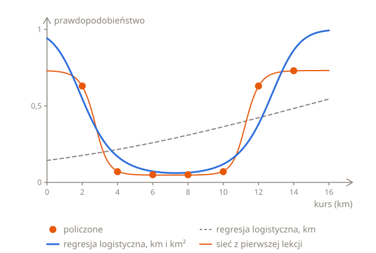

# Przygotowanie wejść

W części [Mierzenie od środka](03-training.pl.md#mierzenie-od-środka) sieć dostawała odległość każdego kursu od 7 km zamiast jego długości, a liczba startów, które utknęły, spadła z 11 na 20 do zera. To, co trafia do modelu, może mieć tak samo duże znaczenie jak sam model, a ta lekcja idzie w tym dalej, na 700 zamówieniach z części [Ile zamówień odrzucono](01-layers.pl.md#ile-zamówień-odrzucono). Robi z nimi trzy rzeczy: liczy nowe wejście z tego, które już jest, sprowadza wejścia bardzo różnej wielkości do tej samej skali i przygotowuje nowe zamówienia tak samo jak te, na których model się trenował.

## Nowe wejście

Na samej długości kursu regresja logistyczna potrafi narysować tylko S. Może jednak dostać więcej niż jedno wejście, jak w części [Więcej niż jedno wejście](../03-logistic-regression/01-probabilities.pl.md#więcej-niż-jedno-wejście), a drugie wejście nie musi mówić o zamówieniu nic nowego. Może być policzone z pierwszego: to długość kursu pomnożona przez samą siebie, km²:

$$
p = \sigma(w_1 \, \text{km} + w_2 \, \text{km}^2 + b)
$$

Trening na 700 zamówieniach znajduje $w_1 = -1{,}51$, $w_2 = 0{,}103$ i $b = 2{,}8$, jak zobaczysz niżej. Dla kursu na 2 km $z = -1{,}51 \times 2 + 0{,}103 \times 4 + 2{,}8 = 0{,}19$, więc $p = 0{,}548$. Dla kursu na 8 km $z = -1{,}51 \times 8 + 0{,}103 \times 64 + 2{,}8 = -2{,}69$, więc $p = 0{,}064$, a dla kursu na 14 km $z = -1{,}51 \times 14 + 0{,}103 \times 196 + 2{,}8 = 1{,}85$, więc $p = 0{,}864$. Prawdopodobieństwo spada, a potem znów rośnie. Oto wszystkie siedem długości i strata logarytmiczna, policzona tak jak w części [Z dwóch S powstaje U](01-layers.pl.md#z-dwóch-s-powstaje-u):

```python run
import math


def sigmoid(z):
    return 1 / (1 + math.exp(-z))


def predict(km):
    return sigmoid(-1.51 * km + 0.103 * km * km + 2.8)


turned_down = {2: 63, 4: 7, 6: 5, 8: 5, 10: 7, 12: 63, 14: 73}

total = 0
for km, count in turned_down.items():
    p = predict(km)
    print(km, round(p, 3))
    total += count * -math.log(p) + (100 - count) * -math.log(1 - p)

print(round(total / 700, 3))
```

Strata logarytmiczna wynosi 0,439: dużo mniej niż 0,601 najlepszego S i niewiele więcej niż 0,401 sieci z pierwszej lekcji:



U bierze się z tego, że dwie wagi ciągną w przeciwne strony. Waga km jest ujemna, więc sama ciągnie $z$ w dół tym mocniej, im dłuższy kurs. Waga km² jest dodatnia, więc pcha $z$ w górę, a km² rośnie dużo szybciej niż km: między 2 a 14 km długość kursu rośnie 7 razy, a km² aż 49 razy. Przy krótkich kursach wygrywa ciągnięcie w dół, a przy długich pchanie w górę, więc $z$ spada, osiąga najniższą wartość przy około 7,3 km i znów rośnie. Wynosi 0 przy około 2,2 km i przy około 12,5 km, więc tam leżą granice decyzyjne: przy progu 0,5 model przewiduje, że kursy krótsze niż 2,2 km lub dłuższe niż 12,5 km zostaną odrzucone, a te pomiędzy nie.

Wejścia nazywa się też cechami, a liczenie nowych cech z tych, które już są, jak km² z km, to **inżynieria cech** (ang. feature engineering).

## Wejścia, które sieć tworzy sama

U z km² jest dobre, ale nie tak dobre jak U sieci: 0,439 wobec 0,401. Z km i km² $z$ jest parabolą, która wygina się wszędzie tak samo, więc U nie może pozostać płaskie od 4 do 10 km, a potem stromo wzrosnąć, tak jak policzone odsetki. Jest za wysoko przy 4 i 10 km, 0,169 i 0,119 zamiast 0,07, i za nisko przy 2 i 12 km, 0,548 i 0,38 zamiast 0,63.

Ważniejsza różnica to to, skąd wzięło się km². Ktoś musiał spojrzeć na policzone odsetki, zobaczyć U i wpaść na km². Sieć z pierwszej lekcji dostała same km, a jej neurony ukryte, $h_1$ dla krótkich kursów i $h_2$ dla długich, to wejścia, które liczy sobie sama, z wag znalezionych przez trening. Na tym polega warstwa ukryta: tworzy wejścia, których potrzebuje neuron wyjściowy.

Zgadywanie wejść szybko robi się trudne. Sieć, która odczytuje odręcznie pisane cyfry, dostaje 784 piksele. Żeby dać regresji logistycznej kwadrat każdego piksela i iloczyn każdych dwóch, oprócz samych pikseli, trzeba by 784 + 784 + 306 936 = 308 504 wejść. 306 936 to 784 × 783 ÷ 2, bo każdy z 784 pikseli tworzy parę z 783 innymi, a tak każda para jest liczona dwa razy. I nadal nie byłoby wiadomo, czy to właśnie te wejścia odróżniają 4 od 9. Wejścia robione ręcznie wciąż się przydają, gdy jest ich niewiele i dobrze wiadomo, co znaczą, jak długość kursu, a z właściwymi wejściami prosty model może wystarczyć.

## Wejścia bardzo różnej wielkości

Trening znajduje $w_1 = -1{,}51$, $w_2 = 0{,}103$ i $b = 2{,}8$, ale nie szybko. Nachylenia to te z części [Wzór na nachylenie](../03-logistic-regression/03-training.pl.md#wzór-na-nachylenie), po jednym dla każdej wagi: średnia z $p - y$ razy wejście tej wagi. 100 zamówień o tej samej długości dostaje to samo $p$, a `count` z nich odrzucono, więc ich $p - y$ sumują się do $100p - \text{count}$, a pętla musi przejść tylko przez siedem długości.

Funkcja `train` zaczyna od 0, dochodzi do kroku `steps`, po drodze wypisuje stratę w krokach 100, 1000, 10 000 i 100 000 i zwraca wagi i wyraz wolny. `inputs` zawiera dwa wejścia dla każdej długości jako parę w nawiasach okrągłych, `(km, km * km)`, którą Python nazywa krotką (ang. tuple). `x1, x2 = inputs[km]` rozkłada tę parę na dwie zmienne, tak jak `for km, count in turned_down.items()`: $x_1$ jest dla $w_1$, a $x_2$ dla $w_2$. Z kolei `return w1, w2, b` wkłada trzy liczby do krotki, żeby `train` mogła zwrócić je wszystkie. Oto trening na km i km², ze współczynnikiem uczenia 0,0005, przez 100 000 kroków. Może to potrwać sekundę albo dwie:

```python run
import math


def sigmoid(z):
    return 1 / (1 + math.exp(-z))


turned_down = {2: 63, 4: 7, 6: 5, 8: 5, 10: 7, 12: 63, 14: 73}


def train(inputs, learning_rate, steps):
    w1 = 0
    w2 = 0
    b = 0
    for step in range(steps + 1):
        total = 0
        slope_w1 = 0
        slope_w2 = 0
        slope_b = 0
        for km, count in turned_down.items():
            x1, x2 = inputs[km]
            p = sigmoid(w1 * x1 + w2 * x2 + b)
            total += count * -math.log(p) + (100 - count) * -math.log(1 - p)
            slope_w1 += (100 * p - count) * x1 / 700
            slope_w2 += (100 * p - count) * x2 / 700
            slope_b += (100 * p - count) / 700
        if step in [100, 1000, 10000, 100000]:
            print(step, round(total / 700, 3))
        w1 = w1 - learning_rate * slope_w1
        w2 = w2 - learning_rate * slope_w2
        b = b - learning_rate * slope_b
    return w1, w2, b


inputs = {}
for km in turned_down:
    inputs[km] = (km, km * km)

train(inputs, 0.0005, 100000)
```

Po 100 000 kroków strata wciąż wynosi 0,456, a poniżej 0,44 schodzi dopiero po 346 721 krokach.

Skąd ta powolność? Krok zmienia $z$ przez każdą wagę: o zmianę wagi razy wejście, które ta waga mnoży. Przy kursie na 14 km $w_2$ mnoży 196, $w_1$ mnoży 14, a $b$ tylko 1. Nachylenia są tak samo nierówne, bo każde z nich to średnia błędów razy to samo wejście: na starcie wynoszą 4,37 dla $w_2$, 1,04 dla $w_1$ i 0,181 dla $b$. Przy współczynniku uczenia 0,0005 pierwszy krok zmienia więc $z$ kursu na 14 km o 0,43 przez $w_2$, o 0,007 przez $w_1$ i o mniej niż 0,0001 przez $b$.

Współczynnik uczenia, który szybciej przesuwałby $w_1$ i $b$, byłby za duży dla $w_2$. Wpisz w kodzie powyżej `0.001`, a strata w kroku 100 wyniesie 0,801, więcej niż 0,693 na starcie: $w_2$ skacze od 0 do −0,004, potem do 0,003, potem do −0,009, w każdym kroku przestrzeliwując. W końcu skoki słabną, a strata schodzi poniżej 0,44 po około 170 000 kroków, ale przy 0,002 po 100 000 kroków wciąż wynosi 0,70. Nawet najlepszy współczynnik uczenia, około 0,0012, potrzebuje około 120 000 kroków. Współczynnik uczenia musi pasować do $w_2$, której wejście jest największe, a wtedy dla pozostałych wag jest o wiele za mały.

## Standaryzacja wejść

Rozwiązanie to sprowadzić wszystkie wejścia do tej samej skali przed treningiem. Od każdego wejścia odejmij jego średnią na zamówieniach treningowych i podziel wynik przez to, jak bardzo wejście jest rozrzucone:

$$
\frac{x - \text{średnia}}{\text{rozrzut}}
$$

Rozrzut to tutaj **odchylenie standardowe** (ang. standard deviation): policz odległość każdej wartości od średniej, podnieś ją do kwadratu, uśrednij kwadraty i wyciągnij z wyniku pierwiastek kwadratowy. 700 zamówień ma po 100 zamówień każdej długości, więc ich średnie i rozrzuty są takie same jak dla siedmiu długości. Dla km średnia wynosi 8, a odległości od niej to −6, −4, −2, 0, 2, 4 i 6. Ich kwadraty, 36, 16, 4, 0, 4, 16 i 36, sumują się do 112, więc ich średnia to 16, a pierwiastek z niej to 4. Kurs na 14 km wchodzi więc jako (14 − 8) ÷ 4 = 1,5, a kurs na 2 km jako −1,5. W Pythonie, z `math.sqrt` do pierwiastka kwadratowego:

```python run
import math


def average(values):
    return sum(values) / len(values)


def spread(values):
    middle = average(values)
    total = 0
    for value in values:
        distance = value - middle
        total += distance * distance
    return math.sqrt(total / len(values))


kms = [2, 4, 6, 8, 10, 12, 14]
squares = [km * km for km in kms]
print(average(kms), spread(kms))
print(average(squares), round(spread(squares), 2))
```

Dla km² średnia wynosi 80, a rozrzut 65,48, więc 196 kursu na 14 km wchodzi jako (196 − 80) ÷ 65,48 = 1,77. Oto wszystkie siedem długości, z liczbami zaokrąglonymi do 2 miejsc po przecinku:

| Kurs (km)            | 2     | 4     | 6     | 8     | 10   | 12   | 14   |
| -------------------- | ----- | ----- | ----- | ----- | ---- | ---- | ---- |
| km po standaryzacji  | −1,5  | −1    | −0,5  | 0     | 0,5  | 1    | 1,5  |
| km² po standaryzacji | −1,16 | −0,98 | −0,67 | −0,24 | 0,31 | 0,98 | 1,77 |

Oba wejścia mają teraz średnią 0 i rozrzut 1 i właśnie to oznacza **standaryzacja** (ang. standardization). To najczęściej używany rodzaj normalizacji z części [Mierzenie od środka](03-training.pl.md#mierzenie-od-środka): wyśrodkowuje każde wejście na 0, a do tego je skaluje. Inny rodzaj, skalowanie min-max (ang. min-max scaling), zamiast tego sprowadza każde wejście do przedziału od 0 do 1: odejmuje od niego jego najmniejszą wartość i dzieli wynik przez różnicę między największą a najmniejszą.

Oto ten sam trening na wejściach po standaryzacji, ze współczynnikiem uczenia 1, czyli 2000 razy większym, przez 10 000 kroków. Na końcu wypisuje wagi i wyraz wolny:

```python run
import math


def sigmoid(z):
    return 1 / (1 + math.exp(-z))


turned_down = {2: 63, 4: 7, 6: 5, 8: 5, 10: 7, 12: 63, 14: 73}


def train(inputs, learning_rate, steps):
    w1 = 0
    w2 = 0
    b = 0
    for step in range(steps + 1):
        total = 0
        slope_w1 = 0
        slope_w2 = 0
        slope_b = 0
        for km, count in turned_down.items():
            x1, x2 = inputs[km]
            p = sigmoid(w1 * x1 + w2 * x2 + b)
            total += count * -math.log(p) + (100 - count) * -math.log(1 - p)
            slope_w1 += (100 * p - count) * x1 / 700
            slope_w2 += (100 * p - count) * x2 / 700
            slope_b += (100 * p - count) / 700
        if step in [100, 1000, 10000, 100000]:
            print(step, round(total / 700, 3))
        w1 = w1 - learning_rate * slope_w1
        w2 = w2 - learning_rate * slope_w2
        b = b - learning_rate * slope_b
    return w1, w2, b


inputs = {}
for km in turned_down:
    inputs[km] = ((km - 8) / 4, (km * km - 80) / 65.48)

w1, w2, b = train(inputs, 1, 10000)
print(round(w1, 2), round(w2, 2), round(b, 2))
```

W kroku 1000 strata wynosi już 0,439, najmniej, ile się da. Poniżej 0,44 schodzi w kroku 678 zamiast 346 721, czyli mniej więcej 500 razy szybciej:


Wykres rozmieszcza kroki tak, że każda kreska to 10 razy więcej niż poprzednia: odcinek od 1 do 10 zajmuje tyle samo miejsca co od 100 000 do 1 000 000. Gdyby kroki były rozmieszczone równo, pierwsze 678 zajęłoby mniej niż tysięczną część szerokości wykresu.

Po standaryzacji każde wejście jest mniej więcej tak duże jak pozostałe i jak 1, które mnoży $b$, więc krok zmienia $z$ mniej więcej tak samo przez każdą wagę i jeden współczynnik uczenia pasuje do wszystkich. Wagi się zmieniły, ale model nie, bo standaryzacja tylko odejmuje jedną liczbę i dzieli przez drugą. Po wymnożeniu nawiasów to to samo U co wcześniej:

$$
-6{,}04 \times \frac{\text{km} - 8}{4} = -1{,}51 \, \text{km} + 12{,}08
\qquad
6{,}75 \times \frac{\text{km}^2 - 80}{65{,}48} = 0{,}103 \, \text{km}^2 - 8{,}25
$$

a wyraz wolny to $-1{,}03 + 12{,}08 - 8{,}25 = 2{,}8$.

## Nowe zamówienia

Wagi −6,04; 6,75 i −1,03 działają tylko na wejściach po takiej samej standaryzacji, ze średnimi i rozrzutami zamówień treningowych: 8 i 4 dla km oraz 80 i 65,48 dla km². Każde nowe zamówienie przechodzi więc te same kroki, zanim dostanie predykcję:

```python run
import math


def sigmoid(z):
    return 1 / (1 + math.exp(-z))


def predict(km):
    x1 = (km - 8) / 4
    x2 = (km * km - 80) / 65.48
    return sigmoid(-6.04 * x1 + 6.75 * x2 - 1.03)


for km in [3, 5, 13]:
    print(km, round(predict(km), 3))

print(round(sigmoid(-6.04 * 5 + 6.75 * 25 - 1.03), 3))
```

Żadnej z tych trzech długości nie ma w zamówieniach treningowych, ale model nauczył się całego U, więc nie jest mu to potrzebne. Ostatni wiersz zapomina o standaryzacji kursu na 5 km i wstawia 5 i 25 bez zmian. $z$ wychodzi 137,5, a model jest pewien, że kurs zostanie odrzucony, choć powinien dać mu 0,103.

Standaryzacja nowych zamówień ich własną średnią i rozrzutem też daje złe wyniki. Weź trzy nowe zamówienia, na 3, 4 i 5 km. Ich własna średnia to 4 km, a własny rozrzut 0,82, więc kurs na 5 km wchodzi jako (5 − 4) ÷ 0,82 = 1,22, czyli tak, jak ze średnią i rozrzutem zamówień treningowych wszedłby kurs na 12,9 km. Jego km² też wchodzi o wiele za duże i model daje mu 0,54 zamiast 0,103. Pojedyncze nowe zamówienie wypadłoby jeszcze gorzej: jest swoją własną średnią, więc jego rozrzut wynosi 0 i nie ma przez co dzielić.

Średnie i rozrzuty są więc częścią modelu, tak samo jak jego wagi. Liczy się je raz, na zamówieniach treningowych, i przechowuje razem z wagami, a zamówienia walidacyjne, testowe i każde nowe zamówienie standaryzuje się właśnie nimi. To samo dotyczy sieci z części [Mierzenie od środka](03-training.pl.md#mierzenie-od-środka): trenowano ją na km − 7, więc nowy kurs na 12 km wchodzi do niej jako 5, a nie jako 12.

## Podsumowanie

- Na samych km regresja logistyczna rysuje S, ale z km² jako drugim wejściem rysuje U, ze stratą logarytmiczną 0,439 zamiast 0,601. Liczenie nowych wejść z tych, które już są, to inżynieria cech.
- Sieć nie potrzebuje nikogo, kto zgadnie jej wejścia: jej neurony ukryte liczą własne i dlatego rysuje U z samych km.
- Wejścia bardzo różnej wielkości, jak km i km², sprawiają, że spadek gradientu się wlecze, bo współczynnik uczenia musi pasować do największego wejścia, a wtedy jest o wiele za mały dla pozostałych.
- Standaryzacja wejścia, $(x - \text{średnia}) / \text{rozrzut}$, daje mu średnią 0 i rozrzut 1, gdzie rozrzut to odchylenie standardowe. Na km i km² sprowadziła stratę poniżej 0,44 w 678 krokach zamiast 346 721.
- Średnie i rozrzuty pochodzą z danych treningowych i są częścią modelu: dane walidacyjne i testowe oraz każdy nowy przykład standaryzuje się właśnie nimi.

## Sprawdź się

<details>
<summary>Granica decyzyjna regresji logistycznej jest zawsze prosta. Jak więc z km i km² na wejściu może przewidywać, że kursy krótsze niż 2,2 km i dłuższe niż 12,5 km zostaną odrzucone, a te pomiędzy nie?</summary>

Granica jest prosta względem wejść, które model dostaje. Na wykresie z km na osi poziomej i km² na pionowej to linia prosta, na której $-1{,}51\,\text{km} + 0{,}103\,\text{km}^2 + 2{,}8 = 0$. Ale km² to nie nowy pomiar, tylko wartość policzona z km, więc każdy kurs leży na krzywej, na której km² to km razy km, a linia prosta przecina tę krzywą dwa razy: przy 2,2 i przy 12,5 km. Na samej osi km to dwie granice.

</details>

<details>
<summary>Trening regresji logistycznej na km i km² w oryginalnej postaci trwa ponad 100 000 kroków. Dlaczego tak wolno i co to naprawia?</summary>

km² jest dużo większe niż km, aż do 196 przy kursie na 14 km, więc krok zmienia $z$ dużo bardziej przez $w_2$ niż przez $w_1$ czy $b$. Współczynnik uczenia musi być na tyle mały, żeby waga $w_2$ nie przestrzeliwała, a wtedy $w_1$ i $b$ się wloką. Standaryzacja obu wejść sprowadza je do tej samej skali i ze współczynnikiem uczenia 1 strata schodzi poniżej 0,44 w 678 krokach.

</details>

<details>
<summary>Model z tej lekcji dostaje nowe zamówienie: kurs na 16 km. Jakie są jego dwa wejścia?</summary>

2 i 2,69. Standaryzuje się je średnimi i rozrzutami zamówień treningowych: (16 − 8) ÷ 4 = 2 dla km i (256 − 80) ÷ 65,48 = 2,69 dla km². 16 km to więcej niż każdy kurs treningowy, więc jego wejścia są większe niż wejścia każdego zamówienia treningowego, ale standaryzuje się je tak samo. Model daje mu 0,994, choć bez tak długich kursów treningowych to raczej zgadywanie.

</details>

## Twoja kolej

W ćwiczeniu [Standaryzacja wejść](../../../exercises/04-foundations/04-neural-networks/04-inputs/01-standardize/task.pl.md) policzysz średnią i rozrzut i wystandaryzujesz nowe zamówienia średnią i rozrzutem zamówień treningowych. W ćwiczeniu [U bez warstwy ukrytej](../../../exercises/04-foundations/04-neural-networks/04-inputs/02-no-hidden-layer/task.pl.md) wytrenujesz regresję logistyczną na km i km² po standaryzacji.
